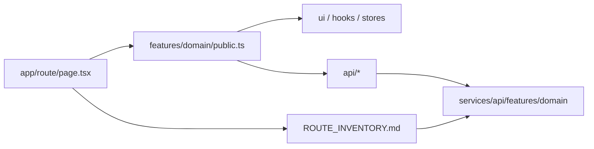

# Kiến trúc phân tầng Frontend

Tài liệu này mô tả **cách `client/` được tổ chức sau wave clean-architecture + traceability**: luật import, dual-home UI, và cách truy vết page → feature → API → backend trong ≤30 giây.

## Mục tiêu truy vết

1. Mở [`client/ROUTE_INVENTORY.md`](../../client/ROUTE_INVENTORY.md) (máy sinh).
2. Đọc cột Features + Backend mounts.
3. Với hub lớn, mở `app/<route>/TRACE.md`.
4. Vào `features/<domain>/public.ts` rồi `api/` / `ui/`.

## Các tầng

| Tầng | Vai trò |
|------|---------|
| `app/` | Thin route shell — compose, không deep-import feature internals |
| `features/<domain>/public` | Cổng duy nhất cross-boundary (client) |
| `features/<domain>/server` | RSC fetchers (`server-only`) — không re-export từ `public` |
| `features/<domain>/{api,hooks,stores,lib,ui,data}` | Nội bộ domain |
| `components/3d` | Presentational Three.js |
| `lib/` | Cross-cutting thật (`apiConfig`, `cn`, analytics…) |

## Dual-home (hybrid 1C)

Domain UI mới sống ở `features/<domain>/ui/`. `components/<domain>` được migrate dần.
Không tạo `features/studio` — studio surfaces map về courses / learning-path / content3d / concepts.

## Guards (CI + prebuild)

| Script | Luật |
|--------|------|
| `check-app-public-imports` | `app/` không deep `api\|lib\|hooks\|stores\|ui\|…` |
| `check-feature-public-imports` | Feature A không deep-import feature B |
| `check-components-public` | `components/` không deep `features/*/api` (allowlist 0) |
| `check-import-boundaries` | `components/3d` không gọi domain API |
| `check-store-imports` | Store không import store khác |
| `check-earth-history-ssot` | Earth data SSOT |
| `gen-route-inventory --check` | Inventory không stale |

Baseline file: `client/scripts/architecture-baseline.json` — chỉ shrink qua `--prune-baseline`. Mục tiêu: **0 entries**.

## Đối chiếu backend

Backend đã có layering `routes → controllers → services → repositories` và baseline 0
([`api-layering.md`](./api-layering.md)). Frontend dùng cùng vocabulary `features/` và nối bằng
ROUTE_INVENTORY + DOMAIN_MAP.

## Cách thêm một page mới

1. Thin `app/.../page.tsx` import từ `features/*/public` (hoặc `server`).
2. UI domain đặt trong `features/<domain>/ui/`.
3. Nếu page ≥400 LOC hoặc là studio/explore hub → thêm `TRACE.md`.
4. Chạy `node scripts/gen-route-inventory.mjs` và commit file generated.
5. `npm run check:guards`.
