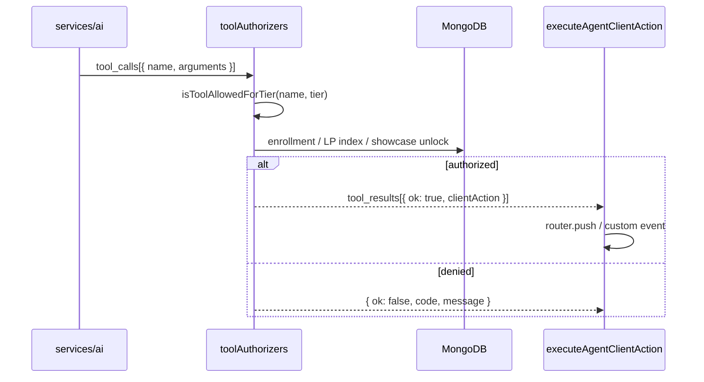
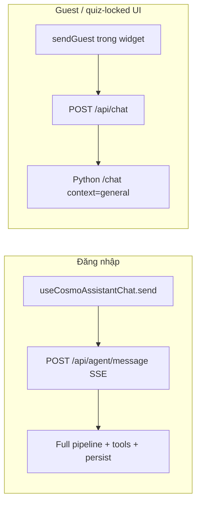

# Kiến trúc hệ thống AI Learning Agent

Tài liệu này giải thích **app CosmoLearn AI (nito) chạy thế nào trong code** — từ lúc bạn gõ câu hỏi đến lúc nhận câu trả lời và có thể được “dẫn” sang bài học / Explore.

Đây là **tài liệu kiến trúc (mô tả hệ thống đang có)**, không phải kế hoạch tính năng tương lai. Phần “sẽ làm gì tiếp” nằm ở [`docs/plans/learning-agent-system.md`](../plans/learning-agent-system.md).

---

## Đọc nhanh — một câu chuyện đơn giản

Hãy tưởng tượng **ba vai**:

1. **Màn hình (trình duyệt)** — bạn thấy nito góc phải, gõ chat, bấm gợi ý “mở bài học”.
2. **Người điều phối (server Node, `/api/agent`)** — biết bạn là ai, đang học bài nào, được phép làm gì; gọi AI; **duyệt** mọi hành động nhạy cảm (mở bài khóa chưa mua, nhảy Explore…) trước khi cho màn hình làm.
3. **Bộ não nói chuyện (server Python, `services/ai`)** — đọc tài liệu tham khảo (RAG), soạn câu trả lời, **đề xuất** hành động — nhưng **không** tự mở khóa học hay sửa database.

Luồng chuẩn khi **đã đăng nhập**:

```
Bạn gõ câu hỏi
  → trình duyệt gửi kèm “đang ở đâu” (bài LP, khóa học, Explore…)
  → Node kiểm tra quyền + ghép tiến độ học
  → Python sinh câu trả lời (+ có thể đề xuất “mở bài X”)
  → Node kiểm tra “mở bài X” có hợp lệ không
  → trình duyệt hiện chữ + thực hiện điều hướng (nếu được duyệt)
```

**Khách (chưa đăng nhập)** chỉ được demo vài câu, qua đường chat đơn giản hơn — không đủ quyền mở bài / dùng tool đầy đủ.

---

## Từ điển thuật ngữ (giải thích dễ hiểu)

Các mục dưới đây lặp lại trong doc. Đọc một lần rồi quay lại khi gặp từ lạ.

### Sản phẩm & người dùng

| Thuật ngữ | Nghĩa đơn giản |
|-----------|----------------|
| **Agent / Learning Agent** | Trợ lý AI học tập trong app — không phải “agent” nghĩa marketing chung chung. |
| **CosmoLearn AI / nito** | Tên sản phẩm + nhân vật Live2D bạn thấy góc màn hình. |
| **Guest (khách)** | Chưa đăng nhập — chat demo, hạn chế. |
| **Đăng nhập** | Có tài khoản JWT — dùng pipeline agent đầy đủ, lưu lịch sử chat. |
| **Learning path (LP)** | Lộ trình bài học chính (`/tutorial/...`). |
| **Explore** | Khám phá 3D Trái Đất / Sao Hỏa / showcase. |
| **Showcase** | Mô hình thiên thể có thể mở khóa bằng gem (story/orbit). |
| **Enrollment** | Ghi danh khóa học — quyết định được mở bài khóa nào. |
| **Trial** | Học thử một phần khóa — agent/tool bị giới hạn theo module. |
| **Gem** | Điểm thưởng trong app — agent **chỉ đọc** số dư để gợi ý, **không** trừ gem khi chat. |
| **Recall quiz** | Bài kiểm tra nhớ lại sau khi học — khi đang làm quiz, agent tạm **khóa** để tránh gian lận. |

### Kỹ thuật — nhưng nói bình thường

| Thuật ngữ | Nghĩa đơn giản |
|-----------|----------------|
| **Client / trình duyệt** | Code Next.js chạy trên máy người dùng (`client/`). |
| **API / server** | Máy chủ xử lý request (`services/api`). |
| **Node (services/api)** | Backend chính của Galaxies — user, khóa học, tiến độ, **điều phối agent**. |
| **Python (services/ai)** | Service riêng chỉ lo **chat AI + tìm tài liệu + gọi model**. |
| **LLM** | Mô hình ngôn ngữ lớn (vd. Groq) — “bộ não” sinh câu chữ. |
| **RAG** | *Retrieval-Augmented Generation* — trước khi trả lời, hệ thống **tìm đoạn tài liệu liên quan** trong kho bài học rồi nhét vào prompt để ít bịa đặt. |
| **Prompt** | Đoạn chỉ dẫn gửi cho LLM (vai trò, quy tắc, nội dung bài đang học…). |
| **Context / ngữ cảnh** | Thông tin “bạn đang ở đâu, học gì” — không chat kiểu ChatGPT trắng trang. |
| **`session_context`** | Gói ngữ cảnh client gửi kèm mỗi tin nhắn (bài, khóa, Explore…). |
| **`learner_snapshot`** | Ảnh tóm tắt tiến độ (đã học bao nhiêu bài, bài nào yếu…) — server có thể bổ sung thêm. |
| **Pipeline** | Chuỗi bước xử lý **cố định** một tin nhắn (kiểm tra quyền → gọi AI → duyệt tool → lưu chat). |
| **Orchestrator** | “Người điều phối” — ở đây là **Node**, không phải Python. |
| **Tool (công cụ)** | Hành động AI **đề xuất**, vd. `open_learning_path_lesson`, `focus_showcase_entity`. |
| **Authorize / duyệt tool** | Server **kiểm tra** đề xuất đó có hợp lệ với tài khoản & quyền hay không. |
| **`clientAction`** | Lệnh an toàn trả về trình duyệt: “đi tới URL này”, “hiện 3 bài liên quan” — chỉ sau khi duyệt. |
| **Tier / entitlement** | **Hạng quyền** agent: guest, học LP miễn phí, học thử khóa, học full khóa, giáo viên… |
| **SSOT** | *Single source of truth* — **một nơi quyết định đúng** (vd. enrollment ở DB, không tin lời model). |
| **SSE / stream** | Trả lời **từng mảnh chữ** dần dần thay vì đợi một cục — cảm giác “đang gõ”. |
| **Prefetch / cache ngữ cảnh** | Vào bài học trước → server **chuẩn bị sẵn** context 5 phút → câu hỏi đầu nhanh hơn. |
| **MongoDB** | Database chính — lưu session chat, profile agent, tiến độ. |
| **Widget / portal** | Cửa sổ nito gắn **toàn app** (layout root), không gắn riêng một trang. |
| **Live2D** | Công nghệ avatar 2D có animation (nito nhún nhảy, phản ứng khi chat). |
| **Rate limit** | Giới hạn số tin nhắn (vd. 40/giờ) — chống spam & chi phí API. |

### Nguyên tắc thiết kế (mục 1.3 — diễn giải lại)

| Thuật ngữ trong doc | Ý nghĩa thực tế |
|---------------------|-----------------|
| **Grounded** | Trả lời dựa trên **tài liệu & dữ liệu app**, hạn chế bịa. |
| **Context-first** | Luôn biết **đang học gì** trước khi trả lời. |
| **Agent-native** | Không chỉ nói — có thể **đề xuất thao tác** (mở bài, Explore) qua tool có kiểm soát. |
| **Option B orchestration** | **Node** giữ quyền & duyệt tool; **Python** chỉ lo AI — tránh hai nơi cùng quyết định enrollment. |

### Ba lớp L1 / L2 / L3 (sơ đồ mục 2)

| Lớp | Hiểu là |
|-----|---------|
| **L3 — Experience** | Phần người dùng **nhìn và bấm** (nito, panel chat). |
| **L2 — Orchestrator** | Server **điều phối & kiểm tra** mỗi tin nhắn. |
| **L1 — Knowledge & signals** | Dữ liệu nền: bài học, tiến độ, RAG, khóa học, gem unlock. |

### Coach & học tập (mục 10)

| Thuật ngữ | Nghĩa đơn giản |
|-----------|----------------|
| **Struggle / bài yếu** | Hệ thống đoán bạn **đang kẹt** (quiz fail nhiều, ở lại bài lâu…). |
| **Coach nudge** | Gợi ý nhẹ từ AI (“thử hỏi theo hướng này”) — có **cooldown** để không spam. |
| **Spaced review** | Nhắc **ôn lại** bài đã mastered sau 1, 3, 7… ngày. |
| **Misconception** | Ghi nhận **hiểu lầm** (vd. sau quiz sai) để coach lần sau tốt hơn. |

---

## 1. Mục tiêu và phạm vi

### 1.1 Agent là gì trong Galaxies?

**CosmoLearn AI** (persona **nito**) là lớp trợ lý học tập gắn với **ngữ cảnh thật** của người dùng:

- Đang học bài nào trên learning path (LP)
- Đang ở stage/entity nào trên Explore (Earth, Mars, showcase)
- Đang xem khóa học nào, section nào
- Tiến độ, mastery, quiz recall, gem, cohort, v.v.

Agent **không** thay giáo viên soạn nội dung, **không** tự ghi MongoDB curriculum, **không** bán quota bằng gem.

### 1.2 Ngoài phạm vi

| Không thuộc agent | Ghi chú |
|-------------------|---------|
| Forum Q&A thuần | `CommunityAskButton` → forum; agent chỉ có tool `suggest_community_thread` |
| Sinh recall quiz | `services/api/lib/ai/tasks/generateRecallQuiz.js` — pipeline riêng |
| Studio authoring | Surface `studio` + tier `teacher` — persona khác, không phải tutor học sinh |
| Thanh toán / gem earn | Chỉ **đọc** `gemBalance` trong context; không spend gem qua agent |

### 1.3 Nguyên tắc thiết kế

| Nguyên tắc | Triển khai (xem bảng diễn giải ở mục «Từ điển») |
|------------|------------|
| **Grounded** | RAG + outline bài học, beat Explore, tiến độ — ít trả lời “bịa”. |
| **Context-first** | Mỗi tin nhắn kèm `session_context` (+ có thể `learner_snapshot`). |
| **Agent-native** | AI gợi ý tool → Node **duyệt** → trình duyệt thực hiện `clientAction`. |
| **Server là SSOT** | Quyền học / mở showcase lấy từ DB — không tin client hay model. |
| **Option B** | Node: quyền + duyệt tool; Python: chỉ chat + RAG. |

---

## 2. Bối cảnh hệ thống

```mermaid
flowchart TB
  subgraph L3 [L3 — Experience — Next.js client]
    Layout[app/layout.tsx]
    Widget[CosmoAssistantWidget + Live2D nito]
    Provider[AgentPageProvider LP / Explore]
    Hook[useCosmoAssistantChat]
    Exec[executeAgentClientAction]
    Layout --> Widget
    Provider --> Hook
    Widget --> Hook
    Hook --> Exec
  end

  subgraph L2 [L2 — Orchestrator — services/api/features/agent]
    Routes["/api/agent/*"]
    Pipe[messagePipeline.js]
    Ent[entitlementResolver]
    Ctx[contextBuilder + contextCache]
    Auth[toolAuthorizers / executeTool.js]
    Persist[sessionHistoryService]
    Routes --> Pipe
    Pipe --> Ent
    Pipe --> Ctx
    Pipe --> Auth
    Pipe --> Persist
  end

  subgraph L1 [L1 — Knowledge & signals]
    Mongo[(MongoDB: progress, events, sessions, profiles)]
    LP[Learning path curriculum]
    RAGIndex[RAG index JSON + knowledge/]
    Courses[Courses + enrollment]
    Showcase[Showcase + gamification unlocks]
  end

  subgraph AI [services/ai — Python FastAPI]
    Chat[POST /chat]
    Rag[rag.retrieve]
    ToolsPy[agent_tools.py definitions]
    Chat --> Rag
    Chat --> ToolsPy
  end

  Hook -->|SSE POST /message| Routes
  Widget -->|guest| NextChat[/api/chat proxy]
  NextChat --> Chat
  Pipe -->|POST /chat 70s timeout| Chat
  Ctx --> Mongo
  Ctx --> LP
  Auth --> Mongo
  Auth --> Courses
  Auth --> Showcase
```

---

## 3. Phân tách runtime: tại sao hai service?

| Runtime | Vai trò | Lý do tách |
|---------|---------|------------|
| **`services/api` (Node)** | JWT, Mongo, entitlement, context merge, tool **authorization**, session persist, rate limit, SSE | Business rules và dữ liệu học đã có sẵn ở API |
| **`services/ai` (Python)** | Groq/LLM, RAG retrieve, tool **schema** cho model, security blocklist, multimodal ảnh | Stateless, dễ scale / đổi model; không duplicate enrollment logic |

**Luồng chuẩn (user đăng nhập):** Client → `POST /api/agent/message` → Node pipeline → `POST {AI_SERVICE_URL}/chat` → Node authorize tools → SSE về client.

**Luồng demo (guest):** Client → `POST /api/chat` (Next proxy) → Python `/chat` trực tiếp — **không** qua orchestrator đầy đủ (xem §12).

---

## 4. Ba lớp kiến trúc

### 4.1 L3 — Experience (client)

| Thành phần | Path | Vai trò |
|------------|------|---------|
| Widget global | `client/src/components/ai-tutor/CosmoAssistantWidget.tsx` | FAB + panel portal `document.body`; mascot Live2D |
| Chat hook | `client/src/features/agent/hooks/useCosmoAssistantChat.ts` | SSE, prefetch, tool results → navigation |
| Session context | `buildSessionContext.ts`, `AgentPageContext.tsx`, `useAgentPageContextStore` | LP/Explore inject context; widget đọc Zustand vì nằm ngoài cây provider |
| Tool UI | `executeToolCall.ts`, `parseTutorActions.ts` | Map `clientAction` → `router.push`, custom events |
| Coach UI | `useAgentCoach.ts`, `AgentCoachBanner.tsx` | Nudge sau quiz fail |
| History | `CosmoChatHistoryPanel.tsx` | `GET /api/agent/sessions` |

**Mount:** `client/src/app/layout.tsx` — `<CosmoAssistantWidget />` trong `AuthProvider`, mọi trang học sinh.

**Mở từ CTA:** `openCosmoAssistant({ prompt })` hoặc event `galaxies:agent-open` — không popup riêng giữa màn hình.

### 4.2 L2 — Orchestrator (Node)

Mount: `app.use('/api/agent', agentRouter)` trong `services/api/server.js`.

| Service | File | Vai trò |
|---------|------|---------|
| Pipeline | `services/messagePipeline.js` | Điều phối một lượt chat |
| Steps | `services/pipelineSteps.js` | Guest session, entitlement, rate limit, persist, fallback |
| Entitlement | `services/entitlementResolver.js` | Tier SSOT |
| Context | `services/contextBuilder.js` | Merge DB + snapshot → `agentContext` |
| Cache | `services/contextCache.js` | TTL 5 phút theo user + lesson/narrative key |
| AI bridge | `services/aiClient.js` | `mapContextForAi` + `callAiChat` |
| Tools | `services/toolAuthorizers/executeTool.js` | Authorize + `clientAction` |
| Coach | `services/coachPolicyService.js` | Nudge + quiz outcome |
| Struggle | `learning-state/learningStateEngine` (`getWeakLessons`) | Weak lesson signals |
| Spaced review | `services/spacedReviewService.js` | SM-2 lite intervals |
| Sessions | `services/sessionHistoryService.js` | Mongo `AgentSession` |

### 4.3 L1 — Knowledge & signals

| Nguồn | Dùng cho agent |
|-------|----------------|
| `UserProgress`, `LearningPathEvent` | Tiến độ, struggle heuristics |
| LP curriculum index | Validate `lesson_id`, related lessons, concepts |
| `Course`, `Enrollment` | Tier course/trial; `open_lesson` |
| `ShowcaseUnlock`, gamification | `focus_showcase_entity`, navigate explore |
| `planet-narratives`, fossils | Explore / Deep History context |
| `LearnerAgentProfile` | Misconceptions, coach counters, spaced review, depth pref |
| RAG index (`services/ai/data/rag_index.json`) | Passages inject vào system prompt |

---

## 5. Luồng tin nhắn chính (`POST /api/agent/message`)

### 5.1 Request body (hợp đồng)

```typescript
{
  message?: string           // tin nhắn mới (có thể kèm history trong messages[])
  messages?: { role: 'user' | 'assistant', content: string }[]
  sessionId?: string
  session_context: SessionContext   // bắt buộc — client build
  learner_snapshot?: LearnerSnapshot  // optional — server có thể bổ sung
  image_base64?: string
  image_media_type?: string
}
```

**Stream:** `Accept: text/event-stream` hoặc `?stream=1` (mặc định stream). Guest gửi header `X-Agent-Guest-Session: <uuid>` (lưu `localStorage` key `galaxies_agent_guest_session`).

### 5.2 Pipeline (thứ tự cố định)

```
1. assertAgentNotQuizLocked(session_context)
      → recall quiz đang mở: 403, agent tạm khóa

2. stepResolveGuestSession(req)
      → guest: header hoặc UUID mới

3. stepEntitlement(req, session_context)
      → tier: guest | lp_free | course_trial | course_enrolled | teacher | trial_expired
      → trial_expired được map thành lp_free cho tools/limits

4. stepRateLimit(tier, userId | guestSessionId)
      → guest: 2 tin / session; authed: theo tier/giờ (§11)

5. sessionId ||= randomUUID()

6. stepBuildContext(userId, session_context, learner_snapshot)
      → đọc/ghi contextCache; merge Mongo + enrichment

7. loadCourseForTools(courseSlug) — nếu có

8. mapContextForAi(agentContext, tier) + toolsForTier(tier)
      → body gửi Python: context label, agent_state, allowed_tools, rag_timeout_ms: 3000

9. callAiChat(body) → POST {AI_SERVICE_URL}/chat (timeout 70s)

10. Nếu AI lỗi → buildFallbackResponse (copy Việt + static chips)

11. authorizeToolCalls(tool_calls từ AI)
      → mỗi tool: tier gate (JSON schema) + executeAuthorizedTool
      → kết quả: { ok, clientAction } | { ok: false, code, message }

12. stepPersistSession (chỉ user đăng nhập, có nội dung user+assistant)

13. logAgentMetrics (latency, prefetch hit, tool count, …)

14. Response SSE hoặc JSON
```

### 5.3 SSE events (client xử lý)

| Event | Payload | Client |
|-------|---------|--------|
| `session` | `{ sessionId, tier, guestSessionId?, quota? }` | Lưu sessionId |
| `token` | `{ text }` | Ghép stream UI (chunk sau khi LLM xong — xem §13) |
| `tool_calls` | Raw từ model | Debug / merge UI |
| `tool_results` | Authorized actions | `executeAgentClientAction` |
| `fallback` | Offline chips | Hiển thị khi AI down |
| `done` | — | Kết thúc |
| `error` | `{ error, code? }` | Toast / banner |

---

## 6. Entitlement (ai được dùng gì?)

### 6.1 Thứ tự resolve (`entitlementResolver.js`)

```
1. user.role === 'teacher' AND surface === 'studio'  → teacher
2. courseSlug + userId:
     Enrollment.status === 'trial' && expired       → trial_expired
     Enrollment.status === 'trial'                    → course_trial
     enrolled (active)                                → course_enrolled
3. userId (không match course)                       → lp_free
4. không userId                                      → guest
```

### 6.2 Ma trận khả năng (tóm tắt)

| Tier | Chat agent đầy đủ | Tools | RAG | Rate limit / giờ |
|------|-------------------|-------|-----|------------------|
| `guest` | Demo qua `/api/chat` hoặc `/message` giới hạn | Không (`tierAllow` rỗng) | General ngắn | 2 tin demo / guest session |
| `lp_free` | Có | LP + explore + map + quiz | General + LP | 40 |
| `course_trial` | Có | + `open_lesson` trong module trial | Module-scoped (policy) | 40 |
| `course_enrolled` | Có | Full course tools | Course + general fallback | 60 |
| `teacher` (studio) | Có | Mở rộng studio (persona khác) | Rộng hơn | 120 |
| `trial_expired` | Downgrade như `lp_free` | Như lp_free | — | 40 |

Chi tiết guardrail: [`docs/plans/agent-entitlement-guardrails.md`](../plans/agent-entitlement-guardrails.md).

### 6.3 Trial enrollment (data)

```javascript
// Enrollment (courses) — fields agent quan tâm
{
  status: 'active' | 'trial' | 'expired',
  trialModuleId?: ObjectId,
  trialExpiresAt?: Date,
}
```

`open_lesson` kiểm tra lesson thuộc module trial và chưa hết hạn.

---

## 7. Context builder — agent “biết đang ở đâu”

### 7.1 `SessionContext` (client gửi)

| Field | Ý nghĩa |
|-------|---------|
| `surface` | `learning_path` \| `explore` \| `course` \| `dashboard` \| `studio` \| `general` |
| `pathname`, `search` | Route hiện tại |
| `lessonId`, `moduleId`, `nodeId`, `depth` | LP |
| `courseSlug`, `currentLessonSlug`, `activeSectionId` | Khóa học |
| `showcaseEntityId`, `narrativeContext` | Explore |
| `quizLock` | `recall` → chặn agent |
| `coachTrigger` | Gợi ý coach chủ động |

**Nguồn context trên client (ưu tiên):**

1. `useAgentPageContextStore` (Zustand)
2. `AgentPageProvider` context
3. `inferSessionContextFromPath(pathname)`
4. Course tutor store
5. `general`

### 7.2 `buildAgentContext` (server merge)

| Khối | Nội dung |
|------|----------|
| Session | Normalize surface, ids, narrative key |
| `currentLesson` | Title, sections outline, concept tags (LP index) |
| `activeSection` | Section đang đọc, excerpt ≤600 ký tự |
| `weakLessons` | Từ snapshot hoặc `detectWeakLessons` |
| Explore | `narrativeContext`, `earthFossilContext`, `showcaseContext` khi surface phù hợp |
| Learner | Spaced review due, depth suggestion, progress counts, misconceptions (12 gần nhất) |
| Enrichment | Cohort, concept graph snippet, gem/tier economy, studio assist flags |

**Không** nhét full HTML bài vào snapshot — full text qua RAG on-demand.

### 7.3 Prefetch cache

| API | `POST /api/agent/context/prefetch` |
| Key | `{userId}:{lessonId \| narrativeKey}[:sec:{activeSectionId}]` |
| TTL | **5 phút** (`contextCache.js`) |
| Trigger client | Mount lesson, đổi beat Explore (debounced) |

Mục tiêu: giảm latency turn đầu; RAG vẫn timeout 3s song song khi miss cache.

### 7.4 `GET /api/agent/snapshot`

Server-built `LearnerSnapshot` cho dashboard chips / coach — không bắt client tự tính progress.

---

## 8. Tools — từ ý định LLM đến hành động UI

### 8.1 Hai lớp định nghĩa tool

| Lớp | File | Việc |
|-----|------|--------|
| **Shape + LLM** | `services/ai/agent_tools.py` | Định nghĩa function cho Groq; validate tham số cơ bản (slug, Ma range) |
| **Entitlement SSOT** | `shared/agent/agentToolSchema.json` | `tierAllow` per tool; Node `lib/toolSchema.js` |

**Workflow thêm tool:** sửa JSON → Node authorizer → Python definition → client `executeToolCall` switch → CI schema check (khi bật).

### 8.2 Catalog tool (version 2 schema)

| Tool | Tier tối thiểu | Hành động client (`clientAction`) |
|------|----------------|-----------------------------------|
| `open_lesson` | course_trial+ | Mở `/courses/{slug}/learn/{lessonSlug}` |
| `open_learning_path_lesson` | lp_free+ | Mở bài LP theo `lesson_id` |
| `navigate_to_narrative` / `go_to_explore` | lp_free+ | Explore URL + stage Ma; có thể kèm focus entity |
| `focus_showcase_entity` | lp_free+ | Focus entity; `open_history` cần Deep History beats |
| `suggest_depth_switch` | lp_free+ | Banner xác nhận — **không** đổi depth tự động |
| `highlight_concept_in_map` | lp_free+ | `/map` + highlight concept |
| `show_related_lessons` | lp_free+ | Panel tối đa 3 bài liên quan |
| `start_recall_quiz` | lp_free+ | Event mở recall quiz |
| `generate_concept_quiz` | lp_free+ | Quiz LLM theo concept; overlay + `POST /agent/concept-quiz/submit`; quota **heavy op** (tách tin nhắn) |
| `search_learning_content` | guest+ | RAG LP + cộng đồng; có thể auto-bootstrap mỗi tin nhắn |
| `suggest_community_thread` | lp_free+ | Tối đa 3 thread liên quan |
| `open_courses` / `open_dashboard` / `open_my_courses` | lp_free+ | Điều hướng |

**Guest:** `allowed_tools = []` — model không được gọi tool qua policy Node.

### 8.3 Authorization flow (quan trọng)



**Quy tắc:** API học (`GET /courses/.../learn/...`) vẫn phải check enrollment — agent không phải lối tắt duy nhất.

**Showcase:** `assertShowcaseEntityAccess` — unlock gem **hoặc** đã hoàn thành bài LP liên kết **hoặc** entity free.

---

## 9. Python AI service (`services/ai`)

### 9.1 `POST /chat`

1. `security.is_request_blocked`
2. Chọn **system prompt** theo `context`: `general` | `learning_path` | `course` | `explore`
3. Gắn `agent_state` (pathname, lesson, narrative, economy, cohort, …)
4. **RAG** (nếu `USE_RAG=1`): query = tin nhắn user cuối; `retrieve(query, lesson_id)`; timeout từ Node (`rag_timeout_ms`, mặc định 3000ms)
5. **LLM** + tools (tắt tools khi có ảnh đính kèm)
6. `validate_and_normalize_tool_calls` → trả `message` + `tool_calls` + `rag_ms`

Env: `AI_SERVICE_URL` (mặc định `http://127.0.0.1:5005`).

### 9.2 RAG

| Thành phần | Chi tiết |
|------------|----------|
| Index | `data/rag_index.json` (chunks + embeddings) |
| Corpus | `knowledge/*.md` + export LP lessons |
| Retrieve | Cosine similarity; boost `lp/{lessonId}/` (+0.15) |
| Build | `scripts/build_rag_index.py` |
| Invalidation | Chủ yếu rebuild script; event-driven là mục tiêu plan |

### 9.3 Enrolled + câu hỏi ngoài syllabus

Policy: ưu tiên course corpus; nếu score thấp → bổ sung general corpus + disclaimer trong prompt (implement trong context/RAG merge — xem `aiClient` / Python prompt).

---

## 10. Coach, struggle, spaced review

### 10.1 Struggle detector

Nguồn tín hiệu (ưu tiên `LearnerSignal` 7 ngày, fallback `LearningPathEvent`):

| Signal | Ý nghĩa |
|--------|---------|
| `quiz_fail_streak` | Fail recall ≥2 lần / bài |
| `revisit_pattern` | Mở lại bài ≥3 lần / 7 ngày |
| `dwell_struggle` | Dwell ≥480s (8 phút) |

Top 8 bài “yếu” đưa vào `weakLessons` cho prompt và chips.

### 10.2 Coach policy (`GET /api/agent/coach-nudge`)

| Tham số | Giá trị |
|---------|---------|
| Dwell trigger | 8 phút / bài |
| Quiz fail streak | 2 |
| Cooldown cùng bài | 1 giờ |
| Cooldown global | 30 phút |
| Sau dismiss | 2 giờ |
| Max / session | 2 |

Client chỉ render khi API trả `allowed: true`. Copy A/B qua hash `userId`.

### 10.3 Quiz outcome (`POST /api/agent/quiz-outcome`)

- Cập nhật `quizFailStreakByLesson` trên `LearnerAgentProfile`
- Pass → `markLessonMasteredForSpaced`
- Fail + `misconceptionTag` → push `misconceptions[]`

### 10.4 Spaced review

Intervals ngày: **1, 3, 7, 14, 30** (SM-2 lite).

| API | Việc |
|-----|------|
| `GET /api/agent/spaced-review` | Bài mastered đến hạn ôn |
| `POST /api/agent/spaced-review/complete` | Ghi nhận đã ôn |

---

## 11. Session, memory, lịch sử chat

### 11.1 `AgentSession` (Mongo)

| Field | Mô tả |
|-------|--------|
| `sessionId`, `userId` | Unique compound |
| `tier`, `title`, `summary` | Hiển thị history panel |
| `messages[]` | Cap ~200; `{ role, content, hasImage?, createdAt }` |
| `lastContext` | Snapshot context lần cuối |
| `messageCount` | Counter |

`persistChatTurn` sau mỗi lượt user+assistant (đăng nhập).

### 11.2 `LearnerAgentProfile` (Mongo)

| Field | Mô tả |
|-------|--------|
| `misconceptions[]` | Tag + lesson/concept + count |
| `coach.*` | Counters, dismiss, quiz streak map |
| `spacedReview.lastReviewByLesson` | Per-lesson review metadata |
| `depthPrefs.preferredDepth` | beginner \| explorer \| researcher |

### 11.3 Client history

- `GET /api/agent/sessions?limit=24`
- `GET /api/agent/sessions/:sessionId`
- `CosmoChatHistoryPanel` + `loadHistorySession` trong hook

**Chưa có:** episodic memory embedding dài hạn / planner multi-day (P2+ trong plan).

---

## 12. Guest vs đăng nhập



| | Đăng nhập | Guest |
|--|-----------|-------|
| Pipeline Node | Đầy đủ | Không (trừ `/message` bị rate limit 2 tin) |
| Tools | Authorize + UI action | Không thực thi |
| Session DB | Có | Không |
| Ảnh đính kèm | Có | Không trong `sendGuest` |
| Live2D nito | Có | Có (welcome khuyên đăng nhập) |

**Quiz lock:** Khi recall quiz mở, `canUseAI = false` — widget có thể rơi về luồng guest hạn chế; `assertAgentNotQuizLocked` chặn pipeline agent.

---

## 13. UI: CosmoAssistantWidget & Live2D

| Khía cạnh | Chi tiết |
|-----------|----------|
| Vị trí | Góc phải dưới, `z-index` portal — **không** dùng FAB chat legacy trên từng page |
| Persona | **nito** — model Live2D Cubism (`Live2DAvatar.tsx`, `lib/live2d/nitoConfig.ts`) |
| Motion | `onUserMessage`, `onThinking`, `onAssistantReply` — heuristic + idle |
| Panel | ~380×52vh; hero avatar khi chưa có tin nhắn |
| Markdown | `AssistantMarkdown.tsx` + action chips từ tools |

---

## 14. Rate limit & quota (đơn vị / lượt gọi)

Định nghĩa: `services/api/features/agent/services/agentQuota.js` (Redis `INCRBY` hoặc memory — **reset khi restart process** nếu không có Redis).

Ngân sách **đơn vị quota** / giờ (không còn “1 tin = 1 quota”):

| Tier | Budget / giờ |
|------|----------------|
| `guest` | 6 đơn vị / `guestSessionId` (lifetime) |
| `lp_free`, `course_trial`, `trial_expired` | 40 |
| `course_enrolled` | 60 |
| `teacher` | 120 |

**Chi phí mỗi thao tác** (`QUOTA_COST`):

| Thao tác | Đơn vị |
|----------|--------|
| Mỗi HTTP `/message` | 1 (`user_message`) |
| Mỗi lần gọi LLM (ReAct + synthesize) | 1 (`llm_call`) |
| `search_learning_content` (kể cả auto-bootstrap) | 2 (`rag_search`) |
| `generate_concept_quiz` | 6 (`concept_quiz`) |

Ví dụ một tin nặng: 1 + 2 (auto-search) + 1 (synth) + 3×1 (ReAct) + 6 (quiz) ≈ **13 đơn vị** — vượt vài tin “nhẹ” chỉ tốn 2–3 đơn vị.

**Agent không trừ gem.** Trong một tin: `heavyOpsThisTurn` vẫn giới hạn **1** quiz concept; ReAct tối đa `AGENT_REACT_MAX_STEPS`; tin dài bị cắt `AGENT_MAX_USER_MESSAGE_CHARS`.

---

## 15. Bảo mật

| Rủi ro | Giảm thiểu |
|--------|------------|
| Tool bypass enrollment | Node `executeOpenLesson` + API course gates |
| Prompt injection | `security.py` blocklist; strip HTML trước prompt |
| PII trong LLM | Không gửi email/password; snapshot có displayName có kiểm soát |
| Showcase unlock bypass | `showcaseAccess.js` dual check |
| Guest abuse | Demo limit + không tools |
| Quiz integrity | `agentQuizLock` — khóa agent khi đang recall |

---

## 16. Observability

| Cơ chế | Vị trí |
|--------|--------|
| `logAgentMetrics` | Pipeline — prefetch hit, rag_ms, tool count, latency |
| Admin API | `GET /api/admin/analytics/agent` (`adminAgentAnalyticsService.js`) |
| Client events (plan) | `agent_message_sent`, `agent_tool_executed` — bổ sung vào `LearningPathEvent` khi cần |

---

## 17. Chỉ mục file (debug nhanh)

| Layer | Path |
|-------|------|
| Mount | `services/api/features/agent/index.js` |
| Routes | `services/api/features/agent/routes/agent.js` |
| Pipeline | `services/api/features/agent/services/messagePipeline.js` |
| Entitlement | `services/api/features/agent/services/entitlementResolver.js` |
| Context | `services/api/features/agent/services/contextBuilder.js` |
| Tools execute | `services/api/features/agent/services/toolAuthorizers/executeTool.js` |
| Tool schema | `shared/agent/agentToolSchema.json` |
| AI client | `services/api/features/agent/services/aiClient.js` |
| Python chat | `services/ai/server.py` |
| Python tools | `services/ai/agent_tools.py` |
| RAG | `services/ai/rag.py` |
| Widget | `client/src/components/ai-tutor/CosmoAssistantWidget.tsx` |
| Feature public API | `client/src/features/agent/public.ts` |
| Guest proxy | `client/src/app/api/chat/route.ts` |

---

## 18. Hạn chế & nợ kỹ thuật (hiện tại)

| # | Trạng thái | Mô tả |
|---|------------|--------|
| 1 | **Mở** | **Hai luồng chat** — production vs guest `/api/chat`; behavior không đồng nhất |
| 2 | **Đã cải thiện** | **Stream thật** — Python `/chat/stream` → Node `callAiChatStream` → SSE token; fallback vẫn chunk giả. Metric: `t_llm_ttft_ms` (sau RAG), `t_rag_ms`, `stream_proxy` |
| 3 | **Đã cải thiện** | **Rate limit** — `REDIS_URL` → Redis INCR; không có URL → in-memory (dev). Production multi-instance: **bắt buộc** set `REDIS_URL` |
| 4 | **Đã cải thiện** | **ReAct loop** — `runReactAgentTurn` tối đa `AGENT_REACT_MAX_STEPS` (mặc định 3): tool → observe → LLM lại; synthesis stream khi hết bước |
| 5 | **Đã cải thiện** | **Token budget** — `trimMessagesForBudget` + `context_budget` trong `agent_state` (mặc định 12k token / 40 tin) |
| 6 | **Đã cải thiện** | **Feedback** — `POST /api/agent/feedback` (±1); thumbs trên widget; cộng `proceduralMemory` |
| 7 | **Đã cải thiện** | **LLM observability** — `prompt_tokens`, `completion_tokens`, `react_steps`, `tools_ok` / `tools_fail`, `history_dropped` trong `agent_metrics` |
| 8 | **Một phần** | **Procedural memory** — `tutoring_style` (`balanced` / `hint_first` / `explain_first`); **tutoring engagement** prompt: `generate_analogy` (interests), `ask_understanding_check`, `suggest_curiosity_hook` (`server.py` `TUTORING_ENGAGEMENT_VI`); chưa tự học từ feedback |
| 9 | **Một phần** | **RAG** — vẫn `rag_index.json` in-memory; **LP save** gọi `scheduleReindexAllLessons`; chưa pgvector |
| 10 | **Mở** | **Tool schema drift** — Python + JSON; cần codegen/CI |
| 11 | **Mở** | **Context bridge Zustand** — widget ở layout root |
| 12 | **Mở** | **Output safety filter** — chưa Llama Guard / classifier sau LLM |
| 13 | **Mở** | **Episodic memory nâng cao** — misconceptions list; chưa embedding cross-session |

---

## 19. Learning State Engine (SSOT trạng thái học)

**Module:** `services/api/features/learning-state/`  
**API:** `GET/POST /api/learning-state/*`

### Vai trò

Một nguồn sự thật cho mastery, struggle, misconceptions, spaced review, depth suggestion — thay cho việc rải logic trên `LearnerAgentProfile` (misconceptions/spaced/quiz streak), `struggleDetector` aggregate thô, và `coachPolicyService.recordQuizOutcome` ghi trực tiếp profile.

`LearnerAgentProfile` giữ: coach session (dismiss, cooldown), `proceduralMemory` (tutoring style, thumbs), A/B copy.

### Models

| Collection | Key | Nội dung |
|------------|-----|----------|
| `LearningStateEvent` | `eventId` + `userId` | Event log idempotent |
| `LessonLearningState` | `userId` + `lessonId` | mastery, confidence, quizFailStreak, signals, spacedReview |
| `ConceptLearningState` | `userId` + `conceptId` | mastery, misconceptions[], recommendedDifficulty |

### Event types

`recall_quiz_submitted`, `concept_quiz_submitted`, `lesson_dwell`, `lesson_revisit`, `lesson_mastered`, `spaced_review_completed`, `depth_preference_set`, …

### Luồng ghi

- Recall submit → `recordRecallQuizSubmit` → lesson state + `UserProgress` mastery sync
- Concept quiz submit → `recordConceptQuizSubmit`
- `POST /agent/quiz-outcome` → `recordQuizOutcome` (engine)
- LP `events/batch` ingest → `bridgeLearningPathEvents` (dwell, revisit, mastered)

### Đọc (agent / UI)

- `getLearnerSnapshot` — widget Cosmo
- `getAgentLearningContext` — `contextBuilder` / `aiClient` (`lesson_learning_state`, `concept_learning_states`)
- `spacedReviewService`, `depthAdaptationService` — delegate sang engine (`struggleDetector.js` đã gỡ)

### Client & Explore

- `postExploreLearningStateEvent` — focus, discovery, contextual quiz → engine.
- LP `events/batch` bridge map `scene_*` → cùng event types (fallback nếu client không POST).
- **visited3D** (client): chỉ khi quiz Explore **đúng hết**; focus không còn auto-mark visited.
- **mastery LP** (server): recall pass = 100; Explore quiz pass = tối đa ~55 lesson / concept qua engine (không thay recall gate).

---

## 20. Quan hệ với tài liệu khác

| Tài liệu | Dùng khi nào |
|----------|--------------|
| **Tài liệu này** | Hiểu kiến trúc & vận hành **hiện tại** |
| [`learning-agent-system.md`](../plans/learning-agent-system.md) | Vision, phase, metric mục tiêu, quyết định sản phẩm |
| [`agent-entitlement-guardrails.md`](../plans/agent-entitlement-guardrails.md) | Matrix tier chi tiết, trial, teacher |
| [`gem-rewards-system.md`](../plans/gem-rewards-system.md) | Agent chỉ **đọc** gem; không spend |
| [`AI_TUTOR_PLAN.md`](../AI_TUTOR_PLAN.md) | Kế hoạch tutor cũ (tiền thân) |

---

## 21. Audit changelog

| Ngày | Nội dung |
|------|----------|
| 2026-05-30 | Thêm mục «Đọc nhanh» + «Từ điển thuật ngữ»; làm rõ nguyên tắc thiết kế |
| 2026-05-30 | Tạo architecture doc đầu tiên — đồng bộ codebase: Option B pipeline, nito Live2D, session history API, tool schema v2, rate limits |
| 2026-06-01 | Stream thật, ReAct loop, token budget, Redis rate limit, feedback, LLM metrics, procedural memory sơ |
| 2026-06-02 | Learning State Engine v1 — SSOT mastery/misconceptions/spaced; quota theo đơn vị; `generate_concept_quiz` |

---

*Khi thay đổi hành vi agent (tier, tool, pipeline), cập nhật code trước — sau đó sửa mục tương ứng trong tài liệu này và `audited:` trong frontmatter.*
