# Sequence diagrams (supplement)

Mermaid UML-style sequence diagrams for use cases that were missing figures in `FinalReport.docx.md`.  
Render in GitHub, VS Code (Mermaid), or export to PNG for Word.

**Notation:** `Actor` → `UI (boundary)` → `API (control)` → `Entity (MongoDB / external)`.

---

## UC-22 Explore Sky Planetarium

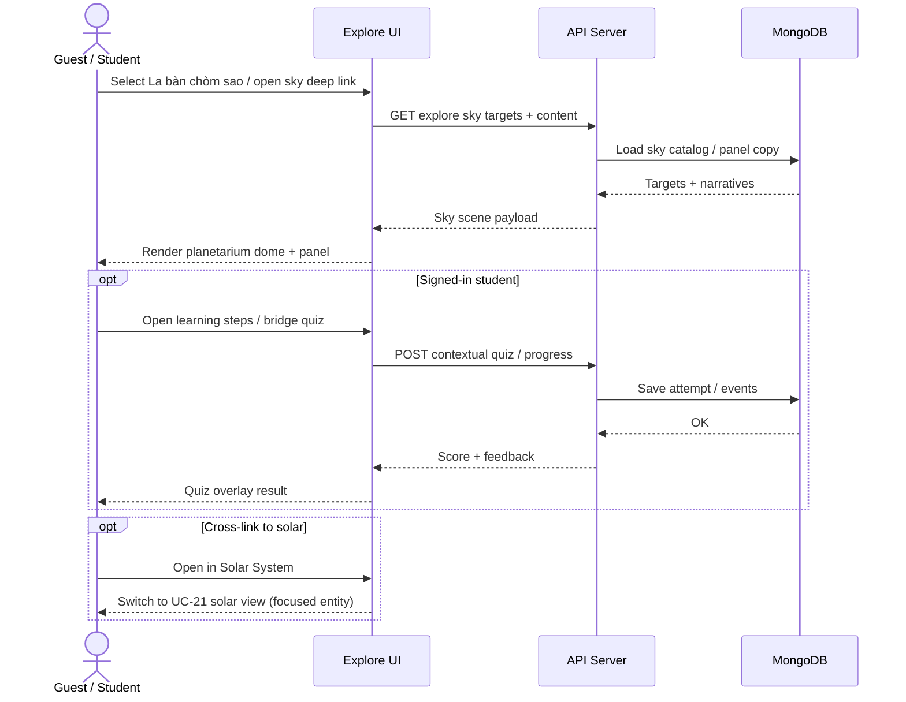
```mermaid
sequenceDiagram
    actor User as Guest / Student
    participant UI as Explore UI
    participant API as API Server
    participant DB as MongoDB

    User->>UI: Select La bàn chòm sao / open sky deep link
    UI->>API: GET explore sky targets + content
    API->>DB: Load sky catalog / panel copy
    DB-->>API: Targets + narratives
    API-->>UI: Sky scene payload
    UI-->>User: Render planetarium dome + panel
    opt Signed-in student
        User->>UI: Open learning steps / bridge quiz
        UI->>API: POST contextual quiz / progress
        API->>DB: Save attempt / events
        DB-->>API: OK
        API-->>UI: Score + feedback
        UI-->>User: Quiz overlay result
    end
    opt Cross-link to solar
        User->>UI: Open in Solar System
        UI-->>User: Switch to UC-21 solar view (focused entity)
    end
```

---

## UC-28 Browse Community / News

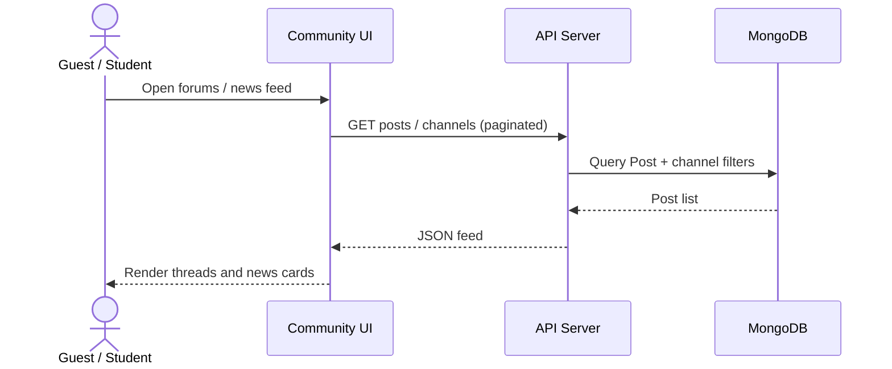
```mermaid
sequenceDiagram
    actor User as Guest / Student
    participant UI as Community UI
    participant API as API Server
    participant DB as MongoDB

    User->>UI: Open forums / news feed
    UI->>API: GET posts / channels (paginated)
    API->>DB: Query Post + channel filters
    DB-->>API: Post list
    API-->>UI: JSON feed
    UI-->>User: Render threads and news cards
```

---

## UC-29 Post & Comment

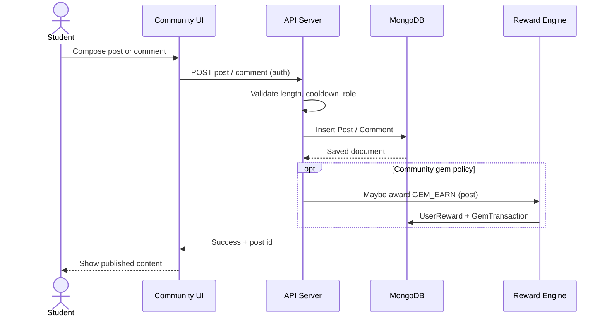
```mermaid
sequenceDiagram
    actor Student
    participant UI as Community UI
    participant API as API Server
    participant DB as MongoDB
    participant Rewards as Reward Engine

    Student->>UI: Compose post or comment
    UI->>API: POST post / comment (auth)
    API->>API: Validate length, cooldown, role
    API->>DB: Insert Post / Comment
    DB-->>API: Saved document
    opt Community gem policy
        API->>Rewards: Maybe award GEM_EARN (post)
        Rewards->>DB: UserReward + GemTransaction
    end
    API-->>UI: Success + post id
    UI-->>Student: Show published content
```

---

## UC-30 Report Content

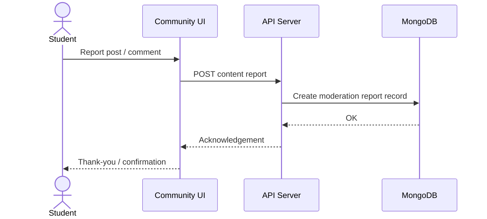
```mermaid
sequenceDiagram
    actor Student
    participant UI as Community UI
    participant API as API Server
    participant DB as MongoDB

    Student->>UI: Report post / comment
    UI->>API: POST content report
    API->>DB: Create moderation report record
    DB-->>API: OK
    API-->>UI: Acknowledgement
    UI-->>Student: Thank-you / confirmation
```

---

## UC-32 Direct Messages

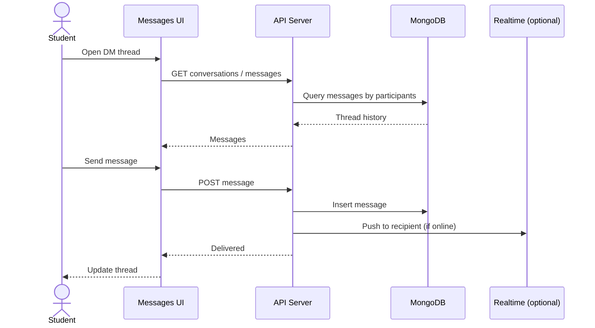
```mermaid
sequenceDiagram
    actor Student
    participant UI as Messages UI
    participant API as API Server
    participant DB as MongoDB
    participant RT as Realtime (optional)

    Student->>UI: Open DM thread
    UI->>API: GET conversations / messages
    API->>DB: Query messages by participants
    DB-->>API: Thread history
    API-->>UI: Messages
    Student->>UI: Send message
    UI->>API: POST message
    API->>DB: Insert message
    API->>RT: Push to recipient (if online)
    API-->>UI: Delivered
    UI-->>Student: Update thread
```

---

## UC-33 Gem Shop & Avatar

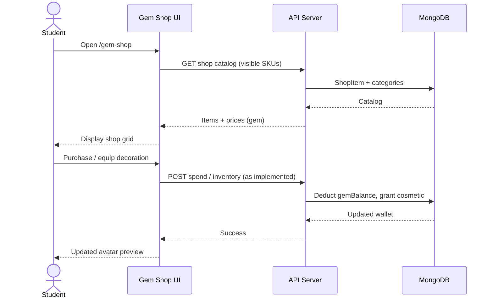
```mermaid
sequenceDiagram
    actor Student
    participant UI as Gem Shop UI
    participant API as API Server
    participant DB as MongoDB

    Student->>UI: Open /gem-shop
    UI->>API: GET shop catalog (visible SKUs)
    API->>DB: ShopItem + categories
    DB-->>API: Catalog
    API-->>UI: Items + prices (gem)
    UI-->>Student: Display shop grid
    Student->>UI: Purchase / equip decoration
    UI->>API: POST spend / inventory (as implemented)
    API->>DB: Deduct gemBalance, grant cosmetic
    DB-->>API: Updated wallet
    API-->>UI: Success
    UI-->>Student: Updated avatar preview
```

---

## UC-34 Earn & Spend Gems

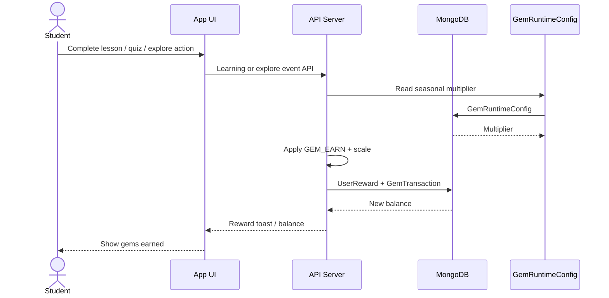
```mermaid
sequenceDiagram
    actor Student
    participant UI as App UI
    participant API as API Server
    participant DB as MongoDB
    participant CFG as GemRuntimeConfig

    Student->>UI: Complete lesson / quiz / explore action
    UI->>API: Learning or explore event API
    API->>CFG: Read seasonal multiplier
    CFG->>DB: GemRuntimeConfig
    DB-->>CFG: Multiplier
    API->>API: Apply GEM_EARN + scale
    API->>DB: UserReward + GemTransaction
    DB-->>API: New balance
    API-->>UI: Reward toast / balance
    UI-->>Student: Show gems earned
```

---

## UC-36 View Notifications

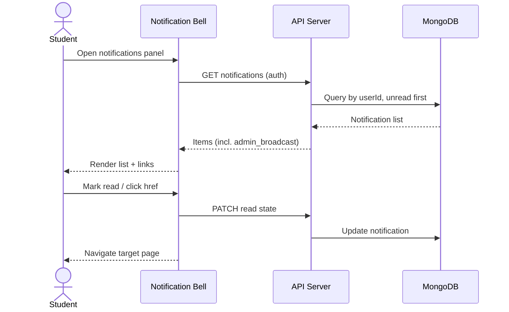
```mermaid
sequenceDiagram
    actor Student
    participant UI as Notification Bell
    participant API as API Server
    participant DB as MongoDB

    Student->>UI: Open notifications panel
    UI->>API: GET notifications (auth)
    API->>DB: Query by userId, unread first
    DB-->>API: Notification list
    API-->>UI: Items (incl. admin_broadcast)
    UI-->>Student: Render list + links
    Student->>UI: Mark read / click href
    UI->>API: PATCH read state
    API->>DB: Update notification
    UI-->>Student: Navigate target page
```

---

## UC-40 Manage Cohort

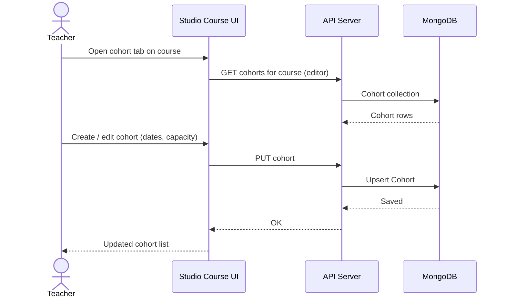
```mermaid
sequenceDiagram
    actor Teacher
    participant UI as Studio Course UI
    participant API as API Server
    participant DB as MongoDB

    Teacher->>UI: Open cohort tab on course
    UI->>API: GET cohorts for course (editor)
    API->>DB: Cohort collection
    DB-->>API: Cohort rows
    Teacher->>UI: Create / edit cohort (dates, capacity)
    UI->>API: PUT cohort
    API->>DB: Upsert Cohort
    DB-->>API: Saved
    API-->>UI: OK
    UI-->>Teacher: Updated cohort list
```

---

## UC-42 Manage Learning Path

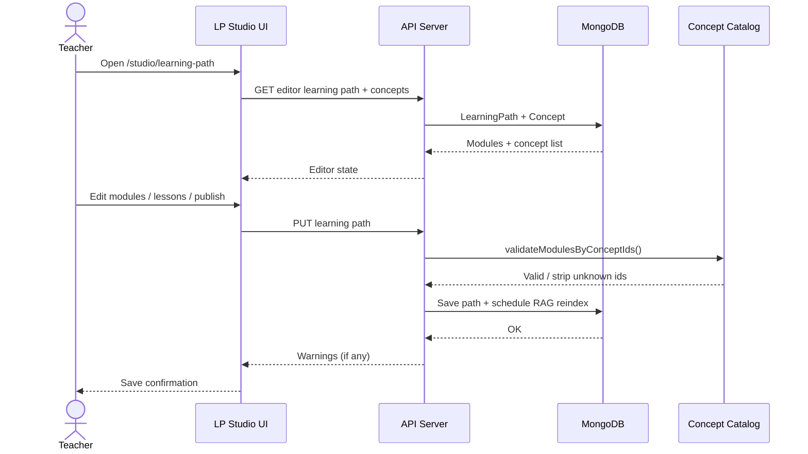
```mermaid
sequenceDiagram
    actor Teacher
    participant UI as LP Studio UI
    participant API as API Server
    participant DB as MongoDB
    participant Concepts as Concept Catalog

    Teacher->>UI: Open /studio/learning-path
    UI->>API: GET editor learning path + concepts
    API->>DB: LearningPath + Concept
    DB-->>API: Modules + concept list
    API-->>UI: Editor state
    Teacher->>UI: Edit modules / lessons / publish
    UI->>API: PUT learning path
    API->>Concepts: validateModulesByConceptIds()
    Concepts-->>API: Valid / strip unknown ids
    API->>DB: Save path + schedule RAG reindex
    DB-->>API: OK
    API-->>UI: Warnings (if any)
    UI-->>Teacher: Save confirmation
```

---

## UC-45 Manage User

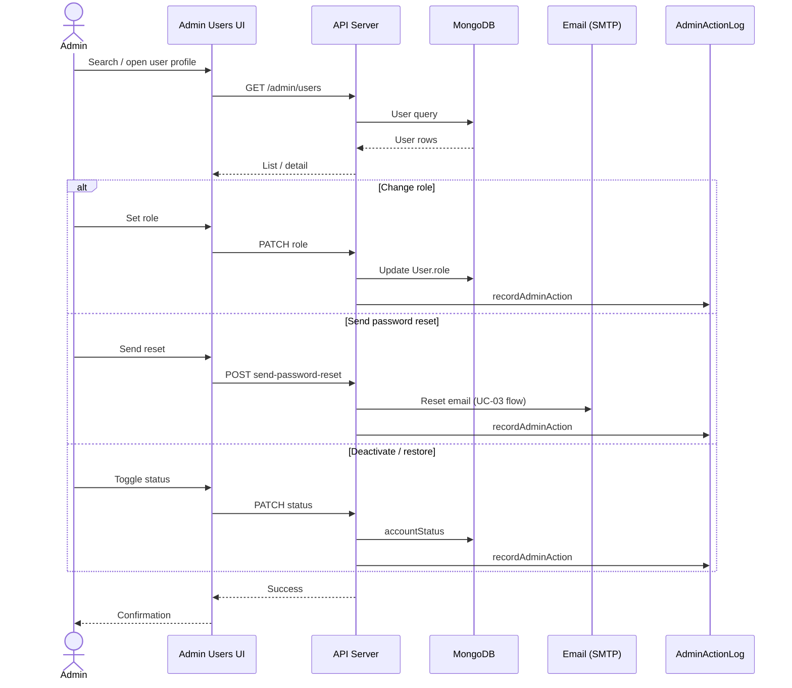
```mermaid
sequenceDiagram
    actor Admin
    participant UI as Admin Users UI
    participant API as API Server
    participant DB as MongoDB
    participant Mail as Email (SMTP)
    participant Audit as AdminActionLog

    Admin->>UI: Search / open user profile
    UI->>API: GET /admin/users
    API->>DB: User query
    DB-->>API: User rows
    API-->>UI: List / detail
    alt Change role
        Admin->>UI: Set role
        UI->>API: PATCH role
        API->>DB: Update User.role
        API->>Audit: recordAdminAction
    else Send password reset
        Admin->>UI: Send reset
        UI->>API: POST send-password-reset
        API->>Mail: Reset email (UC-03 flow)
        API->>Audit: recordAdminAction
    else Deactivate / restore
        Admin->>UI: Toggle status
        UI->>API: PATCH status
        API->>DB: accountStatus
        API->>Audit: recordAdminAction
    end
    API-->>UI: Success
    UI-->>Admin: Confirmation
```

---

## UC-46 Manage Order

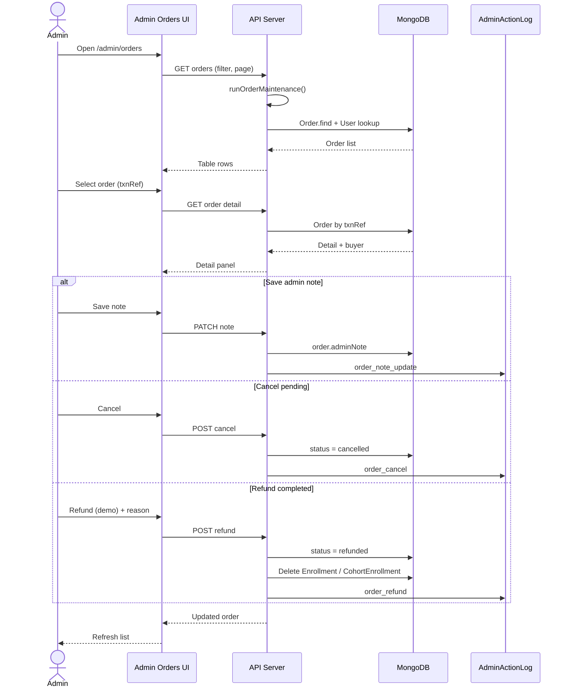
```mermaid
sequenceDiagram
    actor Admin
    participant UI as Admin Orders UI
    participant API as API Server
    participant DB as MongoDB
    participant Audit as AdminActionLog

    Admin->>UI: Open /admin/orders
    UI->>API: GET orders (filter, page)
    API->>API: runOrderMaintenance()
    API->>DB: Order.find + User lookup
    DB-->>API: Order list
    API-->>UI: Table rows
    Admin->>UI: Select order (txnRef)
    UI->>API: GET order detail
    API->>DB: Order by txnRef
    DB-->>API: Detail + buyer
    API-->>UI: Detail panel
    alt Save admin note
        Admin->>UI: Save note
        UI->>API: PATCH note
        API->>DB: order.adminNote
        API->>Audit: order_note_update
    else Cancel pending
        Admin->>UI: Cancel
        UI->>API: POST cancel
        API->>DB: status = cancelled
        API->>Audit: order_cancel
    else Refund completed
        Admin->>UI: Refund (demo) + reason
        UI->>API: POST refund
        API->>DB: status = refunded
        API->>DB: Delete Enrollment / CohortEnrollment
        API->>Audit: order_refund
    end
    API-->>UI: Updated order
    UI-->>Admin: Refresh list
```

---

## UC-48 Manage Gem Economy

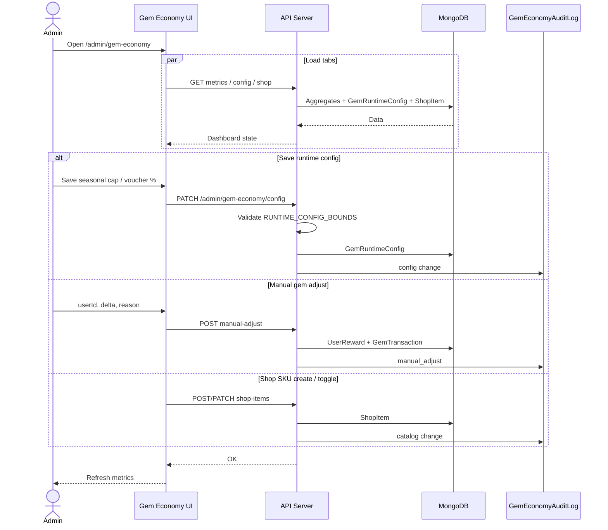
```mermaid
sequenceDiagram
    actor Admin
    participant UI as Gem Economy UI
    participant API as API Server
    participant DB as MongoDB
    participant Audit as GemEconomyAuditLog

    Admin->>UI: Open /admin/gem-economy
    par Load tabs
        UI->>API: GET metrics / config / shop
        API->>DB: Aggregates + GemRuntimeConfig + ShopItem
        DB-->>API: Data
        API-->>UI: Dashboard state
    end
    alt Save runtime config
        Admin->>UI: Save seasonal cap / voucher %
        UI->>API: PATCH /admin/gem-economy/config
        API->>API: Validate RUNTIME_CONFIG_BOUNDS
        API->>DB: GemRuntimeConfig
        API->>Audit: config change
    else Manual gem adjust
        Admin->>UI: userId, delta, reason
        UI->>API: POST manual-adjust
        API->>DB: UserReward + GemTransaction
        API->>Audit: manual_adjust
    else Shop SKU create / toggle
        UI->>API: POST/PATCH shop-items
        API->>DB: ShopItem
        API->>Audit: catalog change
    end
    API-->>UI: OK
    UI-->>Admin: Refresh metrics
```

---

## UC-49 Promo & Broadcast

### A — Create promo code

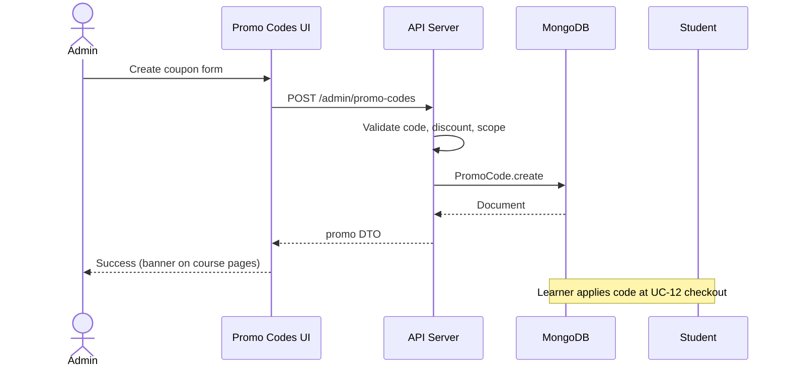
```mermaid
sequenceDiagram
    actor Admin
    participant UI as Promo Codes UI
    participant API as API Server
    participant DB as MongoDB

    Admin->>UI: Create coupon form
    UI->>API: POST /admin/promo-codes
    API->>API: Validate code, discount, scope
    API->>DB: PromoCode.create
    DB-->>API: Document
    API-->>UI: promo DTO
    UI-->>Admin: Success (banner on course pages)
    Note over Student,DB: Learner applies code at UC-12 checkout
```

### B — Broadcast notification

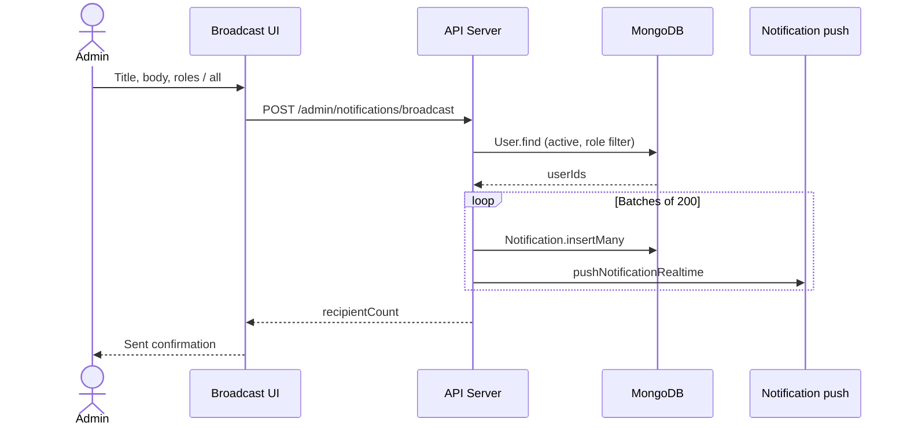
```mermaid
sequenceDiagram
    actor Admin
    participant UI as Broadcast UI
    participant API as API Server
    participant DB as MongoDB
    participant RT as Notification push

    Admin->>UI: Title, body, roles / all
    UI->>API: POST /admin/notifications/broadcast
    API->>DB: User.find (active, role filter)
    DB-->>API: userIds
    loop Batches of 200
        API->>DB: Notification.insertMany
        API->>RT: pushNotificationRealtime
    end
    API-->>UI: recipientCount
    UI-->>Admin: Sent confirmation
```

---

## UC-50 Platform Analytics, Audit & System

### A — Platform analytics (main flow)

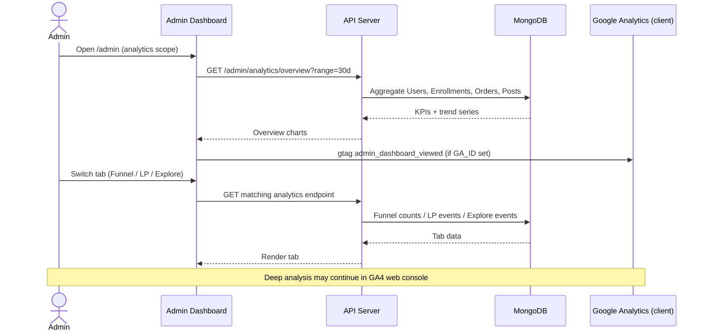
```mermaid
sequenceDiagram
    actor Admin
    participant UI as Admin Dashboard
    participant API as API Server
    participant DB as MongoDB
    participant GA as Google Analytics (client)

    Admin->>UI: Open /admin (analytics scope)
    UI->>API: GET /admin/analytics/overview?range=30d
    API->>DB: Aggregate Users, Enrollments, Orders, Posts
    DB-->>API: KPIs + trend series
    API-->>UI: Overview charts
    UI->>GA: gtag admin_dashboard_viewed (if GA_ID set)
    Admin->>UI: Switch tab (Funnel / LP / Explore)
    UI->>API: GET matching analytics endpoint
    API->>DB: Funnel counts / LP events / Explore events
    DB-->>API: Tab data
    API-->>UI: Render tab
    Note over Admin,GA: Deep analysis may continue in GA4 web console
```

### B — Audit log

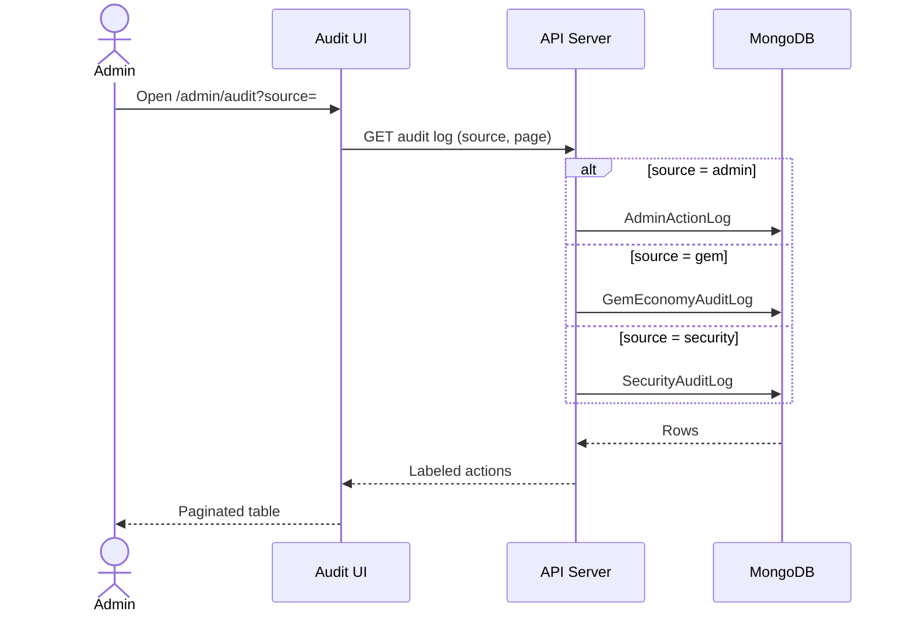
```mermaid
sequenceDiagram
    actor Admin
    participant UI as Audit UI
    participant API as API Server
    participant DB as MongoDB

    Admin->>UI: Open /admin/audit?source=
    UI->>API: GET audit log (source, page)
    alt source = admin
        API->>DB: AdminActionLog
    else source = gem
        API->>DB: GemEconomyAuditLog
    else source = security
        API->>DB: SecurityAuditLog
    end
    DB-->>API: Rows
    API-->>UI: Labeled actions
    UI-->>Admin: Paginated table
```

### C — System status & news crawl

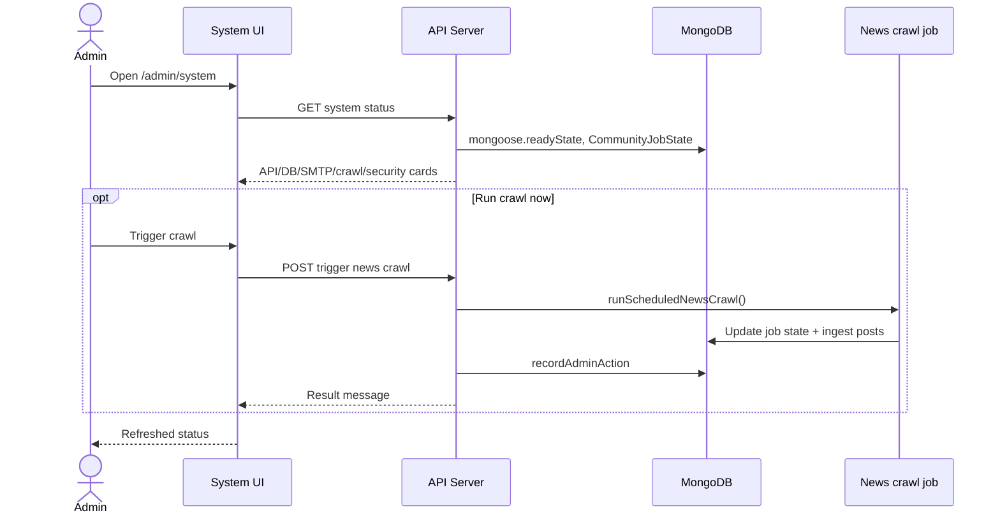
```mermaid
sequenceDiagram
    actor Admin
    participant UI as System UI
    participant API as API Server
    participant DB as MongoDB
    participant Job as News crawl job

    Admin->>UI: Open /admin/system
    UI->>API: GET system status
    API->>DB: mongoose.readyState, CommunityJobState
    API-->>UI: API/DB/SMTP/crawl/security cards
    opt Run crawl now
        Admin->>UI: Trigger crawl
        UI->>API: POST trigger news crawl
        API->>Job: runScheduledNewsCrawl()
        Job->>DB: Update job state + ingest posts
        API->>DB: recordAdminAction
        API-->>UI: Result message
    end
    UI-->>Admin: Refreshed status
```

---

## Export tips

- VS Code: Markdown Preview Mermaid Support → export PNG.
- [mermaid.live](https://mermaid.live): paste diagram → PNG/SVG for Word.
- Keep actor on the left; solid arrows = synchronous calls; dashed = returns.
