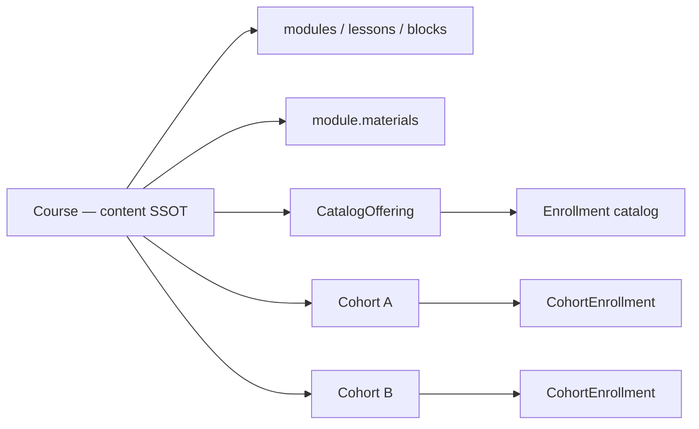

# Course Delivery — Content SSOT vs Delivery Layer

Tài liệu chốt kiến trúc: **Course = nội dung tĩnh (SSOT)**; **phân phối** tách qua Catalog offering và Cohort. Quiz/assignment có route và lifecycle production-grade.

> **Tham khảo LMS (Moodle / syllabus theo ngày)** — *chỉ tham khảo pattern*, không copy UI hay model. Triển khai theo `features/courses/*`, design system Galaxies, API hiện có.

---

## 0. Tham khảo → map Galaxies (reference only)

| Pattern tham khảo | Cách làm của chúng ta |
|-------------------|------------------------|
| Day N + Opened/Due | `Cohort` + `CohortScheduleOverride` (UTC); UI timeline tại `/cohort/[cohortId]` |
| Assignment + deadline | `lesson.type: assignment` + schedule override theo cohort |
| Folder Slides | `module.materials[]` trên **Course** (content), không duplicate course |
| Quiz + Opened/Closed | `quizSettings` + override schedule; trang exam (route §4) |

---

## 1. Tách Content và Delivery (không gắn `deliveryMode` lên Course)

### 1.1 Vấn đề với `Course.deliveryMode`

Một khóa (vd. Lập trình React) vừa bán **tự học quanh năm** vừa mở **nhiều lớp theo kỳ** → nếu `deliveryMode` nằm trên `Course`, phải **duplicate** toàn bộ modules/lessons → mất SSOT.

### 1.2 Mô hình đúng



| Layer | Entity | Trách nhiệm |
|-------|--------|-------------|
| **Content** | `Course` | Modules, lessons, blocks, `quizQuestions`, `quizSettings` *mặc định*, assignment *brief mặc định* — **không** roster, **không** deadline lớp |
| **Catalog delivery** | `CatalogOffering` (hoặc flags trên course: `catalogEnabled`, `price`, `published`) | “Mở mặc định” — enroll bất cứ lúc nào; progress `Enrollment` như hiện tại |
| **Cohort delivery** | `Cohort` | `courseId` (ref), `title`, `startAt`/`endAt`, `timezone` (GV), `status`, roster qua `CohortEnrollment` |
| **Override lịch** | `CohortActivitySchedule` | Per `(cohortId, lessonSlug)`: `openAt`, `dueAt`, `closeAt` — **UTC ISO** (§6) |

**Một Course, nhiều Cohort, một Catalog:** Studio chỉ sửa **một** bản content; GV tạo cohort mới trỏ cùng `courseId`, chỉnh lịch/deadline trên layer delivery.

```typescript
// Course — content only (không deliveryMode)
interface Course {
  id: string
  slug: string
  title: string
  modules: CourseModule[]
  lessons: Lesson[]
  // quizSettings mặc định trên lesson; cohort có thể override schedule, không duplicate câu hỏi
}

interface CatalogOffering {
  courseId: string
  enabled: boolean
  isPaid: boolean
  price: number
  currency: string
  published: boolean
}

interface Cohort {
  id: string
  courseId: string          // SSOT content
  title: string
  startAt: string           // UTC ISO
  endAt: string
  timezone: string          // IANA, vd. 'Asia/Ho_Chi_Minh' — dùng khi GV nhập lịch local
  status: 'draft' | 'open' | 'closed'
  inviteCode?: string
}

interface CohortActivitySchedule {
  cohortId: string
  lessonSlug: string
  openAt?: string | null    // UTC
  dueAt?: string | null
  closeAt?: string | null
}
```

### 1.3 `effectiveSchedule` — một query, O(1) trên RAM (tránh N+1)

**Rủi ro:** Syllabus cohort ~30–50 lesson; gọi `find({ cohortId, lessonSlug })` **từng lesson** → N+1, trang load chậm.

**Chuẩn:** Một lần load toàn bộ override của cohort, build `Map` trên RAM.

```javascript
// services/api/features/courses/services/scheduleResolver.js

/** @param {Record<string, CohortActivitySchedule>} scheduleByLessonSlug */
function effectiveSchedule(lesson, scheduleByLessonSlug) {
  const override = scheduleByLessonSlug[lesson.slug]
  return {
    openAt: override?.openAt ?? lesson.quizSettings?.defaultOpenAt ?? lesson.defaultOpenAt ?? null,
    dueAt: override?.dueAt ?? lesson.defaultDueAt ?? null,
    closeAt: override?.closeAt ?? lesson.quizSettings?.defaultCloseAt ?? null,
  }
}

async function buildCohortSyllabusPayload({ cohortId, course }) {
  const schedules = await CohortActivitySchedule.find({ cohortId }).lean()
  const scheduleByLessonSlug = Object.fromEntries(
    schedules.map((s) => [s.lessonSlug, s])
  )
  const now = new Date()
  return course.lessons.map((lesson) => {
    const schedule = effectiveSchedule(lesson, scheduleByLessonSlug)
    return {
      ...lessonOutlineFields(lesson),
      schedule,
      access: computeAccess(schedule, now), // 'open' | 'locked' | 'closed'
    }
  })
}
```

| Endpoint | Query pattern |
|----------|----------------|
| `GET /api/cohorts/:id/syllabus` | `Course` (1) + `CohortActivitySchedule.find({ cohortId })` (1) + enroll guard (1) |
| Catalog listing | Không cần schedule map — `access: 'open'` mặc định |

---

## 2. Cấu trúc nội dung (Course / Studio)

### 2.1 Module + tài liệu tuần

- `module.materials[]` — PDF/slide/link (content, không phụ thuộc cohort).
- Cohort **không** copy materials — chỉ override **khi nào** module/lesson được mở (`CohortModuleUnlock` optional nếu cần granular hơn `CohortActivitySchedule`).

### 2.2 Lesson types

| `lesson.type` | Ghi chú |
|---------------|---------|
| `text` / `visualization` | Player catalog hoặc cohort hub |
| `quiz` | Trang exam (§3–§4) |
| `assignment` | Trang nộp bài (§5) |
| `live_session` | Chỉ meaningful trong cohort (link Meet/Zoom trên lesson content + `scheduledAt` override) |

---

## 3. Quiz — UX “chọn hết → sửa tự do → nộp”, lifecycle & bảo mật đáp án

### 3.1 Nguyên tắc UX (tránh race autosave từng câu)

**Không** PATCH mỗi lần click đáp án (dễ race Request 2 đến sau Request 1).

**Mô hình chính:**

- Một màn exam: học sinh **chọn/sửa mọi câu** cho đến khi **Nộp bài** hoặc **hết giờ → tự nộp**.
- **Thanh điều hướng câu** (question palette): ô 1…N — trạng thái `empty` | `answered` | `flagged`; click nhảy tới câu (không lùi Next/Prev liên tục).
- Timer (nếu `timeLimitMinutes`): đồng hồ đếm ngược; `expiresAt` server → client gọi `POST submit` hoặc server auto-submit khi hết giờ.
- `maxAttempts`: chỉ trừ khi `submitted` / `timed_out`; `in_progress` = tiếp tục lượt cũ.

```text
┌─────────────────────────────────────────────────────────┐
│  ⏱ 12:34    Câu 5 / 10    [Nộp bài]                   │
├─────────────────────────────────────────────────────────┤
│  [1][2][3][4][■5][6][7][8][9][10]  ← palette           │
├─────────────────────────────────────────────────────────┤
│  Nội dung câu 5 + các lựa chọn (chưa có đáp án đúng)   │
│  ○ A  ○ B  ● C  ○ D                                    │
└─────────────────────────────────────────────────────────┘
```

**Checkpoint (resume F5) — tùy chọn, không thay UX:**

- `PATCH .../attempts/:id/checkpoint` gửi **toàn bộ** `answers` + `revision` (integer tăng dần) mỗi ~30s hoặc `visibilitychange`.
- Server: `if (revision <= attempt.revision) return 409 stale` — loại request trễ mạng.
- Không bắt buộc P0 nếu chỉ `POST submit` + lưu attempt lúc start; checkpoint khuyến nghị P1 khi có timer dài.

### 3.2 Schema `QuizAttempt`

```typescript
interface QuizAttempt {
  id: string
  userId: string
  courseId: string
  lessonSlug: string
  cohortId: string | null
  answers: Record<string, number | string>   // questionId → lựa chọn
  lockedQuestionIds?: string[]             // chỉ dùng khi revealMode + confirm từng câu
  status: 'in_progress' | 'submitted' | 'timed_out'
  revision: number                         // checkpoint monotonic
  startedAt: string
  lastSavedAt?: string
  submittedAt?: string
  expiresAt?: string | null
  score?: number
}
```

### 3.3 API exam (không lộ đáp án)

| Endpoint | Payload |
|----------|---------|
| `GET .../exam/[lessonSlug]/session` | `questions[]`: `{ id, question, options[] }` — **không** `correctIndex`, **không** `explanation` |
| `GET .../attempts/active` | Resume `answers`, `revision`, `expiresAt`, palette state |
| `PATCH .../attempts/:id/checkpoint` | `{ answers, revision }` — full snapshot (optional) |
| `POST .../attempts/:id/submit` | `{ answers }` — chấm server-side, trả điểm + reveal theo mode |
| `POST .../attempts/:id/confirm-question` | Chỉ khi `revealMode: 'after_each_question'` + HS bấm “Xác nhận câu này” |

**`after_each_question` + palette UX:**

- Trước khi “Xác nhận”, câu đó **sửa được** (nhảy palette qua lại).
- `confirm-question` → server khóa `questionId` trong `lockedQuestionIds`, trả `{ correct, explanation? }` — **lần đầu** client biết đúng/sai câu đó.
- Các câu chưa confirm: vẫn không lộ đáp án trong Network tab.

**`after_submit` / `never`:** mọi đáp án đúng chỉ trong response `POST submit` (hoặc `GET result` sau submit).

### 3.4 Hành vi server

| Sự kiện | Server |
|---------|--------|
| Bắt đầu | `POST .../attempts` → `in_progress`, set `expiresAt` nếu có timer |
| Làm bài | Client giữ state local; optional checkpoint full `answers` |
| Hết giờ | Job hoặc lazy check: auto `submit` answers hiện có → `timed_out` nếu trống |
| Nộp tay | `POST submit` → validate window schedule, chấm, `submitted` |
| F5 | `GET active` → hydrate palette + answers |

### 3.5 Quiz settings (trên lesson content)

```typescript
interface QuizLessonSettings {
  revealMode: 'after_submit' | 'after_each_question' | 'never'
  timeLimitMinutes?: number | null
  maxAttempts?: number | null
  shuffleOptions?: boolean
  passingScorePct?: number | null
  // schedule mặc định (UTC); cohort override qua CohortActivitySchedule
  defaultOpenAt?: string | null
  defaultCloseAt?: string | null
}
```

---

## 4. Routes — cohort lồng trong path (không `?cohortId=`)

**Vấn đề:** `?cohortId=xxx` dễ sót, dễ giả mạo (nộp bài hộ lớp khác).

**Chuẩn:**

```
# Catalog — self-paced (cohortId = null ở API)
client/src/app/courses/[slug]/
  page.tsx
  exam/[lessonSlug]/page.tsx
  assignment/[lessonSlug]/page.tsx

# Cohort — cohortId từ segment, layout validate membership
client/src/app/courses/[slug]/cohort/[cohortId]/
  layout.tsx              # load cohort + CohortEnrollment guard
  page.tsx                # timeline syllabus
  exam/[lessonSlug]/page.tsx
  assignment/[lessonSlug]/page.tsx
```

**Backend:** mọi `POST/PATCH` attempt & submission **bắt buộc** `cohortId` từ route param (cohort tree) hoặc explicit `null` + catalog enrollment check (catalog tree). **Không** tin `cohortId` từ body/query nếu mâu thuẫn với URL.

```typescript
// features/courses/exam/ExamContext.tsx — cohort layout provide
{ mode: 'catalog' | 'cohort', cohortId: string | null, courseSlug, lessonSlug }
```

---

## 5. Assignment upload — staging, MIME, dọn rác

### 5.1 Submission schema

```typescript
interface AssignmentSubmission {
  id: string
  cohortId: string | null   // catalog optional: null + Enrollment
  userId: string
  courseId: string
  lessonSlug: string
  status: 'draft' | 'submitted' | 'graded'
  files: SubmissionFile[]   // chỉ file đã commit khi submit
  note?: string
  submittedAt?: string      // UTC
  isLate?: boolean          // server: submittedAt > effectiveDueAt (UTC)
  grade?: number | null
  feedback?: string
}

interface SubmissionFile {
  storageKey: string
  url: string
  name: string
  mime: string              // từ magic-byte detect
  size: number
  uploadedAt: string
}
```

### 5.2 Hai phase upload (tránh file rác)

1. **Staging:** `POST /upload` với `purpose: assignment-staging`, `stagingSessionId`, trả `storageKey` tạm.
2. **Draft submission:** lưu `stagingFiles[]` trên submission `draft` (+ `stagingExpiresAt` per file, default now+24h).
3. **Submit:** `POST .../submissions/:id/validate-files` rồi promote → `files[]`; `status: submitted`.
4. **Cron (24h):** `cleanupOrphanUploads.js` — xem §5.4.

### 5.4 Cleanup đồng bộ DB + UX draft hết hạn

**Rủi ro:** Worker xóa S3 nhưng `AssignmentSubmission.draft.stagingFiles[]` vẫn trỏ URL chết → nộp bài lỗi.

**Worker phải:**

1. Xóa object storage orphan (staging > 24h, chưa `submitted`).
2. **Đồng thời** cập nhật mọi `AssignmentSubmission` `status: 'draft'`: gỡ file khỏi `stagingFiles` hoặc set `file.status = 'expired'`.
3. (Optional) set `draft.stagingExpired: true` để FE hiện banner ngay khi mở trang.

**Trước khi Submit (FE + API):**

```typescript
// GET .../submissions/draft → { files: [{ storageKey, status: 'ok' | 'expired' }] }
// POST .../submissions/:id/submit
//   → server headObject từng key; nếu thiếu → 409 STAGING_FILE_EXPIRED
```

Frontend: khi mở draft cũ hoặc trước nút **Nộp bài**, gọi `validate-files`; nếu có `expired` → *"File nháp đã quá hạn, vui lòng tải lên lại"* (không silent fail).

### 5.5 Bảo mật MIME

| Tầng | Việc |
|------|------|
| Client | `accept` gợi ý UX only |
| API | `file-type` (magic bytes) + allowlist MIME; **không** tin extension |
| Lưu trữ | Key path `{cohortId|catalog}/{userId}/{submissionId}/` — không execute |

---

## 6. Timezone (UTC SSOT, hiển thị local)

| Quy tắc | Chi tiết |
|---------|----------|
| **Lưu DB** | Mọi `openAt`, `dueAt`, `closeAt`, `submittedAt` → **UTC ISO 8601** (`2026-05-30T16:59:59.000Z`) |
| **GV nhập lịch** | UI datetime theo `cohort.timezone` (mặc định `Asia/Ho_Chi_Minh`); API convert local → UTC trước khi ghi `CohortActivitySchedule` |
| **HS xem** | Format `vi-VN` + timezone cohort (hoặc browser) — chỉ presentation |
| **So sánh Muộn** | `submittedAt > dueAt` hoàn toàn trên UTC — không so sánh string local |
| **Quiz timer** | `expiresAt` tính trên server UTC; client đồng hồ chỉ hiển thị |

```javascript
// API — ví dụ convert khi GV save schedule
const { zonedTimeToUtc } = require('date-fns-tz')
const dueAtUtc = zonedTimeToUtc(localInput, cohort.timezone).toISOString()
```

---

## 7. Feature folders & API (modular monolith)

```
client/src/features/courses/
  content/          # scheduleResolver, effectiveSchedule(map)
  catalog/          # offering, Enrollment player
  cohort/           # hub, syllabus (batch schedule)
  exam/             # ExamRunner, question palette, submit/checkpoint
  assignments/      # staging upload, validate-files, submit

services/api/features/courses/
  models/Course.js              # content only
  models/CatalogOffering.js     # optional tách collection
  models/Cohort.js
  models/CohortActivitySchedule.js
  models/QuizAttempt.js
  models/AssignmentSubmission.js
  routes/cohorts.js
  routes/quizAttempts.js
  routes/assignments.js
  workers/cleanupOrphanUploads.js
```

---

## 8. Lộ trình (cập nhật)

| Phase | Phạm vi | Trạng thái |
|-------|---------|------------|
| **P0** | Exam page + palette + submit; session không lộ đáp án; `QuizAttempt`; module materials Studio + learner | **done** |
| **P1** | Cohort + schedules + nested routes; assignment staging; checkpoint/revision; confirm-question; magic MIME; validate-files | **done** |
| **P2** | `catalogEnabled` (thay `CatalogOffering` riêng); cohort layout guard; teacher inbox; Studio cohorts | **done** |
| **P3** | Cron `cleanup:assignment-staging` + S3 delete; in-app notifications (join, nộp, chấm); `date-fns-tz` lịch GV | **done** |
| **P4** | Agent teacher tự chấm / nhắc hạn (xem `learning-agent-system.md`) | backlog |

---

## 9. Audit changelog (review 2026-05-21)

| # | Phản biện | Thay đổi trong doc |
|---|-----------|-------------------|
| 1 | Course + deliveryMode → duplicate content | **§1** Content vs Delivery; `Cohort.courseId`; `CohortActivitySchedule` |
| 2 | Quiz F5 mất tiến độ | **§3** palette + checkpoint `revision` / resume |
| 3 | `?cohortId` không an toàn | **§4** nested `/cohort/[cohortId]/...` + layout guard |
| 4 | File rác + MIME giả | **§5** staging upload + cron + magic bytes |
| 5 | Deadline lệch TZ | **§6** UTC store, cohort TZ on input |
| 6 | N+1 `effectiveSchedule` | **§1.3** batch `CohortActivitySchedule` → map |
| 7 | Autosave race | **§3.1** palette + full submit; checkpoint + `revision` optional |
| 8 | F12 lộ đáp án | **§3.3** strip correctIndex; `confirm-question` / post-submit reveal |
| 9 | Draft file deleted, DB còn ref | **§5.4** worker sync draft + `validate-files` |

---

## 10. Implementation map (code)

| Khu vực | Path |
|---------|------|
| Quiz API | `services/api/features/courses/routes/deliveryQuiz.js` |
| Assignment API | `routes/deliveryAssignments.js`, `lib/assignmentMime.js`, `services/assignmentStaging.js` |
| Cohort API | `routes/cohorts.js`, `services/scheduleResolver.js`, `services/scheduleTz.js` |
| Worker | `workers/cleanupOrphanUploads.js` — `npm run cleanup:assignment-staging` |
| Upload HS | `POST /upload/assignment-staging` (`features/media/index.js`) |
| Client exam | `client/src/features/courses/exam/ExamRunner.tsx` |
| Client cohort | `cohort/CohortHub.tsx`, `cohort/CohortStudioManager.tsx`, `app/courses/.../cohort/[cohortId]/layout.tsx` |
| Notifications | `services/deliveryNotifications.js` |

---

*SSOT kiến trúc delivery — cập nhật 2026-05-21 (scope P0–P3 implemented).*
