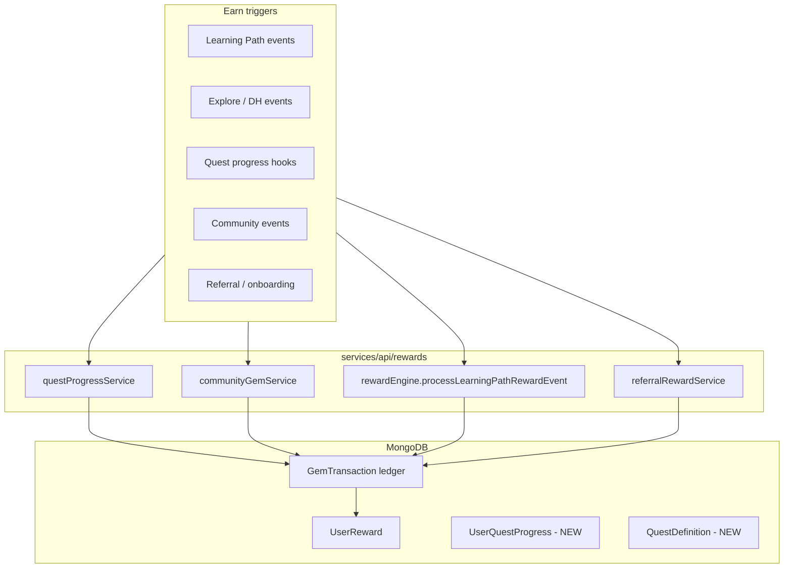

# Gem Economy Expansion — Quest · Community · Referral

Tài liệu thiết kế cho các **missing features** đã được ghi nhận concern trong audit gem (2026-05-29).  
**Chưa implement** — dùng làm spec trước khi mở PR.

---

## 0. Concerns đã ghi nhận (tóm tắt)

| Feature | Concern chính | Mitigation trong thiết kế |
|---------|---------------|---------------------------|
| **Daily/weekly quests** | Inflation nếu reward quá cao; trùng streak/achievement | Cap quest gem/tuần; quest chỉ **bổ sung** streak, không thay |
| **Forum gem** | Spam post, vote ring, moderation load | Rate limit + cap/ngày; chỉ reward post/answer **được duyệt hoặc marked helpful** |
| **Referral / onboarding** | Sybil accounts, self-referral | Reward sau **verified action** (email + 1 bài LP); 1 referral/active user cap |
| **Achievement gemBonus** | Engine chưa đọc field (ngoài scope gap G1–G8) | Phase Q0: wire `gemBonus` trong `checkAchievements` trước quest |

---

## 1. Kiến trúc chung

**Nguyên tắc giữ nguyên từ audit:**

- Server là SSOT; mọi earn → `GemTransaction` + atomic `$inc` wallet.
- UI chỉ hiển thị sau khi có tx server (không fake local earn).
- Mọi earn mới cần `reason` enum + dedup key (userId + reason + scope id + window).

---

## 2. Quest system (daily / weekly)

### 2.1 Mục tiêu

- **Retention hàng ngày:** “Hôm nay còn 2 quest chưa xong” — lý do quay lại cụ thể hơn streak.
- Không thay achievement (milestone dài hạn) hay streak (continuity).

### 2.2 Model đề xuất

**`QuestDefinition`** (admin seed / CMS sau)

| Field | Ví dụ |
|-------|--------|
| `slug` | `daily_lp_lessons_3` |
| `cadence` | `daily` \| `weekly` |
| `criteriaType` | `lp_complete_dwell_count` \| `recall_quiz_pass_count` \| `scene_discovery_count` \| `dh_beat_count` |
| `criteriaThreshold` | 3 |
| `gemReward` | 12 |
| `windowTimezone` | `UTC` (MVP) |
| `active` | true |

**`UserQuestProgress`**

| Field | Ví dụ |
|-------|--------|
| `userId` | |
| `questSlug` | |
| `windowKey` | `2026-05-30` (daily) hoặc `2026-W22` (weekly) |
| `progress` | 2 |
| `completedAt` | null \| Date |
| `rewardedAt` | null \| Date |

### 2.3 Quest catalog MVP (3 daily + 2 weekly)

| Quest | Cadence | Điều kiện | Gem |
|-------|---------|-----------|-----|
| Học 1 bài có dwell | daily | `lp_complete_dwell` ≥ 1 | +6 |
| Học 3 bài có dwell | daily | ≥ 3 | +15 |
| Khám phá 1 entity mới | daily | `scene_entity_discovered` ≥ 1 | +5 |
| Quiz nhớ 3 lần tuần | weekly | `recall_quiz_*` pass ≥ 3 | +20 |
| Deep History 5 beat tuần | weekly | `dh_beat_dwell` ≥ 5 | +18 |

**Cap:** tối đa **40 gem/ngày** và **80 gem/tuần** từ quest (config Tầng 2 admin).

### 2.4 Integration

- **Không** event bus riêng — hook sau mỗi successful earn trong `rewardEngine` hoặc subscriber:
  - `onGemEarned(userId, reason, metadata)` → increment quest counters.
- Completion quest → `applyGemEarn` với `reason: quest_complete`, `metadata.questSlug`.
- UI: widget trên `/dashboard` + badge trên `/gem` (“Quest hôm nay: 1/3”).

### 2.5 Concerns

| Risk | Giải pháp |
|------|-----------|
| Double quest reward | Unique index `(userId, questSlug, windowKey)` + `rewardedAt` |
| Quest + LP double-dip cùng hành vi | OK by design — quest là **bonus meta**, LP vẫn earn base |
| Timezone edge | MVP UTC; Phase 2: user locale từ profile |

---

## 3. Community / Forum incentives

### 3.1 Mục tiêu

Khuyến khích hỏi–đáp chất lượng, không spam.

### 3.2 Earn rules (đề xuất)

| Hành vi | Gem | Cap |
|---------|-----|-----|
| Tạo post thảo luận (≥ N ký tự, không trùng) | +3 | 1/ngày |
| Answer được mark **helpful** (author hoặc mod) | +8 | 3/tuần |
| Helpful vote nhận được (per post) | +1 | 5/tuần tổng |

**Không reward:** tin tức RSS forum, post bị flag, self-vote.

### 3.3 Integration

- Hook tại `services/api/features/community/routes/posts.js` + moderation service khi:
  - Post created (async validate length, dedup)
  - Moderation marks helpful / resolves report
- `reason`: `community_post`, `community_helpful_answer`, `community_helpful_vote`
- `entityId`: postId

### 3.4 Concerns

| Risk | Giải pháp |
|------|-----------|
| Spam low-effort posts | Min length + cooldown 10 phút + mod queue |
| Vote manipulation | Chỉ count vote từ user khác author; 1 vote/voter/post |
| Moderation burden | Auto-reward chỉ khi `helpfulMarkedBy` ∈ {teacher, admin} MVP |

---

## 4. Referral & onboarding

### 4.1 Onboarding checklist (không cần referral code)

| Bước | Gem | Điều kiện |
|------|-----|-----------|
| Hoàn thành profile (avatar + displayName) | +5 | One-time |
| Hoàn thành onboarding tour | +5 | One-time event |
| Bài LP đầu tiên (dwell) | +10 | `lp_complete_dwell` lần 1 |

Tổng onboarding: **≤20 gem** — đủ “khởi đầu thuận lợi”, không phá economy.

### 4.2 Referral

| Event | Gem (referrer) | Gem (referee) |
|-------|----------------|---------------|
| Referee đăng ký + verify email | 0 | +5 welcome |
| Referee hoàn thành 1 bài LP dwell | +15 | +5 bonus |

**Rules:**

- Max **5 referral rewards/tháng** cho referrer.
- Referee device fingerprint / IP soft-check (log only MVP).
- `ReferralAttribution` collection: `(referrerId, refereeId)` unique.

### 4.3 Concerns

| Risk | Giải pháp |
|------|-----------|
| Fake accounts | Reward sau dwell ≥60s + email verified |
| Guest “preview” conflict (G6 fixed) | Guest thấy copy “đăng ký để nhận”, không local balance |
| Pay-to-win | Gem không unlock mastery — giữ policy hiện tại |

---

## 5. Phase roadmap

| Phase | Scope | Effort |
|-------|--------|--------|
| **Q0** | Wire `achievement.gemBonus` in engine + seed non-zero | S |
| **Q1** | Quest models + daily 3 quests + dashboard UI | M |
| **Q2** | Weekly quests + admin quest CRUD | M |
| **Q3** | Community helpful rewards | M |
| **Q4** | Onboarding checklist + referral | L |

---

## 6. Metrics (admin)

Bổ sung vào `gemEconomyMetricsService`:

- Earn by `reason` including `quest_complete`, `community_*`, `referral_*`
- Quest completion rate / DAU with ≥1 quest done
- Referral conversion funnel
- **Inflation guard:** alert khi `earnPerActiveUser7d` > threshold

---

## 7. UI policy (tránh lặp G1)

- Chỉ list earn/spend **đã ship** trên `/gem` và `/gem-shop`.
- Quest/community/referral: section “Sắp ra mắt” cho đến khi server path tồn tại.
- Copy phân biệt rõ: **Lộ trình học** ≠ **Khóa học trả phí** ≠ **Quest**.

---

*Phase Q bắt đầu sau khi G1–G8 ổn định trên production.*
