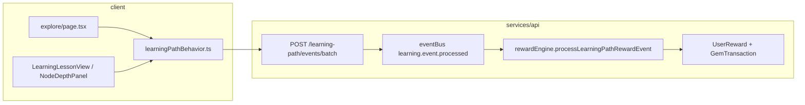

# Hệ thống Gem & Rewards — Planning (cập nhật 2026-05-20)

Tài liệu này **không thay** `rewardEngine.js` ngay — mô tả hiện trạng, khoảng trống sau các update (Learning Bridge Layer 3–4, Deep History generic, Learning Agent plan), và lộ trình gem **khớp kiến trúc hiện có** (event bus → `processLearningPathRewardEvent`).

---

## 1. Vai trò Gem trong sản phẩm

| Vai trò | Mô tả |
|---------|--------|
| **Positive feedback** | +gem khi hành vi học “đủ ý nghĩa” (đọc đủ lâu, mastery quiz, khám phá 3D). |
| **Sink (tiêu)** | Mở khóa nội dung showcase premium (`story` 40, `orbit` 55 gem). |
| **Progress meta** | Level từ `totalGemsEarned`, streak ngày, achievement catalog. |
| **Không phải** | Tiền thật, pay-to-win mastery, hoặc bắt buộc gem để học LP core. |

**Nguyên tắc sau update mới**

1. **Deep History = học, không khóa bằng gem** — timeline + beat + pin là curriculum; gem chỉ thưởng *hành vi*, không paywall.
2. **Một entity, nhiều mode** — `planet-mars` showcase orbit vs `history=1` cùng `entityId`; reward phải **phân biệt mode** để không double-count hoặc miss.
3. **Bridge-first** — gem gắn `LearningPathEvent` + metadata chuẩn; không hardcode trong component 3D.
4. **Agent ≠ gem sink** — quota agent là **giới hạn sản phẩm** (theo policy, ví dụ msg/ngày hoặc msg/h); **không** bán “+N câu hỏi” bằng gem (xem §8.1). Chỉ xem xét **Coach burst có điều kiện** (struggle signal), không thay thế quota bằng tiền ảo.

---

## 2. Hiện trạng (đã có trong repo)

### 2.1 Pipeline



### 2.2 Bảng earn (server — `rewardEngine.js`)

| Event | Điều kiện | Gem | `reason` (transaction) |
|-------|-----------|-----|-------------------------|
| `lp_lesson_completed_toggled` | `completed=true`, dwell ≥ 60s từ `lp_lesson_opened`, 1 lần/ngày/bài | +5 | `lp_complete_dwell` |
| `lp_lesson_completed_toggled` | depth lần đầu / bài | +8 / +14 / +20 | `depth_complete` |
| `lp_lesson_mastered` | recall pass | +8 lần đầu, +3 retry | `recall_quiz_first` / `recall_quiz_retry` |
| `scene_entity_discovered` | ≥1 bài LP completed; entity chưa reward trước | +5 | `scene_entity_discovered` |

**Spend**

| Hành động | Gem | API |
|-----------|-----|-----|
| Unlock showcase story | −40 | `POST /api/showcase/unlock` |
| Unlock showcase orbit | −55 | `POST /api/showcase/unlock` |

**Achievement criteria** (một phần): `scene_discovery_count`, `depth_researcher_count`, `lesson_complete_dwell_count`, `total_gems`, `streak_days`.

### 2.3 Client surfaces

| UI | Gem |
|----|-----|
| `/gem` | Số dư + lịch sử (một phần copy **lỗi thời** — forum/course chưa wire) |
| `/gem-shop` | Catalog unlock |
| Explore showcase | Toast `learning-path-rewards`, badge discovery |
| `visited3D` | Sync LP progress — **không** tự +gem |

### 2.4 Learning Bridge (vừa ship) — liên quan gem

| Tính năng | Gem hôm nay |
|-----------|-------------|
| `sceneContext` → Showcase 3D | Discovery +5 khi focus 3s (mode showcase) |
| `historyFocus` → Deep History | **Chưa có event/reward riêng** |
| `linkedLessonIds` trên narrative | Chỉ hiển thị link; `visited3D` khi discovery showcase |
| Chip LP → Deep History | Track `lp_lesson_opened` metadata `learning-cta-to-deep-history` — **không earn** |

---

## 3. Khoảng trống (sau update hiện tại)

| # | Vấn đề | Hậu quả |
|---|--------|---------|
| G1 | Mở Deep History **không** emit discovery | Học timeline Mars không +gem; cảm giác “dead” so với showcase |
| G2 | Cùng `entityId` — discovery chỉ 1 lần | Hợp lý cho entity; nhưng **beat/pin/site** không có milestone |
| G3 | `planetHistoryOpen` tắt bridge focus timer | Đúng UX; nhưng mất cơ hội overlay/quiz/discovery ở history mode |
| G4 | Gem page copy không khớp engine | User kỳ vọng forum/course gem — chưa có |
| G5 | Agent plan có `gemBalance` trong snapshot | Chưa có sink/earn agent |
| G6 | Layer 4 spec (`prompt_contextual_quiz`) | Quiz prompt có; gem cho **hoàn thành** quiz contextual chưa định nghĩa |
| G7 | Anti-farm beat hopping | Chưa có dwell trên beat |

---

## 4. Mô hình kinh tế đề xuất (v1.1)

### 4.1 Phân lớp hành vi → gem

```
Tier A — Core LP (giữ nguyên)
  lesson dwell complete, depth, recall mastery

Tier B — Explore showcase (giữ + tinh chỉnh metadata)
  scene_entity_discovered (mode=showcase)

Tier C — Deep History (MỚI)
  deep_history_beat_dwell (dwell ≥ 45s; 1 lần / beatKey / user lifetime)
  deep_history_site_opened (1 lần / pinId / user lifetime)
  — Không reward "mở trang"; beat đầu tiên entity có thể +5 thay +4 (discovery bonus)

Tier D — Bridge CTA (MỚI, nhỏ)
  lp_deep_history_cta_used (từ bài có historyFocus, 1 lần / lesson / ngày)

Tier E — Contextual quiz (Layer 4, sau)
  scene_contextual_quiz_passed (+2~+4, cap / session)
```

**Không gem hóa:** mở agent message, đọc panel, scroll timeline.

### 4.2 Bảng giá đề xuất (draft — sau audit inflation)

**Nguyên tắc:** chỉ reward hành vi có **learning signal** (dwell, pin, CTA có lesson context) — không reward click/mở trang.

| Hành vi | Gem | Cap |
|---------|-----|-----|
| Dwell beat ≥ 45s (beat ổn định) | +4 | 1×/`beatKey`/user **lifetime**; max **5 beats**/entity/**session** |
| Beat đầu tiên entity (lifetime, lần dwell đầu) | +5 | Thay cho +4 — **không** tách event "session start" |
| Mở pin site (fly-to + panel) | +2 | 1×/`pinId`/user lifetime |
| LP CTA → history (`historyFocus`) | +1 | 1×/`lessonId`/ **rolling 24h** |
| Contextual quiz ≥1 đúng | +3 | 3×/explore session |

**Global caps (Tier C + D — bắt buộc G1):**

| Guard | Giá trị | Lý do |
|-------|---------|--------|
| `WEEKLY_DH_CAP` | **50 gem**/user | ~30 beat × +4 ≈ 120 nếu không cap → phá sink 40/55; đủ thưởng engagement thật |
| `MAX_BEATS_PER_SESSION` | **5**/entity/session | Khuyến khích quay lại nhiều ngày, không grind hết map 1 lần |

> **Audit math (Mars ~10 beats, không phải 30):** lifetime tối đa ~10×4 + sites ~16 ≈ 56 gem *nếu không weekly cap* — vẫn > 1× story. Weekly cap 50 + 5 beat/session là lớp an toàn bắt buộc.

**Tổng sink giữ:** story 40, orbit 55.

### 4.3 Quan hệ với `visited3D`

| Signal | Mục đích | Gem? |
|--------|----------|------|
| `learningPathVisited3DLessonIds` | Progress LP / CTA “đã khám phá” | Không tự động |
| `scene_entity_discovered` tx | Achievement + earn | Có (showcase) |
| Deep History beat engaged | Achievement riêng | Có (Tier C) |

**Quy tắc:** khi earn Tier C beat, **đồng thời** mark `visited3D` cho `linkedLessonIds` + lessons có `historyFocus` trùng beat (đã có bridge resolve) — align Layer 4 §7.2.

---

## 5. Hợp đồng event (mở rộng)

Thêm vào `LearningPathBehaviorEventName` (client) và xử lý trong `rewardEngine`:

```typescript
// Đề xuất thêm (không có deep_history_opened — không earn)
| 'deep_history_beat_dwell'       // entityId, beatKey, durationSec, firstBeatOnEntity?
| 'deep_history_site_opened'      // entityId, beatKey, pinId
| 'lp_explore_deep_history_cta'   // lessonId, entityId, beatKey, source
```

**Metadata chuẩn (bắt buộc)**

```json
{
  "schemaVersion": "scene_event_v2",
  "entityId": "planet-mars",
  "mode": "showcase" | "deep_history",
  "beatKey": "planet-mars:beat-3-noachian",
  "beatId": 3,
  "pinId": "elysium-mons",
  "source": "timeline" | "learning-cta-to-deep-history" | "explore-header"
}
```

**`beatKey` vs `beatId` (align agent plan, khớp code hiện tại)**

| Field | Kiểu | Dùng cho |
|-------|------|----------|
| `beatKey` | **string** (stable) | `GemTransaction`, caps, agent `NarrativeContext` — **bắt buộc** khi reward |
| `beatId` | number (optional) | Runtime index / URL `?beat=` hiện tại (`NarrativeBeat.id`) |

**Quy tắc sinh `beatKey` (G1):** `{entityId}:beat-{order}-{slug}` với `slug` = `nameEn` kebab hoặc `id` nếu chưa có slug CMS. Khi CMS thêm `beat.slug`, dùng slug làm suffix — **không** đổi key đã earn (migration: map cũ → mới một lần).

> Code hiện tại dùng `beat.id` number (1–10) — đủ cho URL/store; reward **không** chỉ lưu `3` mà lưu `beatKey` để reorder beat không làm sai lịch sử.

**Nơi emit (implementation map)**

| Event | File gợi ý |
|-------|------------|
| `deep_history_beat_dwell` | `NarrativeTimeline` / store — timer khi `currentBeat` ổn định ≥ 45s |
| `deep_history_site_opened` | `NarrativeSitePin` / `setSelectedSiteId` |
| `lp_explore_deep_history_cta` | `NodeDepthPanel` (đã track metadata) |

**Sửa discovery hiện tại**

- `scene_entity_discovered`: thêm `metadata.mode === 'showcase'` trong điều kiện reward (tránh nhầm khi sau này history cũng dùng entityId).
- Không gọi discovery khi `planetHistoryOpen` (đã skip timer — giữ).

---

## 6. Achievement & hiển thị

### 6.1 Achievement mới (Mongo seed)

| slug | criteriaType (mới hoặc tái dùng) | Ngưỡng |
|------|----------------------------------|--------|
| `mars-time-traveler` | `deep_history_beats_engaged` | 3 beats Mars |
| `pin-hunter` | `deep_history_sites_opened` | 10 sites |
| `bridge-scholar` | `lp_deep_history_cta_count` | 5 lessons |

Cần thêm `countCriteria` branches trong `rewardEngine.checkAchievements`.

### 6.2 UI cập nhật

| Màn | Việc |
|-----|------|
| `/gem` | Sync copy với bảng earn thật; nhóm Showcase / Deep History / LP |
| Explore Deep History header | Chip “+gem?” nhỏ khi beat dwell đủ (toast qua `learning-path-rewards`) |
| LP NodeDepthPanel | Sau Deep History CTA — optional hint “+1 gem lần đầu/ngày” |
| Studio | Không cấu hình gem — chỉ curriculum link |

---

## 7. Learning Agent × Gem (khớp `learning-agent-system.md`)

| Giai đoạn | Gem |
|-----------|-----|
| Agent P0–P2 | **Không spend, không earn** — `gemBalance` trong snapshot chỉ để personalize copy |
| Agent quota | **Product limit** (ví dụ học sinh / giáo viên — số cụ thể trong `learning-agent-system.md`, có thể đổi theo sản phẩm) — **hard rate limit**, không là kênh tiêu gem mặc định |
| Hết quota | “Thử lại sau …” — **không** trừ gem, **không** khóa học |

**Không làm:** bán gói “+5 câu hôm nay” / “+10 câu weekend” bằng gem — đó vẫn là *trả gem để hỏi thêm*, trúng đúng nhóm học sinh yếu nhất (hỏi nhiều nhất) → friction và cảm giác pay-to-learn.

**Có thể làm (defensible):** **Coach burst** — ví dụ tối đa **3 câu sâu** trong cửa sổ ngắn, **chỉ khi có struggle signal** (fail recall quiz, streak hint từ engine, hoặc policy rõ ràng khác — implement sau). Burst **không** thay quota cơ bản; không phải sink chính.

**Không** đưa chi phí RAG/LLM nguyên chiếc vào gem balance.

---

## 8. Gem Shop + Admin config (audit kiến trúc 2026-05-20)

Phần này chốt **3 điều chỉnh shop plan**, **mô hình hybrid hardcode × admin**, và **UI admin** để triển khai không làm méo economy.

### 8.1 Ba điều chỉnh bắt buộc trong shop plan

| Issue | Vấn đề | Điều chỉnh |
|-------|--------|------------|
| **I1 — Agent quota shop** | Gói “+5 câu hôm nay / +10 weekend” tạo ma sát cho đúng nhóm học sinh hay struggle; vẫn là *trả tiền ảo để hỏi bài*. | **Xóa hẳn** các SKU quota dạng này khỏi shop. **Agent quota = product limit**, không phải gem sink. Giữ **duy nhất** hướng **Coach burst** có **điều kiện** (struggle signal) — xem §7. |
| **I2 — Depth preview gray area** | “Xem trước 1 đoạn Researcher 24h” không mua mastery nhưng cho xem content trước prerequisite → bỏ qua learning sequence, dễ confusing / misleading. | **Hoặc** depth preview **chỉ mở** khi user **đã hoàn thành Explorer depth** của **cùng node** đó; **hoặc** **bỏ** preview tier cao, thay bằng **Extended hint** — gợi ý thêm cho **bài / depth đang học** (đã unlock), không phải “nhìn trước” bài chưa đủ nền. |
| **I3 — Voucher / Khóa học** | Section voucher (80–400 gem) chỉ có giá trị khi **paid courses** thật sự live và hấp dẫn; list tab khi chưa có course → trust loss. | **Ẩn hoàn toàn** tab “Khóa học / Voucher” cho đến khi `paidCoursesCount >= 1` (flag server). **Dùng slot tab** cho **cosmetic theo mùa** / spotlight shop khi chưa unlock tab C. **Mở tab** khi catalog paid course sẵn sàng. |

### 8.2 Giữ nguyên từ shop plan (đã chốt)

- Công thức **3-tier pricing** (S/M/L/XL) so với baseline earn.
- **Daily deal rotation** và UX **gem path mini** (không ép grind tẻ nhạt).
- **Coach burst** gắn struggle signal (§7), không gói “+N câu” generic.
- **Cosmetic sink** (category **F** / trang trí trong brainstorm) — vô hại với mastery.
- **LP convenience** (category **E** — streak shield, v.v.) — inventory; không đụng progress schema core.

*(Chi tiết category A–F giữ trong bản brainstorm nội bộ — doc này chỉ ràng buộc policy.)*

### 8.3 Tại sao không để admin config “tất cả”?

- Ai đó chỉnh “lesson complete = 1000 gem” → inflation / crisis một ngày.
- Ai đó chỉnh “story = 1 gem” → sink vỡ, inventory rỗng, mất tin.
- **Gem economy = game balance** — cần **version control + review như code**, không phải ô nhập tự do không bound.
- Mọi số **không có min/max validation** là **production incident chờ xảy ra**.

→ **Earn base amounts** không cho admin nhập tay; chỉ đổi qua PR.

### 8.4 Tại sao không hardcode “tất cả”?

- Event theo mùa (double gem weekend, holiday bonus) → **deploy chậm** nếu nằm hết trong code.
- **A/B** earn rates, tweak sink velocity → cần **config** không cần ship build.
- **Giá shop / rotation** là quyết định business — tách khỏi deploy cycle hợp lý.

→ **Hybrid 3 tầng** dưới đây.

### 8.5 Hybrid model — 3 tầng rõ ràng

**Tầng 1 — Hardcode (code + PR + review)**  
Base earn **mỗi event** — admin **không** đổi trực tiếp.

```typescript
// Ví dụ: services/api/features/rewards/constants/gemEarn.js (đã có)
export const GEM_EARN = {
  lp_complete_dwell: 5,
  depth_beginner: 8,
  depth_explorer: 14,
  depth_researcher: 20,
  recall_quiz_first: 8,
  recall_quiz_retry: 3,
  dh_beat_dwell: 4,
  dh_site_opened: 2,
} as const
// Đổi số = PR + review — versioned, auditable
```

`rewardEngine.js` (hoặc successor) **import** constants; không magic number rải rác.

**Tầng 2 — Admin config có bounds (server validate)**  
Multipliers, seasonal, **một phần** shop price override, caps vận hành — đổi được nhưng **trong giới hạn**.

```typescript
// Concept: GemRuntimeConfig (Mongo hoặc feature flag store)
interface GemConfig {
  /** [1.0, 3.0] — server reject ngoài range */
  seasonalMultiplier: number
  /** Bắt buộc nếu seasonalMultiplier > 1.0 */
  seasonalEndsAt?: Date

  /** Mỗi item: price trong [basePrice * 0.7, basePrice * 1.3] */
  itemPriceOverrides: { itemId: string; price: number }[]

  /** Ví dụ Deep History weekly cap người dùng — [20, 100] */
  weeklyDeepHistoryCap: number
}
```

UI admin: chỉ slider / dropdown trong range, không ô số tùy ý cho các field sensitives.

**Tầng 3 — Admin full control (ops / catalog)**  
Ảnh hưởng balance **nếu làm sai**, nhưng đúng nghĩa là **vận hành nội dung**:

- CRUD **shop catalog**: tạo item, category, **visible/hidden**, seasonal window (`startAt` / `endAt`).
- **Manual gem adjustment** với **audit log bất biến** (who, when, why, delta) — không xóa log sau khi ghi.
- **User-level exceptions** (support): one-time bonus có reason code.

### 8.6 Admin UI — trang “Gem Economy” (Admin / Studio tách biệt curriculum)

```
Gem Economy Dashboard
├── Live metrics
│   ├── Tổng gem trong hệ (supply / velocity proxy)
│   ├── Earn velocity (gem/day, MA7)
│   ├── Sink velocity (spend/day)
│   └── Earn/sink ratio — cảnh báo nếu earn ≫ sink bền vững (ví dụ > 3× ngưỡng policy)
├── Seasonal config (Tầng 2)
│   ├── Current multiplier
│   ├── [Bật event: 2× weekend] [từ — đến] — bắt buộc end nếu > 1×
│   └── Preview helper: “User chăm nhất ~X gem/day” (ước lượng, không cam kết)
├── Shop catalog (Tầng 3)
│   ├── List items [visible/hidden] [effective price]
│   ├── Add seasonal item / window
│   └── Price override trong bounds (hiển thị base + allowed band)
└── Manual actions
    ├── Adjust user gem (reason **required**; cap per action — xem §8.7)
    └── Audit log (read-only, export)
```

### 8.7 Điều admin **không** được làm (server enforce)

| Rule | Lý do |
|------|--------|
| Đổi **base earn** (Tầng 1) từ UI | Chỉ qua code PR |
| `seasonalMultiplier` > **3.0** | Hard cap server |
| Bật seasonal > 1× **không có** `seasonalEndsAt` | Tránh event vĩnh viễn |
| Xóa / sửa **audit log** manual adjustment | Chỉ append-only |
| Một lần adjust **> 500** gem (ví dụ) | Cần **secondary approval** hoặc ticket — policy product |
| Voucher discount **> 20%** (nếu có SKU %) | Hard cap — tránh phá pricing course |

Đây là **bảo vệ admin khỏi typo** (“1000” thay “100”), không phải thiếu tin.

### 8.8 Thứ tự implement (economy + shop sau G0)

1. **`GEM_EARN` constants file** (+ refactor `rewardEngine` đọc từ đó).
2. **Shop catalog DB** (Tầng 3 — items, visibility, seasonal window).
3. **Admin bounds + validation** (Tầng 2 — `GemRuntimeConfig`, seasonal, price overrides, DH cap trong range).
4. **Economy dashboard metrics** (supply/velocity/ratio alerts).

Song song UX: §8.1 **ẩn tab voucher**, **coach-only** agent shop SKU, §8.1 **depth preview guard** hoặc **extended hint** thay preview.

---

## 9. Lộ trình triển khai

### Phase G0 — Hygiene (1 tuần)

| # | Việc |
|---|------|
| G0.1 | Sửa copy `/gem` earn list theo `rewardEngine` thật |
| G0.2 | `scene_entity_discovered` require `metadata.mode === 'showcase'` |
| G0.3 | Document `reason` enum trong `GemTransaction` (comment hoặc constants file) |
| G0.4 | Đảm bảo `learning-path-rewards` toast hiện ở Deep History nếu batch trả rewards (listener global — đã có trên explore) |

### Phase G1 — Deep History rewards (2 tuần, sau bridge 1–4 ổn)

Phụ thuộc: URL `beat`/`pin`, `historyFocus`, `linkedLessonIds` (đã ship).

| # | Việc |
|---|------|
| G1.1 | Event types + emitters (§5) |
| G1.2 | `rewardEngine` handlers Tier C + `WEEKLY_DH_CAP` + `MAX_BEATS_PER_SESSION` + rolling 24h |
| G1.3 | `visited3D` sync khi `deep_history_beat_dwell` + resolve lessons |
| G1.4 | Achievement seed + criteria counters |
| G1.5 | QA: không double với `scene_entity_discovered` cùng entity |

### Phase G2 — Bridge & contextual quiz (2–3 tuần)

Phụ thuộc: Layer 4 quiz prompt ổn định.

| # | Việc |
|---|------|
| G2.1 | `lp_explore_deep_history_cta` reward |
| G2.2 | `scene_contextual_quiz_passed` (+ wire từ bridge quiz Explore) |
| G2.3 | Gem strip trên Deep History (balance nhỏ góc phải, giống showcase) |

### Phase G3 — Economy tuning & sinks (ongoing)

| # | Việc |
|---|------|
| G3.1 | Dashboard gem analytics (earn by reason, DAU sinks) — nền cho **Gem Economy Dashboard** §8.6 |
| G3.2 | Điều chỉnh giá unlock / thêm cosmetic sink; shop tab voucher ** gated** §8.1 I3 |
| G3.3 | Agent quota tuning only (policy); **không** SKU “+N câu”; Coach burst có signal §7 |
| G3.4 | Course/voucher UX — chỉ hiện tab khi có paid course §8.1 I3 |
| G3.5 | Shop catalog DB + `GemRuntimeConfig` bounds — khớp thứ tự §8.8 |

---

## 10. Chống lạm dụng

| Rủi ro | Giảm thiểu |
|--------|------------|
| Spam đổi beat | Dwell ≥ 45s; `MAX_BEATS_PER_SESSION` = 5 / entity |
| Grind cả map 1 ngày | `WEEKLY_DH_CAP` = 50 gem (Tier C+D) |
| AFK timeline | Tab hidden → không tích dwell (optional `document.visibilityState`) |
| Multi-account farm | Cap theo `userId`; guest không earn |
| Double entity discovery | `scene_entity_discovered` once per entity; history `reason` khác |
| UTC midnight double-dip | **Rolling 24h** cho mọi cap “per day” (CTA, v.v.) — không calendar UTC |
| Gem inflation (tổng) | Log `totalGemsEarned` velocity; alert nếu +15% sau G1 |

**Rolling 24h (server):**

```javascript
// Pseudocode — mọi cap "daily"
const last = await lastGemTx(userId, reason, scopeKey)
if (Date.now() - last.createdAt < 24 * 60 * 60 * 1000) return null
```

---

## 11. Quyết định cần chốt với team

| # | Câu hỏi | Đề xuất |
|---|---------|---------|
| 1 | Deep History có +gem không? | Có Tier C, nhỏ — học được thưởng, không paywall |
| 2 | Beat reward lifetime hay daily? | **Lifetime** per `beatKey`; max 5 beat/session; weekly cap 50 |
| 3 | Pin reward? | Có (+2), thấp hơn beat — khuyến khích địa danh |
| 4 | Agent / shop “+N câu”? | **Không** — quota là product limit; chỉ Coach burst có signal §7–§8.1 |
| 5 | Session +2 gem? | **Bỏ** — first beat +5 thay thế |
| 6 | Forum/course / voucher trên shop? | Copy `/gem` trung thực; tab Khóa học **ẩn** đến khi có paid course §8.1 I3 |

---

## 12. Liên kết file khi implement

| Thành phần | Path |
|------------|------|
| Reward logic | `services/api/features/rewards/services/rewardEngine.js` |
| `GEM_EARN` | `services/api/features/rewards/constants/gemEarn.js` §8.5 |
| `GemRuntimeConfig` / `ShopItem` / audit | `features/rewards/models/*.js` + `gemRuntimeConfigService.js`, `shopCatalogService.js` |
| Admin Gem Economy API | `GET/PATCH /api/admin/gem-economy/*` (`features/admin/gemEconomy.js`) |
| Public shop bootstrap | `GET /api/gems/shop/bootstrap`, `GET /api/gems/shop/catalog` |
| Admin UI (Next) | `/admin/gem-economy` — dashboard metrics, config, shop SKU, manual adjust, audit |
| Shop UI (Next) | `/gem-shop` — tabs catalog + slot voucher/seasonal theo `voucherTabVisible` |
| Subscriber | `services/api/features/rewards/subscribers/learningPathRewards.js` |
| Event batch | `services/api/features/learning-path/routes/learningPath.js` |
| Client track | `client/src/features/learning-path/lib/learningPathBehavior.ts` |
| Explore | `client/src/app/explore/page.tsx` |
| Bridge | `client/src/features/content3d/showcase/lib/showcaseLearningBridge.ts` |
| Narrative store | `client/src/features/content3d/narrative/stores/planetNarrativeStore.ts` |
| Gem UI | `client/src/app/gem/page.tsx`, `features/rewards/lib/gemWallet.ts` |

---

## 13. Tiêu chí thành công (8 tuần sau G1)

1. ≥ 25% user Explore Deep History có ≥1 `GemTransaction` reason `deep_history_*`.
2. Không tăng >15% tổng gem/ngày toàn hệ thống (tránh inflation — đo trước/sau G1).
3. `visited3D` sync rate từ history beat ≥ 80% session có `linkedLessonIds` hoặc `historyFocus`.
4. 0 bug double-pay cùng entity showcase + history trong 1 session (QA checklist).

---

## 14. Audit changelog

### 2026-05-20 — Gem Shop + Admin config

| Issue | Đánh giá | Đã sửa trong doc |
|-------|----------|------------------|
| Shop agent packs | "+5/+10 câu" = pay-to-ask friction | **Xóa** khỏi shop plan; quota ≠ sink §7 §8.1 I1 |
| Depth preview | Bỏ qua sequence / misleading | Guard Explorer hoặc **Extended hint** §8.1 I2 |
| Voucher tab | Speculative without paid SKUs | **Ẩn** tab đến khi có course; seasonal cosmetic §8.1 I3 |
| Config model | Risk: unbounded admin | **Hybrid 3 tầng** + dashboard + disallow list §8.3–§8.8 |
| Implement order | — | §8.8: constants → catalog DB → bounds → metrics |

### 2026-05-19

| Issue | Đánh giá | Đã sửa trong doc |
|-------|----------|------------------|
| 1 Inflation | Hợp lý — cần cap tổng, không chỉ anti-hop | `WEEKLY_DH_CAP=50`, `MAX_BEATS_PER_SESSION=5` |
| 2 Session +2 | Hợp lý — noise, không learning signal | Bỏ earn session; first beat +5 |
| 3 beatId type | Hợp lý lâu dài; runtime vẫn number | `beatKey` string trên transaction |
| 4 Agent gem sink | Hợp lý — contradict struggle users | Quota only; mở rộng Coach burst có signal §7 |
| 5 UTC daily | Hợp lý (edge nhỏ) | Rolling 24h §10 |

---

*Tài liệu bổ sung `LAYER4_EDUCATIONAL_INTEGRATION_SPEC.md` (progress semantics) và `learning-agent-system.md` (snapshot gem, không trộn engine sớm). Implement theo Phase G0 → G1 trước khi mở sink mới; shop + admin economics theo §8.*
