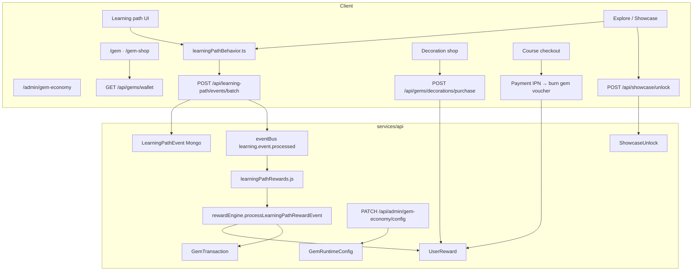

# Hệ thống Gem & Rewards — Audit codebase (2026-05-29)

Tài liệu mô tả **hiện trạng thực tế trong repo**: gem được lưu ở đâu, earn/spend qua đường nào, UI map tới đâu, admin quản lý thế nào. Phần cuối giữ lộ trình chưa triển khai.

**Nguyên tắc sản phẩm**

| Vai trò | Mô tả |
|---------|--------|
| Positive feedback | +gem khi hành vi học có signal (dwell bài, depth, quiz, khám phá 3D) |
| Sink (tiêu) | Unlock showcase premium, trang trí avatar, voucher giảm giá khóa học |
| Progress meta | Level, streak, learner tier, achievement — từ `totalGemsEarned` (lifetime) |
| Không phải | Tiền thật, pay-to-win mastery, paywall Deep History timeline |

**Server là nguồn sự thật.** Client chỉ cache (`localStorage`) và hiển thị; guest không earn qua API.

---

## 1. Kiến trúc tổng quan

**Luồng earn (chính)**

1. UI gọi `trackLearningPathBehavior(...)` → queue client.
2. Batch `POST /api/learning-path/events/batch` → ghi `LearningPathEvent`.
3. Mỗi event → `emitAsync('learning.event.processed')`.
4. Subscriber → `processLearningPathRewardEvent(userId, ev)`.
5. Nếu đủ điều kiện: `UserReward.$inc({ gemBalance, totalGemsEarned })` + `GemTransaction.create`.
6. Response batch có `rewards` → client toast `learning-path-rewards` + `syncGemWallet`.

**Luồng spend**

1. Client gọi endpoint spend (unlock / shop / checkout).
2. Atomic `findOneAndUpdate` với `gemBalance: { $gte: cost }`.
3. Side effect (unlock row / owned SKU / order `gemsCommitted`).
4. `GemTransaction` với `delta` âm.
5. **`totalGemsEarned` không giảm** khi tiêu (tier dựa trên lifetime earned).

---

## 2. MongoDB — models & fields

| Model | Path | Vai trò |
|-------|------|---------|
| **UserReward** | `services/api/features/rewards/models/UserReward.js` | Wallet: `gemBalance`, `totalGemsEarned`, `level`, `streakDays`, `lastStreakDay`, `streakShields` (chưa dùng), `ownedDecorationSkus`, `equippedDecorationSkuId`, `grantedLearnerTierPerks` |
| **GemTransaction** | `services/api/features/rewards/models/GemTransaction.js` | Ledger: `delta`, `reason`, `balanceAfter`, optional `lessonId`, `nodeId`, `depth`, `entityId`, `contentType`, `sessionId`, `metadata` |
| **ShowcaseUnlock** | `services/api/features/rewards/models/ShowcaseUnlock.js` | Unique `(userId, entityId, contentType)` — `story` \| `orbit` |
| **ShopItem** | `services/api/features/rewards/models/ShopItem.js` | SKU shop: `skuId`, `category`, `basePriceGem`, `visible`, seasonal window |
| **GemRuntimeConfig** | `services/api/features/rewards/models/GemRuntimeConfig.js` | Singleton `key: 'global'`: seasonal multiplier, `weeklyDeepHistoryCap`, price overrides, voucher cap |
| **GemEconomyAuditLog** | `services/api/features/rewards/models/GemEconomyAuditLog.js` | Admin manual adjust — append-only |
| **Achievement** / **UserAchievement** | `features/rewards/models/Achievement.js`, `UserAchievement.js` | Badge; `gemBonus` trong seed = **0** (không cộng gem) |
| **LearningPathEvent** | `features/learning-path/models/LearningPathEvent.js` | Raw behavior (input cho reward engine, không phải wallet) |

**Shared contracts (Zod):** `packages/contracts/src/gemWallet.ts`, `shopItem.ts` → `@galaxies/contracts`.

**Seed:** `services/api/data/achievementsCatalog.json`.

---

## 3. Constants — single source of truth

**Server SSOT:** `services/api/features/rewards/constants/gemEarn.js`

| Key | Giá trị | Ghi chú |
|-----|---------|---------|
| `lp_complete_dwell` | +5 | Dwell ≥ 60s, 1×/bài/**UTC calendar day** |
| `depth_beginner` | +8 | Lần đầu depth / bài |
| `depth_explorer` | +14 | |
| `depth_researcher` | +20 | |
| `recall_quiz_first` | +8 | Quiz nhớ lần đầu đạt |
| `recall_quiz_retry` | +3 | Retry sau lần đầu |
| `scene_entity_discovered` | +5 | 1×/entity/user lifetime |
| `dh_beat_dwell` | +4 | **Constants có — handler chưa wire** |
| `dh_site_opened` | +2 | **Constants có — handler chưa wire** |
| `GEM_SPEND_SHOWCASE.story` | −40 | |
| `GEM_SPEND_SHOWCASE.orbit` | −55 | |
| `DWELL_SEC_MIN` | 60 | Giây tối thiểu mở bài → complete |

**Seasonal earn:** `gemRuntimeConfigService.scaleEarn(amount, seasonalMultiplier)` — multiplier Tầng 2 admin `[1.0, 3.0]`.

**Level:** `floor(sqrt(totalGemsEarned / 25)) + 1`, cap 50 — `rewardEngine.computeLevel`.

**Learner tiers** (`constants/learnerTiers.js`) — theo `totalGemsEarned`:

| Tier | Ngưỡng gem đã kiếm | Checkout discount (không trừ gem) |
|------|-------------------|-----------------------------------|
| Observer | 0 | 0% |
| Navigator | 100 | 0% + decoration SKU |
| Astronomer | 500 | 5% |
| Pioneer | 1500 | 10% |
| Voyager | 4000 | 15% |

**Course voucher burn** (`payment/constants/courseVoucherTiers.js`): 200→5%, 400→10%, 600→15% — trừ gem khi IPN thanh toán thành công.

**Client mirror (chỉ hiển thị):** `GEM_REWARD_LEARNING_PATH_LESSON = 5` trong `client/src/features/rewards/lib/gemWallet.ts` — không authoritative.

---

## 4. Earn — đã implement

| Trigger | Event | Điều kiện | Gem (base) | `GemTransaction.reason` | Engine |
|---------|-------|-----------|------------|-------------------------|--------|
| Hoàn thành bài LP | `lp_lesson_completed_toggled` | `completed=true`, dwell ≥ 60s từ `lp_lesson_opened`, chưa reward **hôm UTC** | +5 | `lp_complete_dwell` | `rewardEngine` L174–250 |
| Depth lần đầu | cùng event + `depth` | Chưa có tx `depth_complete` cho lesson+depth | +8/+14/+20 | `depth_complete` | cùng handler |
| Quiz nhớ | `lp_lesson_mastered` | Pass recall | +8 lần đầu, +3 retry | `recall_quiz_first` / `recall_quiz_retry` | L253–284 |
| Khám phá entity 3D | `scene_entity_discovered` | ≥1 bài LP completed; chưa reward entity | +5 | `scene_entity_discovered` | L286–317 |
| Admin | manual adjust | Cap ±500/action | tùy | `admin_manual_adjust` | `manualGemAdjustmentService.js` |

**Nơi client emit event earn-relevant**

| Hành vi | File | Event |
|---------|------|-------|
| Mở/complete/dwell bài, depth, quiz | `client/src/components/learning-path/LearningLessonView.tsx`, `NodeDepthPanel.tsx` | `lp_lesson_*`, `lp_depth_switched` |
| Focus entity showcase ≥3s | `client/src/app/explore/hooks/useExploreLearningBridge.ts` | `scene_entity_discovered` (sau timer) |
| Click entity | `useExploreShowcaseNav.ts` | `scene_entity_clicked` (**không earn**) |

**Điều kiện discovery hiện tại:** engine **không** kiểm tra `metadata.mode === 'showcase'` (plan G0.2 chưa làm). Chỉ cần `metadata.entityId` + ≥1 bài LP hoàn thành.

**Side effects khi earn:** streak bump (`updateStreak`), `checkAchievements`, `handleLearnerTierProgression` (grant decoration SKU khi lên tier).

---

## 5. Earn — chưa implement (constants/UI có nhắc)

| Hành vi | Trạng thái |
|---------|------------|
| Deep History beat dwell (`dh_beat_dwell`) | Constant có; **không handler** trong `rewardEngine` |
| Deep History pin mở (`dh_site_opened`) | Constant có; **không handler** |
| `weeklyDeepHistoryCap` trong `GemRuntimeConfig` | Lưu DB; **không enforce** trong engine |
| Forum +5, course complete +50, streak 7d +20 | Copy trên `/gem` (NODE_CONFIGS) — **không server path** |
| Achievement `gemBonus` | Luôn 0 trong catalog |
| `streakShields` field | Schema có; **không earn/spend** |
| `awardGemsForLearningPathLesson` (client-only) | Export trong `gemWallet.ts` — **không được gọi** (nếu bật → double-pay risk) |
| Agent quota bằng gem | **Chính sách cấm** — không implement |

---

## 6. Spend — đã implement

| Sink | Chi phí | API | `reason` |
|------|---------|-----|----------|
| Unlock showcase **story** | 40 gem | `POST /api/showcase/unlock` | `showcase_unlock` |
| Unlock showcase **orbit** | 55 gem | cùng | `showcase_unlock` |
| Avatar decoration | `ShopItem.basePriceGem` (± override) | `POST /api/gems/decorations/purchase` | `shop_avatar_decoration` |
| Course voucher | 200 / 400 / 600 gem | Payment checkout fulfill | `course_voucher_checkout` |
| Admin trừ tay | — | `POST /api/admin/gem-economy/manual-adjust` | `admin_manual_adjust` |

**Showcase unlock flow (Explore)**

1. `useExploreRewards` → `fetchShowcaseGamificationCatalog` (`GET /api/showcase/catalog`).
2. `ShowcaseEntityPanel` hiện nút "Mở story - 40 gem" / orbit 55.
3. `postShowcaseUnlock(entityId, 'story'|'orbit')` → cập nhật balance + catalog.

**Deep History:** mở timeline **không tốn gem** (curriculum free; gem chỉ sink showcase premium).

---

## 7. API routes (mount)

| Mount | Router | Endpoints chính |
|-------|--------|-----------------|
| `/api/gems` | `features/rewards/routes/gems.js` | `GET /wallet`, `/learner-tiers`, `/shop/bootstrap`, `/shop/catalog`, `/decorations/*` |
| `/api/showcase` | `features/rewards/routes/showcaseGamification.js` | `GET /catalog`, `/unlocks`, `POST /unlock` |
| `/api/learning-path` | `features/learning-path/routes/learningPath.js` | `POST /events/batch` → rewards |
| `/api/admin/gem-economy` | `features/admin/gemEconomy.js` | metrics, config PATCH, shop CRUD, manual adjust, audit |
| `/api/payments` | `features/payment/` | quote + fulfill (gem voucher burn) |

**Bootstrap:** `services/api/features/rewards/index.js` đăng ký subscriber `learningPathRewards.js` khi load feature.

---

## 8. Quản lý economy — hybrid 3 tầng

| Tầng | Ai đổi | Ví dụ |
|------|--------|-------|
| **1 — Code + PR** | Dev review | `GEM_EARN`, `GEM_SPEND_SHOWCASE`, `DWELL_SEC_MIN` |
| **2 — Admin bounds** | `/admin/gem-economy` | `seasonalMultiplier`, `weeklyDeepHistoryCap`, price override ±30%, voucher max 20% |
| **3 — Ops catalog** | Admin UI | CRUD `ShopItem`, manual adjust ±500, audit log |

**Services:** `gemRuntimeConfigService.js`, `shopCatalogService.js`, `manualGemAdjustmentService.js`, `gemEconomyMetricsService.js`.

**Admin UI:** `client/src/app/admin/gem-economy/page.tsx` + `AdminAvatarDecorationsPanel.tsx` + adjust trên `admin/users/[id]`.

**Studio showcase-entities:** **không** cấu hình gem — chỉ curriculum/narrative.

---

## 9. Client — map UI & hooks

| Surface | Path | Gem liên quan |
|---------|------|---------------|
| Ví + lịch sử | `/gem` | `syncGemWallet`, `loadGemWallet`, hiển thị tx + tier progress |
| Hạng learner | `/gem/tiers` | `fetchLearnerTiersWithProgress` |
| Cửa hàng | `/gem-shop` | Decorations live; voucher tab gated `voucherTabVisible`; planned items (streak shield) **chưa mua được** |
| Explore top bar | `ExploreShowcaseOverlay.tsx` | Badge `{gemBalance} gem` |
| Explore panel trái | `ShowcaseEntityPanel.tsx` | Unlock story/orbit qua `gamificationStrip` |
| Dashboard | `dashboard/page.tsx` | Hiển thị balance + tier |
| Checkout khóa | `CourseCheckoutClient.tsx` | Quote gem balance, chọn voucher tier |
| Avatar decoration | `DecorationCatalogExperience.tsx`, `useEquippedDecoration.ts` | Mua/equip overlay |
| Agent Cosmo | `agentContextEnrichment.js` | Snapshot `gemBalance`, gợi ý unlock/affordable — **không spend agent quota** |

**Hooks / lib chính**

| File | Vai trò |
|------|---------|
| `features/rewards/lib/gemWallet.ts` | Cache localStorage `cosmo-gem-wallet-v1`, `syncGemWallet` |
| `features/rewards/api/gemsWalletApi.ts` | `GET /gems/wallet` |
| `features/rewards/api/gemShopPublicApi.ts` | Shop bootstrap/catalog |
| `features/rewards/api/showcaseGamificationApi.ts` | Catalog unlocks + POST unlock |
| `app/explore/hooks/useExploreRewards.ts` | Balance state, gamification strip, toast rewards |
| `features/learning-path/lib/learningPathBehavior.ts` | Event batch + dispatch `learning-path-rewards` |
| `features/rewards/lib/formatGemActivity.ts` | Nhãn Việt cho `reason` trên `/gem` |

**Events DOM**

| Event | Khi nào |
|-------|---------|
| `learning-path-rewards` | Batch trả `gemsEarned` > 0 |
| `gem-wallet-changed` | Sau unlock shop/showcase |

**Không có Zustand gem store** — React state + localStorage cache.

---

## 10. Tích hợp theo domain

| Domain | Tích hợp gem |
|--------|--------------|
| **Learning path** | Earn chính: lesson, depth, recall quiz |
| **Explore showcase** | Spend unlock 40/55; earn discovery +5; badge balance top bar |
| **Deep History** | **Không earn/spend** hiện tại; agent có narrative context |
| **Showcase CMS** | Catalog bundle cho gamification; unlock state `ShowcaseUnlock` |
| **Courses / payment** | Voucher burn gem; learner tier discount (không trừ gem) |
| **Agent** | `gemBalance` trong enriched context; tool `focus_showcase_entity` — không gem sink |
| **Community / forum** | **Không** |
| **Solar journey** | **Không** |
| **Guest** | `createStarterWallet()` local balance 10 + fake tx — **không sync server earn** |

---

## 11. Achievement criteria (engine)

`rewardEngine.checkAchievements` đếm qua `GemTransaction.reason`:

| criteriaType | Ý nghĩa |
|--------------|---------|
| `depth_researcher_count` | Số lần `depth_complete` researcher |
| `scene_discovery_count` | Số lần `scene_entity_discovered` |
| `lesson_complete_dwell_count` | Số lần `lp_complete_dwell` |
| `total_gems` | `UserReward.totalGemsEarned` |
| `streak_days` | `UserReward.streakDays` |

---

## 12. Gaps & inconsistencies (ưu tiên fix)

| # | Vấn đề | Hậu quả |
|---|--------|---------|
| G1 | `/gem` copy forum/course/streak | User kỳ vọng earn không tồn tại |
| G2 | `dh_*` constants không có handler | Deep History học không thưởng gem |
| G3 | `weeklyDeepHistoryCap` không enforce | Config admin vô hiệu |
| G4 | Discovery không require `mode=showcase` | Có thể nhầm khi mở rộng history events |
| G5 | Cap dwell = **UTC day** không rolling 24h | Edge timezone midnight |
| G6 | Guest starter wallet 10 gem local | Confusing trước login |
| G7 | `awardGemsForLearningPathLesson` dead code | Risk double-pay nếu ai gọi lại |
| G8 | Gem-shop "Streak Shield 50" | PLANNED only |

---

## 13. File index (implement & debug)

| Layer | Path |
|-------|------|
| Earn logic | `services/api/features/rewards/services/rewardEngine.js` |
| Constants | `services/api/features/rewards/constants/gemEarn.js`, `learnerTiers.js` |
| Subscriber | `services/api/features/rewards/subscribers/learningPathRewards.js` |
| Runtime config | `services/api/features/rewards/services/gemRuntimeConfigService.js` |
| Showcase spend | `services/api/features/rewards/routes/showcaseGamification.js` |
| Shop / decor | `services/api/features/rewards/services/avatarDecorationService.js`, `shopCatalogService.js` |
| Payment voucher | `services/api/features/payment/services/courseCheckoutService.js` |
| Admin API | `services/api/features/admin/gemEconomy.js` |
| Client wallet | `client/src/features/rewards/lib/gemWallet.ts` |
| Explore rewards | `client/src/app/explore/hooks/useExploreRewards.ts` |
| Behavior batch | `client/src/features/learning-path/lib/learningPathBehavior.ts` |
| Discovery timer | `client/src/app/explore/hooks/useExploreLearningBridge.ts` |
| Agent context | `services/api/features/agent/services/agentContextEnrichment.js` |
| Tests | `services/api/test/contracts-gem-shop.test.js` |

---

## 14. Lộ trình (chưa làm — tóm tắt từ plan G0–G3)

### Phase G0 — Hygiene

- Sửa copy `/gem` khớp engine thật
- `scene_entity_discovered` require `metadata.mode === 'showcase'`
- Enum `reason` document đầy đủ

### Phase G1 — Deep History rewards

- Event `deep_history_beat_dwell`, `deep_history_site_opened`
- Handlers Tier C + `WEEKLY_DH_CAP` + max 5 beat/session
- Achievement seed mới
- Sync `visited3D` khi beat engaged

### Phase G2 — Bridge & contextual quiz

- `lp_explore_deep_history_cta` (+1 rolling 24h)
- `scene_contextual_quiz_passed`
- Gem balance nhỏ trên Deep History header

### Phase G3 — Economy tuning

- Dashboard velocity đầy đủ
- Cosmetic sinks mở rộng
- **Không** bán agent quota bằng gem

**Chi tiết policy shop/admin:** xem audit changelog 2026-05-20 trong git history của file này (agent quota shop removed, voucher tab gated, hybrid 3-tier config).

---

## 15. Audit changelog

| Ngày | Nội dung |
|------|----------|
| 2026-05-29 | **Full codebase audit** — map earn/spend, client, admin, gaps; cập nhật paths Explore (`useExploreRewards`, grid Deep History) |
| 2026-05-20 | Shop + admin hybrid model, inflation caps, agent no gem sink |
| 2026-05-19 | Plan Deep History Tier C, beatKey, rolling 24h |

---

*Implement earn/spend mới theo Phase G0 → G1; mọi thay đổi base `GEM_EARN` = PR + review (Tầng 1).*
