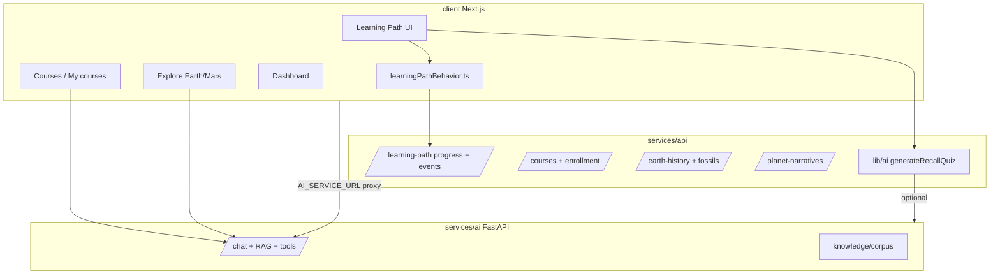

# Hệ thống AI Learning Agent — Thiết kế & lộ trình

## 1. Tầm nhìn

**Learning Agent** không chỉ là chatbot hỏi–đáp. Đó là lớp trí tuệ gắn chặt với **ngữ cảnh học thực** của Galaxies: learning path, khóa học, Explore 3D (Earth/Mars/showcase), tiến độ, mastery, recall quiz, gems/rewards — để **giảm ma sát**, **tăng hiểu bài**, và **điều hướng đúng bước tiếp theo** cho từng người học.

**Nguyên tắc thiết kế**

| Nguyên tắc | Ý nghĩa |
|------------|---------|
| **Grounded** | Mọi lời khuyên phải bám dữ liệu app (lesson, concept, narrative beat, progress) + RAG corpus; không bịa số liệu địa chất / tiến độ. |
| **Context-first** | Agent biết *đang ở đâu* (route, lesson, stage Ma, entity, depth beginner/explorer/researcher) trước khi trả lời. |
| **Agent-native** | Hành động qua **tool có validate** (mở bài, nhảy Explore, gợi ý ôn tập) — client thực thi, server chỉ đề xuất. |
| **Proactive có kiểm soát** | Gợi ý chủ động khi phát hiện kẹt (dwell lâu, quiz fail nhiều lần), không spam. |
| **Privacy & cost** | Hồ sơ học tập theo `userId`; rate limit; model nhỏ cho routing, model lớn cho giải thích. |

**Không làm trong giai đoạn đầu:** Thay giáo viên soạn curriculum, chấm tự luận dài, hoặc agent tự sửa MongoDB/studio không qua con người.

---

## 2. Hiện trạng trong project (điểm xuất phát)

Đã có **mảnh ghép** quan trọng — cần **ghép thành một hệ**, không xây lại từ zero.



| Thành phần | Vị trí | Khả năng hiện tại |
|------------|--------|-------------------|
| AI chat + RAG | `services/ai/server.py` | Groq LLM, corpus MD, security blocklist, multimodal ảnh |
| Agent tools | `services/ai/agent_tools.py` | `open_lesson`, `go_to_explore`, … → migrate `navigate_to_narrative` |
| Recall quiz gen | `services/api/lib/ai/tasks/generateRecallQuiz.js` | Sinh quiz từ nội dung bài, fallback heuristic |
| Hành vi học | `client/.../learningPathBehavior.ts` | 15+ event types → `POST /learning-path/events/batch` |
| Tiến độ LP | `learningPathProgress.ts` + `UserProgress` | completed / mastered / visited3D / lastLesson |
| Kế hoạch cũ | `docs/AI_TUTOR_PLAN.md` | Tutor context-aware Phase 1–3 (chưa gom agent đầy đủ) |
| Admin analytics | `features/admin/api/adminAnalyticsApi.ts` | LP analytics (góc vận hành, chưa feed agent) |

**Khoảng trống chính**

1. **Không có Learner Context API thống nhất** — agent phải tự đoán từ nhiều nguồn rời.
2. **Tool chưa planet-agnostic** (`navigate_to_narrative`), concept map, depth **suggest** (không auto-set).
3. **Chưa có “coach layer”** — phân tích event stream → gợi ý / can thiệp có lý do.
4. **Chưa có memory dài hạn** (sai lần hay gặp, mức độ ưa thích depth) ngoài progress map.
5. **UI agent** chưa nhất quán trên LP / Explore / Dashboard (floating tutor rời rạc).

---

## 3. Kiến trúc mục tiêu — Learning Agent Platform

### 3.1 Ba lớp

```
┌─────────────────────────────────────────────────────────────┐
│  L3 — Experience (client)                                      │
│  Agent Shell: dock chat, chips gợi ý, toast coach, streaming   │
│  Tool executor: router.push, stage/entity focus, open lesson   │
└───────────────────────────┬─────────────────────────────────┘
                            │ agent_state + learner_snapshot
┌───────────────────────────▼─────────────────────────────────┐
│  L2 — Learning Agent Orchestrator (services/api)               │
│  POST /api/agent/session  ·  POST /api/agent/message           │
│  Context Builder · Policy (rate/quota) · Tool validate         │
│  Optional: delegate LLM → services/ai                          │
└───────────────────────────┬─────────────────────────────────┘
                            │
┌───────────────────────────▼─────────────────────────────────┐
│  L1 — Knowledge & Signals                                      │
│  RAG index · Curriculum/Concept APIs · Progress/Events DB      │
│  Narrative beats · Course lessons · Fossils (Earth only)       │
└─────────────────────────────────────────────────────────────┘
```

**Vì sao orchestrator nằm ở `services/api` chứ không chỉ `services/ai`?**

- Agent cần **auth JWT**, đọc `UserProgress`, enrollment, gems — đã có ở API Node.
- `services/ai` giữ vai trò **LLM + RAG + security** thuần (stateless, dễ scale GPU/CPU riêng).
- Tránh duplicate business rules giữa hai runtime.

### 3.2 Learner Context Snapshot (hợp đồng dữ liệu)

Mỗi lần gọi agent, client (hoặc API) gửi **`learner_snapshot`** + **`session_context`**:

```typescript
// Định nghĩa mục tiêu — implement trong features/agent/types.ts

/** Gợi ý yếu — server-derived từ struggleDetector, không gửi full lesson history. */
type WeakLessonSignal = {
  lessonId: string
  signal: 'quiz_fail_rate' | 'revisit_pattern' | 'dwell_outlier'
  score: number // 0–1, cao = yếu hơn
}

type LearnerSnapshot = {
  userId: string | null
  displayName?: string
  // Learning path — counts + recent only (không gửi full ID arrays lên LLM)
  progressPct: number
  lastLessonId: string | null
  completedCount: number
  masteredCount: number
  recentLessonIds: string[] // 5–10 bài gần nhất; detail fetch on-demand khi agent cần
  weakLessons: WeakLessonSignal[]
  preferredDepth: 'beginner' | 'explorer' | 'researcher' | null
  // Courses (optional)
  activeEnrollments: { courseSlug: string; progressPct: number }[]
  // Rewards (optional)
  gemBalance?: number
  // Pedagogy flags (server-derived, Phase 1+)
  struggleSignals?: { lessonId: string; reason: string }[]
}

/** ID narrative thống nhất — tránh branch Earth number vs Mars slug. */
type NarrativeContext = {
  planet: string // 'earth' | 'mars' | 'planet-mars' | showcase entity id
  stageId: string // 'noachian-early' | 'stage-1' | earth stage key
  beatId?: string
  pinId?: string // site pin đang chọn
}

type SessionContext = {
  surface: 'learning_path' | 'course' | 'explore' | 'dashboard' | 'studio'
  pathname: string
  search: string
  routeLabel: string
  // Surface-specific
  moduleId?: string
  nodeId?: string
  lessonId?: string
  depth?: 'beginner' | 'explorer' | 'researcher'
  courseSlug?: string
  currentLessonSlug?: string
  showcaseEntityId?: string
  narrativeContext?: NarrativeContext
  selectedConceptIds?: string[]
}
```

**Weakness heuristic (server, Phase 1)** — không dùng “mở nhiều, chưa mastered” (false signal: đọc kỹ bài khó ≠ yếu):

| Signal | Điều kiện | Trọng số |
|--------|-----------|----------|
| `quiz_fail_rate` | Fail recall ≥ 2 lần cùng bài | Mạnh nhất |
| `revisit_pattern` | Quay lại bài ≥ 3 lần trong 7 ngày | Trung bình |
| `dwell_outlier` | Dwell > 2× median lesson | Yếu (chỉ kết hợp) |

Context builder fetch chi tiết lesson cụ thể **chỉ khi** tool/agent cần (không embed 200 lesson IDs trong prompt).

### 3.2.1 Context Builder — latency & prefetch (bắt buộc Phase 0)

**Vấn đề kiến trúc cũ:** gọi `services/ai` RAG **đồng bộ** trước khi stream LLM → P50 3–6s trước token đầu tiên.

**Mục tiêu:** token đầu tiên < 1s khi có cache; RAG không block stream.

```
User vào lesson/stage
  → client prefetchAgentContext(lessonId | narrativeContext)
  → API cache context 5 phút theo (userId, lessonId | narrativeKey)

User gửi message
  → nếu cache hit: stream LLM ngay với cachedCtx
  → nếu cache miss: Promise.all([
        fetchRagContext(question),      // timeout 3s
        startLlmStream(question, partialCtx)
      ])
  → RAG passages merge vào turn tiếp theo nếu đến trễ (hoặc inject system patch nhẹ)
```

| Tham số | Giá trị |
|---------|--------|
| RAG HTTP timeout | **3s** — sau đó fallback (xem 0.7) |
| Context cache TTL | **5 phút** / `(userId, lessonId)` hoặc narrative key |
| Prefetch trigger | `LessonView` mount, Explore beat change, course lesson open |

**Perceived latency:** hiển thị typing indicator + stream partial ngay; không chờ RAG xong mới mở SSE.

### 3.2.2 Context Builder — nội dung merge

- Nội dung bài hiện tại (sections HTML/text, concept anchors).
- Beat narrative (panel copy) nếu Explore — qua `narrativeContext`.
- Top-3 concept liên quan từ `features/concepts`.
- RAG passages (cached hoặc parallel, không blocking).

Giới hạn token: **ưu tiên structured JSON summary** trước, raw HTML sau (truncate).

### 3.3 Capability matrix (agent “siêu thông minh” theo từng giai đoạn)

| Capability | Mô tả | Giai đoạn |
|------------|--------|-----------|
| **Explain** | Giải thích khái niệm / thời kỳ / bài đang xem | P0 |
| **Navigate** | Tool mở lesson, Explore Ma, module/node LP | P0 (mở rộng tool hiện có) |
| **Quiz coach** | Giải thích đáp án recall quiz sau khi sai | P0 |
| **Next step** | “Nên học gì tiếp?” dựa progress + prerequisite graph | P1 |
| **Spaced review** | Nhắc ôn bài mastered cũ (dựa time + decay heuristic) | P1 |
| **Concept bridge** | Liên kết concept ↔ lesson ↔ scene entity | P1 |
| **Misconception detect** | Pattern: quiz fail 2+, dwell cao, nhảy depth liên tục | P2 |
| **Adaptive depth** | Agent **gợi** depth; user confirm (không auto-set) | P2 |
| **Agent quota** | Rate limit msg/h — **không** trừ gem (xem `gem-rewards-system.md` §7) | P0+ |
| **Teacher digest** | Tóm tắt cho giáo viên (admin) — tách persona | P3 |

### 3.4 Tool catalog mở rộng (agent-native)

Giữ validate chặt như `agent_tools.py` hiện tại. **Deprecate** tool Earth/Mars riêng lẻ; normalize theo `NarrativeContext`.

| Tool | Khi nào | Validate |
|------|---------|----------|
| `open_learning_path_lesson` | LP | `lessonId` ∈ curriculum |
| `open_learning_path_node` | LP hub | `moduleId`, `nodeId` |
| `suggest_depth_switch` | LP | `suggestedDepth` enum + `reason`; **client render confirm chip** — không đổi depth cho đến khi user bấm |
| `navigate_to_narrative` | Explore / Deep History | `planet`, `stageId`, optional `pinId` — client map planet → route + store |
| `focus_showcase_entity` | Showcase | `entityId` ∈ catalog |
| `open_concept` | Mọi nơi | `conceptId` ∈ graph |
| `highlight_concept_in_map` | Concept bridge (P1) | `conceptId` — mở `/map`, highlight node |
| `show_related_lessons` | Concept bridge (P1) | `conceptId` hoặc `lessonId` — surface ≤3 chip, không navigate |
| `start_recall_quiz` | Trong bài | `lessonId` |
| `open_course_lesson` | Course | slug ∈ enrollment |

**Không thêm:** `go_to_explore`, `go_to_mars_explore`, `set_learning_depth` (override ý user).

Client: `features/agent/lib/executeToolCall.ts` — map tool → Next router + store actions; một executor `navigate_to_narrative` thay vì branch theo planet.

### 3.5 Memory model

| Tier | Lưu ở đâu | Nội dung | TTL |
|------|-----------|----------|-----|
| **Session** | Redis hoặc Mongo `AgentSession` | messages[], tool history | 24h |
| **Learner profile** | Mongo `LearnerAgentProfile` | preferred language, depth habit, opt-out proactive | vĩnh viễn |
| **Episodic notes** | Mongo embeddings optional | “Hay nhầm O₂ vs CO₂ ở bài X” | cập nhật khi có evidence |
| **Curriculum** | Đã có — không copy vào agent | concepts, LP, courses | SSOT DB |

Phase 0–1: chỉ **session + snapshot**; không episodic memory để giảm rủi ro hallucination profile.

---

## 4. Luồng người dùng (UX)

### 4.1 Agent Shell thống nhất

Một component `AgentShell` (dock phải, thu gọn được) xuất hiện trên:

- `LearningPathHub`, `LearningLessonView`, `LearningModuleView`
- `explore` (Earth & Mars)
- `courses/[slug]`, `my-courses`
- `dashboard` (tóm tắt tiến độ + CTA)

**Không** hiện ở Studio/admin (persona khác).

### 4.2 Chế độ tương tác

1. **Ask** — user hỏi tự do.
2. **Suggest chips** — sinh từ `SessionContext` (“Giải thích thời kỳ này”, “Quiz nhanh”, “Bài tiếp theo”).
3. **Coach nudge** (P1) — banner nhẹ khi policy cho phép (xem **CoachPolicy** bên dưới).

### 4.2.1 Coach intervention model (bắt buộc Phase 1)

Không có timing model → coach **spam** hoặc **miss**. Định nghĩa rõ trước khi ship proactive UI.

```typescript
interface CoachPolicy {
  triggers: {
    dwellThresholdMs: 480_000      // 8 phút ở 1 bài
    quizFailStreak: 2              // fail recall 2 lần liên tiếp
    revisitCount: 3                // quay lại bài 3+ lần / 7 ngày
  }
  cooldown: {
    sameLessonMs: 3_600_000        // 1 giờ / bài
    globalMs: 1_800_000            // 30 phút toàn app
    afterDismissMs: 7_200_000    // 2 giờ nếu user dismiss
  }
  maxPerSession: 2                 // không quá 2 coach / session
}
```

| Hành vi | Quy tắc |
|---------|---------|
| Show | Chỉ khi trigger **và** không vi phạm cooldown **và** `sessionCoachCount < maxPerSession` |
| Dismiss | Ghi `agent_coach_dismissed` → áp `afterDismissMs` |
| Rate limit | **Không có cooldown = tệ hơn không có agent** |

Implement: `struggleDetector` emit signals → `coachPolicyService` quyết định show/deny → client chỉ render khi API trả `coachNudge: { allowed, message, chips }`.

### 4.3 Streaming & đa phương thức

- SSE từ orchestrator → client (giảm cảm giác chờ).
- Ảnh (fossil, screenshot khung 3D) → `image_base64` như `services/ai` đã hỗ trợ.
- Phase sau: voice (Capacitor) — không block P0.

---

## 5. Cấu trúc code đề xuất (align DOMAIN_MAP)

```
services/api/features/agent/
  index.js                 # mount routes
  routes/agentSession.js   # POST message, GET history
  services/
    contextBuilder.js      # snapshot + lesson + beat + prefetch cache
    contextPrefetch.js     # warm cache on lesson/narrative mount
    toolValidator.js       # mở rộng từ agent_tools logic (shared spec)
    policyService.js       # rate limit, quota
    struggleDetector.js    # P1: events → signals
  models/
    AgentSession.js
    LearnerAgentProfile.js  # P1
  lib/
    aiClient.js            # gọi services/ai /chat

client/src/features/agent/
  api/agentApi.ts
  hooks/useLearningAgent.ts
  lib/executeToolCall.ts
  lib/buildSessionContext.ts
  ui/
    AgentShell.tsx
    AgentMessageList.tsx
    AgentSuggestionChips.tsx
  types.ts
  public.ts                # barrel duy nhất cross-domain

services/ai/
  (giữ) server.py, rag.py, agent_tools.py
  (+) tools spec sync với API validator qua OpenAPI hoặc shared JSON
```

**Import rule:** `app/` và components chỉ import `@/features/agent/public`.

---

## 6. RAG & knowledge — mở rộng corpus có hệ thống

Hiện corpus chủ yếu MD thủ công. Lộ trình index tự động:

| Nguồn | Pipeline | Ưu tiên |
|--------|----------|---------|
| Learning path lessons | Export text → chunk → `/knowledge/append` | P0 |
| Course lessons (published) | Event-driven + cron safety net | P1 |
| Planet narrative beats | Event-driven on beat update | P1 |
| Concept definitions | `features/concepts` API | P1 |
| Fossils (Earth) | Sample theo stage, không full dump | P2 |

**Metadata chunk:** `{ source, entityId, lessonId, stageId, lang: 'vi', version, updatedAt }` — agent có thể cite version khi trả lời.

### 6.1 Invalidation (event-driven, không chỉ cron)

**Vấn đề:** teacher sửa lesson → corpus stale → agent sai fact. Cron weekly **quá chậm** cho content edit thường xuyên.

```
on('lesson.published' | 'lesson.updated', lessonId) =>
  ragIndex.deleteChunks({ lessonId })
  ragIndex.appendChunks(extractText(lessonId))

on('narrative.beat.updated', { entityId, beatId }) =>
  ragIndex.reindex({ entityId, beatId })

on('concept.updated', conceptId) =>
  ragIndex.reindex({ conceptId })
```

| Cơ chế | Vai trò |
|--------|---------|
| **Event-driven** | Primary — ngay khi publish/save CMS |
| **Cron weekly** | Safety net — full reconcile, không phải nguồn truth |

Prefetch cache (§3.2.1) invalidate khi `version` chunk thay đổi cho cùng `lessonId` / narrative key.

---

## 7. Analytics & tối ưu học tập (closed loop)

Agent không chỉ trả lời — **đo hiệu quả** và điều chỉnh:

**Events mới (đề xuất bổ sung vào `LearningPathEvent`):**

- `agent_message_sent`, `agent_tool_executed`, `agent_suggestion_clicked`
- `agent_coach_shown`, `agent_coach_dismissed`

**Metrics sản phẩm:**

- Time-to-mastery sau khi dùng agent vs không
- Recall quiz pass rate khi mở coach
- Completion rate module / course

**A/B (P2):** proactive coach on/off theo cohort.

---

## 8. Bảo mật, an toàn nội dung, chi phí

| Rủi ro | Giảm thiểu |
|--------|------------|
| Hallucination địa chất | RAG + structured beat/lesson; system prompt “không bịa số”; cite source id |
| Lộ dữ liệu user | JWT bắt buộc cho snapshot; không gửi email/password vào LLM |
| Tool abuse | Validate mọi tool server-side; client chỉ execute allowlist |
| Chi phí LLM | Router model nhỏ (intent classify); prefetch + cache context 5 phút (§3.2.1) |
| services/ai down | Fallback static chips (§0.7) — không silent fail |
| Prompt injection | `security.py` blocklist + strip HTML lesson trước khi vào prompt |

**Rate limit đề xuất:** 40 message / user / hour (P0); tăng cho teacher role.

---

## 9. Lộ trình triển khai

### Phase 0 — “Agent có ngữ cảnh thật” (3–4 tuần)

**Mục tiêu:** Một chỗ chat thống nhất, hiểu LP + Explore + course hiện tại.

| # | Việc | File / service chính |
|---|------|----------------------|
| 0.1 | `features/agent` + `AgentShell` trên LP + Explore | client |
| 0.2 | `POST /api/agent/message` gọi `services/ai` kèm context builder | `services/api/features/agent` |
| 0.3 | `buildSessionContext()` từ stores/routes | `client/.../buildSessionContext.ts` |
| 0.4 | Tool spec: `navigate_to_narrative`, `open_learning_path_lesson`, `suggest_depth_switch` | ai + api validator |
| 0.5 | Index RAG batch 20–30 lesson LP đầu tiên | `services/ai/scripts/` |
| 0.6 | Streaming SSE proxy | api + client |
| 0.6b | Context prefetch endpoint + cache layer `(userId, lessonId \| narrativeKey)` | `contextBuilder.js` |
| 0.6c | `services/ai` RAG timeout **3s** + structured fallback | `aiClient.js` |
| 0.7 | **Fallback mode** khi `services/ai` unavailable: static chips từ `SessionContext` (“Tôi tạm thời không khả dụng… Bài tiếp → Ôn lại → Quiz”) — không silent fail | api + client |

**Done khi:** Học sinh hỏi “giải thích bài đang học” và agent trả lời đúng nội dung + có thể mở bài/Explore bằng tool; first token stream < ~1s khi cache warm.

### Phase 1 — Learning Coach (4–5 tuần)

**Thứ tự đúng:** detector → snapshot → coach/quiz → chips → concept bridge → policy.

| # | Việc |
|---|------|
| 1.1 | `struggleDetector` từ `LearningPathEvent` (dwell, quiz fail streak, revisit) — **foundation** |
| 1.2 | `GET /api/agent/snapshot` — counts + `recentLessonIds` + `weakLessons[]` signals (§3.2) |
| 1.3 | Quiz coach sau recall fail (hook `LessonRecallQuiz`, dùng detector) |
| 1.4 | Chips “Bài tiếp theo”, “Ôn lại bài X” (dùng snapshot) |
| 1.5 | Concept bridge: `highlight_concept_in_map`, `show_related_lessons` |
| 1.6 | `CoachPolicy` + cooldown + `maxPerSession` (§4.2.1) |

### Phase 2 — Cá nhân hóa & đa hành tinh (4–6 tuần)

| # | Việc |
|---|------|
| 2.1 | Spaced review scheduler (notification optional) |
| 2.2 | Narrative beat + showcase entity trong context builder |
| 2.3 | `LearnerAgentProfile` + depth adaptation |
| 2.4 | Proactive coach tuning (A/B copy); cooldown đã có ở 1.6 |
| 2.5 | Admin view: agent usage + struggle heatmap |

### Phase 3 — Nâng cao (ongoing)

- Multi-agent nội bộ (Planner / Explainer / Navigator) — **một** orchestrator, nhiều system prompt chuyên vai (không cần 3 service).
- Fine-tune nhỏ trên log Q&A đã được teacher approve (opt-in).
- MCP tools cho Studio (teacher copilot) — tách persona, không trộn học sinh.

---

## 10. Quyết định kỹ thuật cần chốt sớm

| Quyết định | Đề xuất | Lý do |
|------------|---------|-------|
| Orchestrator | `services/api/features/agent` | Auth + progress + enrollment |
| LLM host | Giữ `services/ai` (Groq) | Đã có RAG, tools, multimodal |
| Session store | Mongo `AgentSession` trước, Redis sau | Đơn giản deploy hiện tại |
| UI | Dock shell dùng design-system tokens | Nhất quán edu surface |
| Single agent vs multi | Single orchestrator, multi **prompt role** | Giảm độ phức tạp P0–P1 |

---

## 11. Liên hệ với công việc đang làm (panel schema, narrative CMS)

Deep History `panelSchema` per entity **bổ trợ trực tiếp** cho agent Explore:

- Context builder đọc `planet-narratives` + beat hiện tại → giải thích đúng nhãn Mars vs Earth.
- Tool `navigate_to_narrative` + `focus_showcase_entity` gắn narrative đã CMS hóa.

Nên **hoàn tất sync panel schema → Explore runtime** trước Phase 2.2.

---

## 12. Tiêu chí thành công (12 tuần)

### 12.1 Product metrics

| # | Metric | Target | Cách đo |
|---|--------|--------|---------|
| 1 | Agent adoption | ≥ 30% **weekly active LP users** có ≥1 agent message/tuần | Baseline 2 tuần **trước** launch; không chia total users |
| 2 | Recall quiz | First-try pass rate +10% vs cohort không coach | Cohort flag `coach_enabled` |
| 3 | Efficiency | Median dwell giảm, mastered không giảm | LP events + progress |
| 4 | Fact accuracy | < 2% “sai fact” trong sample | Xem §12.2 |
| 5 | Security | **0** PII leak incidents | Audit log + redaction review |
| 6 | Latency | P95 first-token **< 3s** (cache warm) | Server SSE timestamps |

### 12.2 Measurement mechanisms (không metric “vô nghĩa”)

**Fact accuracy (#4):**

- Mỗi agent response: thumbs up / down.
- Thumbs down → optional tag `incorrect_fact` | `off_topic` | `unsafe`.
- Weekly: sample review **20** responses ngẫu nhiên (ưu tiên thumbs down).

**Session usage (#1):**

- Đo baseline adoption 2 tuần pre-launch.
- Target 30% của **WAU LP**, không phải toàn bộ registered users.
- Nếu baseline thấp, kế hoạch growth (onboarding chip) tách khỏi engineering SLA.

**Latency (#6):**

- Log `t_prefetch_hit`, `t_rag_ms`, `t_first_token_ms` per message.
- Alert nếu P95 > 3s trong 24h.

---

## 13. Audit changelog (2026-05-19)

| Issue | Severity | Fix trong doc |
|-------|----------|----------------|
| Context builder blocking RAG trước LLM | 🔴 | §3.2.1 prefetch + parallel + 0.6b/c |
| LearnerSnapshot arrays + weak heuristic + ID types | 🟡 | §3.2 counts/recent, `weakLessons[]`, `NarrativeContext` |
| Tool catalog Earth/Mars split, depth override, missing map tools | 🟡 | §3.4 `navigate_to_narrative`, `suggest_depth_switch`, concept tools |
| Coach không có timing model | 🔴 | §4.2.1 `CoachPolicy`, Phase 1.6 |
| Phase 0 thiếu fallback; Phase 1 ordering | 🟡 | 0.7, reorder 1.1→1.6 |
| RAG không invalidation | 🔵 | §6.1 event-driven |
| Success criteria không đo được | 🔵 | §12.1–12.2 mechanisms |

---

## 14. Bước tiếp theo ngay (tuần này)

1. Review audit §13 với team; chốt Phase 0 (prefetch + fallback 0.7; coach proactive chỉ sau 1.6).
2. Tạo `services/api/features/agent` skeleton + shared `types` (`LearnerSnapshot`, `NarrativeContext`, `CoachPolicy`).
3. Gắn `AgentShell` + `prefetchAgentContext` vào `LearningLessonView` một đường dọc.
4. Document tool spec JSON — `navigate_to_narrative`, deprecate `go_to_explore` / `go_to_mars_explore`.

---

*Tài liệu này bổ sung và nâng cấp `docs/AI_TUTOR_PLAN.md` (chat tutor) thành **Learning Agent Platform** gắn progress, events, và agent-native navigation trong Galaxies.*
