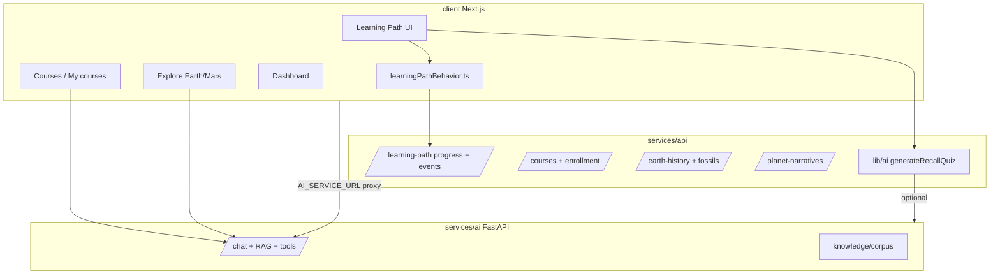
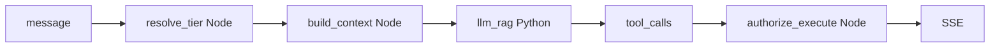

# Hệ thống AI Learning Agent — Thiết kế & lộ trình

> **Kiến trúc & vận hành (as-built):** xem [`docs/architecture/learning-agent.md`](../architecture/learning-agent.md) — tài liệu này giữ vision, phase, và backlog.

## 1. Tầm nhìn

**Learning Agent** không chỉ là chatbot hỏi–đáp. Đó là lớp trí tuệ gắn chặt với **ngữ cảnh học thực** của Galaxies: learning path, khóa học, Explore 3D (Earth/Mars/showcase), tiến độ, mastery, recall quiz, gems/rewards — để **giảm ma sát**, **tăng hiểu bài**, và **điều hướng đúng bước tiếp theo** cho từng người học.

**Nguyên tắc thiết kế**

| Nguyên tắc | Ý nghĩa |
|------------|---------|
| **Grounded** | Mọi lời khuyên phải bám dữ liệu app (lesson, concept, narrative beat, progress) + RAG corpus; không bịa số liệu địa chất / tiến độ. |
| **Context-first** | Agent biết *đang ở đâu* (route, lesson, stage Ma, entity, depth beginner/explorer/researcher) trước khi trả lời. |
| **Agent-native** | Hành động qua **tool có validate** (mở bài, nhảy Explore, gợi ý ôn tập) — client thực thi, server chỉ đề xuất. |
| **Proactive có kiểm soát** | Gợi ý chủ động khi phát hiện kẹt (dwell lâu, quiz fail nhiều lần), không spam. |
| **Privacy & cost** | Hồ sơ học tập theo `userId`; rate limit; model nhỏ cho routing, model lớn cho giải thích. |

**Không làm trong giai đoạn đầu:** Thay giáo viên soạn curriculum, chấm tự luận dài, hoặc agent tự sửa MongoDB/studio không qua con người.

---

## 2. Hiện trạng trong project (điểm xuất phát)

Đã có **mảnh ghép** quan trọng — cần **ghép thành một hệ**, không xây lại từ zero.



| Thành phần | Vị trí | Khả năng hiện tại |
|------------|--------|-------------------|
| AI chat + RAG | `services/ai/server.py` | Groq LLM, corpus MD, security blocklist, multimodal ảnh |
| Agent tools | `services/ai/agent_tools.py` | `open_lesson`, `go_to_explore`, … → migrate `navigate_to_narrative` |
| Recall quiz gen | `services/api/lib/ai/tasks/generateRecallQuiz.js` | Sinh quiz từ nội dung bài, fallback heuristic |
| Hành vi học | `client/.../learningPathBehavior.ts` | 15+ event types → `POST /learning-path/events/batch` |
| Tiến độ LP | `learningPathProgress.ts` + `UserProgress` | completed / mastered / visited3D / lastLesson |
| Kế hoạch cũ | `docs/AI_TUTOR_PLAN.md` | Tutor context-aware Phase 1–3 (chưa gom agent đầy đủ) |
| Admin analytics | `features/admin/api/adminAnalyticsApi.ts` | LP analytics (góc vận hành, chưa feed agent) |

**Khoảng trống chính** (đối chiếu code 2026-05-27)

| Có sẵn | Chưa có / đang làm dở |
|--------|-------------------------|
| `services/ai` chat + RAG + `agent_tools.py` | LangGraph graph đầy đủ (skeleton P0) |
| `services/api/features/agent/*` (message, snapshot, prefetch, coach, spaced review) | Episodic memory / session history merge Mongo (P1 backlog) |
| **`CosmoAssistantWidget`** — một widget cyan góc phải toàn app; `POST /api/agent/message` khi đăng nhập | Guest demo vẫn có thể qua `/api/chat` legacy (giới hạn) |
| `AgentPageProvider` + `buildSessionContext` trên LP / Explore | Multimodal ảnh trong widget thống nhất (đã có ở legacy, chưa port lại) |
| `useTutorContextStore` (course learn) | `entitlementResolver` trial đầy đủ trên mọi tier |
| `learningPathBehavior` → events | — |
| `generateRecallQuiz` (API) | — |
| Phase 1 coach + Phase 2 spaced review / depth / admin analytics (backend + client) | A/B coach tuning production; notification spaced review |

~~5. **UI agent** chưa nhất quán — `AITutor` + `AgentShell` tách rời.~~ **✓ Đã gộp (2026-05-27):** `CosmoAssistantWidget` — xem §4.1.

Các gap còn lại:

1. **Memory session** — chat history chưa merge vào `AgentSession` Mongo (localStorage / in-memory theo tab).
2. **Tool** — một số tool planet-agnostic / depth **suggest** vẫn đang harden.
3. **Coach layer** — policy + nudge đã ship Phase 1; tuning proactive vẫn ongoing.
4. **Episodic profile** — `LearnerAgentProfile` có spaced review / depth / misconceptions; chưa có planner multi-day (P2+).

---

## 3. Kiến trúc mục tiêu — Learning Agent Platform

### 3.1 Ba lớp

```
┌─────────────────────────────────────────────────────────────┐
│  L3 — Experience (client)                                      │
│  CosmoAssistantWidget: FAB góc phải, panel thu gọn, streaming  │
│  AgentPageProvider: ngữ cảnh LP / Explore / course             │
│  Tool executor: router.push, stage/entity focus, open lesson   │
└───────────────────────────┬─────────────────────────────────┘
                            │ agent_state + learner_snapshot
┌───────────────────────────▼─────────────────────────────────┐
│  L2 — Learning Agent Orchestrator (services/api)               │
│  POST /api/agent/session  ·  POST /api/agent/message           │
│  Context Builder · Policy (rate/quota) · Tool validate         │
│  Optional: delegate LLM → services/ai                          │
└───────────────────────────┬─────────────────────────────────┘
                            │
┌───────────────────────────▼─────────────────────────────────┐
│  L1 — Knowledge & Signals                                      │
│  RAG index · Curriculum/Concept APIs · Progress/Events DB      │
│  Narrative beats · Course lessons · Fossils (Earth only)       │
└─────────────────────────────────────────────────────────────┘
```

**Vì sao orchestrator nằm ở `services/api` chứ không chỉ `services/ai`?**

- Agent cần **auth JWT**, đọc `UserProgress`, enrollment, gems — đã có ở API Node.
- `services/ai` giữ vai trò **LLM + RAG + security** thuần (stateless, dễ scale GPU/CPU riêng).
- Tránh duplicate business rules giữa hai runtime.

### 3.2 Learner Context Snapshot (hợp đồng dữ liệu)

Mỗi lần gọi agent, client (hoặc API) gửi **`learner_snapshot`** + **`session_context`**:

```typescript
// Định nghĩa mục tiêu — implement trong features/agent/types.ts

/** Gợi ý yếu — server-derived từ struggleDetector, không gửi full lesson history. */
type WeakLessonSignal = {
  lessonId: string
  signal: 'quiz_fail_rate' | 'revisit_pattern' | 'dwell_outlier'
  score: number // 0–1, cao = yếu hơn
}

type LearnerSnapshot = {
  userId: string | null
  displayName?: string
  // Learning path — counts + recent only (không gửi full ID arrays lên LLM)
  progressPct: number
  lastLessonId: string | null
  completedCount: number
  masteredCount: number
  recentLessonIds: string[] // 5–10 bài gần nhất; detail fetch on-demand khi agent cần
  weakLessons: WeakLessonSignal[]
  preferredDepth: 'beginner' | 'explorer' | 'researcher' | null
  // Courses (optional)
  activeEnrollments: { courseSlug: string; progressPct: number }[]
  // Rewards (optional)
  gemBalance?: number
  // Pedagogy flags (server-derived, Phase 1+)
  struggleSignals?: { lessonId: string; reason: string }[]
}

/** ID narrative thống nhất — tránh branch Earth number vs Mars slug. */
type NarrativeContext = {
  planet: string // 'earth' | 'mars' | 'planet-mars' | showcase entity id
  stageId: string // 'noachian-early' | 'stage-1' | earth stage key
  beatId?: string
  pinId?: string // site pin đang chọn
}

type SessionContext = {
  surface: 'learning_path' | 'course' | 'explore' | 'dashboard' | 'studio'
  pathname: string
  search: string
  routeLabel: string
  // Surface-specific
  moduleId?: string
  nodeId?: string
  lessonId?: string
  depth?: 'beginner' | 'explorer' | 'researcher'
  courseSlug?: string
  currentLessonSlug?: string
  showcaseEntityId?: string
  narrativeContext?: NarrativeContext
  selectedConceptIds?: string[]
}
```

**Weakness heuristic (server, Phase 1)** — không dùng “mở nhiều, chưa mastered” (false signal: đọc kỹ bài khó ≠ yếu):

| Signal | Điều kiện | Trọng số |
|--------|-----------|----------|
| `quiz_fail_rate` | Fail recall ≥ 2 lần cùng bài | Mạnh nhất |
| `revisit_pattern` | Quay lại bài ≥ 3 lần trong 7 ngày | Trung bình |
| `dwell_outlier` | Dwell > 2× median lesson | Yếu (chỉ kết hợp) |

Context builder fetch chi tiết lesson cụ thể **chỉ khi** tool/agent cần (không embed 200 lesson IDs trong prompt).

### 3.2.1 Context Builder — latency & prefetch (bắt buộc Phase 0)

**Vấn đề kiến trúc cũ:** gọi `services/ai` RAG **đồng bộ** trước khi stream LLM → P50 3–6s trước token đầu tiên.

**Mục tiêu:** token đầu tiên < 1s khi có cache; RAG không block stream.

```
User vào lesson/stage
  → client prefetchAgentContext(lessonId | narrativeContext)
  → API cache context 5 phút theo (userId, lessonId | narrativeKey)

User gửi message
  → nếu cache hit: stream LLM ngay với cachedCtx
  → nếu cache miss: Promise.all([
        fetchRagContext(question),      // timeout 3s
        startLlmStream(question, partialCtx)
      ])
  → RAG passages merge vào turn tiếp theo nếu đến trễ (hoặc inject system patch nhẹ)
```

| Tham số | Giá trị |
|---------|--------|
| RAG HTTP timeout | **3s** — sau đó fallback (xem 0.7) |
| Context cache TTL | **5 phút** / `(userId, lessonId)` hoặc narrative key |
| Prefetch trigger | `LessonView` mount, Explore beat change, course lesson open |

**Perceived latency:** hiển thị typing indicator + stream partial ngay; không chờ RAG xong mới mở SSE.

### 3.2.2 Context Builder — nội dung merge

- Nội dung bài hiện tại (sections HTML/text, concept anchors).
- Beat narrative (panel copy) nếu Explore — qua `narrativeContext`.
- Top-3 concept liên quan từ `features/concepts`.
- RAG passages (cached hoặc parallel, không blocking).

Giới hạn token: **ưu tiên structured JSON summary** trước, raw HTML sau (truncate).

### 3.3 Capability matrix (agent “siêu thông minh” theo từng giai đoạn)

| Capability | Mô tả | Giai đoạn |
|------------|--------|-----------|
| **Explain** | Giải thích khái niệm / thời kỳ / bài đang xem | P0 |
| **Navigate** | Tool mở lesson, Explore Ma, module/node LP | P0 (mở rộng tool hiện có) |
| **Quiz coach** | Sau recall fail: **Socratic** 1–2 câu gợi mở trước khi giải thích đáp án (§9 P1.3) | P0 explain / **P1 coach** |
| **Guided problem-solving** | 3–4 turn gợi mở; không đưa đáp án thẳng khi `quiz_fail_streak ≥ 1` | P1 |
| **Misconception clarify** | Sau quiz fail: hỏi “Bạn chọn A vì nghĩ X hay Y?” → log tag → `LearnerAgentProfile.misconceptions[]` | P1 (1.3b) |
| **Struggle signals** | quiz_fail_rate, revisit, dwell — `struggleDetector` (foundation) | P1 |
| **Next step** | “Nên học gì tiếp?” dựa progress + prerequisite graph | P1 |
| **Session summary** | Khi thoát bài / inactive 10p: 3–4 bullet “Hôm nay…” + “Lần sau…” → `AgentSession.summary` | P1 (1.7) |
| **Spaced review** | Nhắc ôn bài mastered cũ (dựa time + decay heuristic) | P1 |
| **Concept bridge** | Liên kết concept ↔ lesson ↔ scene entity | P1 |
| **Misconception aggregate (ML)** | Cluster / predict misconception trước khi quiz — cần episodic memory đủ dày | P2 |
| **Adaptive depth** | Agent **gợi** depth; user confirm (không auto-set) | P2 |
| **Agent quota** | Rate limit msg/h — **không** trừ gem (xem `gem-rewards-system.md` §7) | P0+ |
| **Teacher digest** | Tóm tắt cho giáo viên (admin) — tách persona | P3 |

### 3.4 Tool catalog mở rộng (agent-native)

Giữ validate chặt như `agent_tools.py` hiện tại. **Deprecate** tool Earth/Mars riêng lẻ; normalize theo `NarrativeContext`.

| Tool | Khi nào | Validate |
|------|---------|----------|
| `open_learning_path_lesson` | LP | `lessonId` ∈ curriculum |
| `open_learning_path_node` | LP hub | `moduleId`, `nodeId` |
| `suggest_depth_switch` | LP | `suggestedDepth` enum + `reason`; **client render confirm chip** — không đổi depth cho đến khi user bấm |
| `navigate_to_narrative` | Explore / Deep History | `planet`, `stageId`, optional `pinId` — client map planet → route + store |
| `focus_showcase_entity` | Showcase | `entityId` ∈ catalog |
| `open_concept` | Mọi nơi | `conceptId` ∈ graph |
| `highlight_concept_in_map` | Concept bridge (P1) | `conceptId` — mở `/map`, highlight node |
| `show_related_lessons` | Concept bridge (P1) | `conceptId` hoặc `lessonId` — surface ≤3 chip, không navigate |
| `start_recall_quiz` | Trong bài | `lessonId` |
| `open_course_lesson` | Course | slug ∈ enrollment |

**Không thêm:** `go_to_explore`, `go_to_mars_explore`, `set_learning_depth` (override ý user).

Client: `features/agent/lib/executeToolCall.ts` — **chỉ** điều hướng UI sau khi server đã authorize tool (xem §3.6). Không tin `sessionCtx` hay LLM arguments đơn thuần.

### 3.5 Agent entitlement tiers (Guest → Teacher)

**Bắt buộc từ Phase 0:** mọi `POST /api/agent/message` resolve `agent_tier` trước khi build prompt / expose tools. Trial và Teacher **không** là afterthought — ảnh hưởng schema `Enrollment`, tool allowlist, RAG scope.

| Dimension | 👤 Guest | 🎓 LP / Free | ⏱ Trial (gem) | ✅ Enrolled | 👨‍🏫 Teacher |
|-----------|----------|--------------|---------------|------------|-------------|
| **Tier key** | `guest` | `lp_free` | `course_trial` | `course_enrolled` | `teacher` |
| **System prompt** | Demo 2 câu | Tutor chung (LP) | Course agent (scoped module) | Course agent full | Instructor view |
| **Context snapshot** | Không | LP progress, concepts | Module hiện tại + quiz fail *trong module* | Syllabus summary + tiến độ + quiz fail (structured, §3.6.3) | Course analytics + class progress |
| **Tools exposed to LLM** | Không | `suggest_lesson` (link only) | `open_lesson` (module trial only) | `open_lesson`, `navigate_to_narrative`, `start_recall_quiz` | All learner tools + `view_student_progress` |
| **RAG corpus** | Không | General + LP snippets | Module corpus only | General + full course corpus | General + course + instructor notes |
| **Rate limit** | 2 câu demo | 40 msg/h | 40 msg/h | 60 msg/h | 120 msg/h |
| **Fallback khi hết quyền** | Hard stop sau demo | — | Downgrade → `lp_free` + banner trial expired | — | — |

**Trial enrollment (data model — cần migration):**

```typescript
// services/api/features/courses/models/Enrollment — mở rộng
type EnrollmentStatus = 'active' | 'trial' | 'expired'

interface Enrollment {
  userId: string
  courseId: ObjectId
  status: EnrollmentStatus
  trialModuleId?: string      // ObjectId hoặc slug module — scope agent + open_lesson
  trialExpiresAt?: Date
  progress: { lessonSlug, completed, completedAt }[]
}
```

**Resolver (SSOT):** `services/api/features/agent/services/entitlementResolver.js`

```javascript
// Thứ tự ưu tiên: teacher role → enrolled/trial → lp logged-in → guest
async function resolveAgentTier({ userId, roles, courseSlug, sessionCtx }) {
  if (roles.includes('teacher') && sessionCtx.surface === 'studio') return 'teacher'
  if (courseSlug) {
    const e = await Enrollment.findOne({ userId, courseId })
    if (!e) return 'lp_free'
    if (e.status === 'trial') {
      if (e.trialExpiresAt && e.trialExpiresAt < new Date()) return 'trial_expired' // → downgrade
      return 'course_trial'
    }
    if (e.status === 'active') return 'course_enrolled'
  }
  if (userId) return 'lp_free'
  return 'guest'
}
```

**Trial hết trong session:** không crash — set `agentContext.mode = 'lp_free'`, `trialExpiredMessage: true`; response có thể kèm note do policy node (§3.7) inject.

### 3.6 Guardrails — 5 cải tiến bắt buộc

#### 🔴 3.6.1 Tool validation **server-side** (authorization, không chỉ prompt)

**Vấn đề:** Chỉ nhắc trong prompt “mở bài trong khóa đã mua” → user craft message → model emit `open_lesson` → client navigate → **bypass** nếu API lesson không check enrollment.

**Quy tắc:**

1. `services/ai` (Python) **validate shape** của tool args (slug, Ma range) — như hiện tại.
2. **`services/api/features/agent`** **authorize** mọi tool trước khi trả `tool_calls` cho client hoặc trước khi client gọi API side-effect.
3. Client `executeToolCall` chỉ là **UI router**; mọi mutation (mở bài, progress) vẫn qua API đã có enrollment check.

```javascript
// services/api/features/agent/tools/executeOpenLesson.js
async function executeOpenLesson({ lessonSlug, userId }) {
  const lesson = await Lesson.findOne({ slug: lessonSlug }).lean()
  if (!lesson) return { ok: false, code: 'lesson_not_found' }

  const enrolled = await Enrollment.findOne({
    userId,
    courseId: lesson.courseId,
    status: { $in: ['active', 'trial'] },
  })
  if (!enrolled) {
    return { ok: false, code: 'not_enrolled', message: 'Bạn chưa đăng ký khóa này' }
  }

  if (enrolled.status === 'trial') {
    const inScope = lesson.moduleId && String(lesson.moduleId) === String(enrolled.trialModuleId)
    if (!inScope) return { ok: false, code: 'trial_scope' }
    if (enrolled.trialExpiresAt && enrolled.trialExpiresAt < new Date()) {
      return { ok: false, code: 'trial_expired' }
    }
  }

  return { ok: true, lessonSlug }
}
```

**API bài học** (`GET /courses/:slug/learn/:lessonSlug`) phải giữ check enrollment — agent không được là lối tắt duy nhất.

#### 🟡 3.6.2 Enrolled — câu hỏi ngoài syllabus (hybrid RAG + prompt)

**Vấn đề:** Enrolled Mars course, hỏi “Big Bang” — không có trong course RAG → hallucinate hoặc từ chối cứng.

**Policy (system prompt enrolled):**

- Ưu tiên passages từ **course corpus**.
- Nếu retrieval score < threshold (vd. 0.6) → bổ sung **general corpus** với flag `source: 'general'`.
- Luôn thêm disclaimer khi dùng general: *“Câu này không nằm trong syllabus khóa, nhưng đây là kiến thức nền tảng liên quan.”*
- **Không** từ chối câu hỏi khoa học hợp lệ.

```javascript
// contextBuilder — RAG merge
const courseHits = await ragSearch({ corpus: 'course', courseId, query, topK: 4 })
let passages = courseHits
let ragMode = 'course_only'
if (courseHits.length === 0 || courseHits[0].score < 0.6) {
  const generalHits = await ragSearch({ corpus: 'general', query, topK: 2 })
  passages = [...courseHits, ...generalHits.map((p) => ({ ...p, source: 'general' }))]
  ragMode = 'course_plus_general'
}
```

#### 🟡 3.6.3 Snapshot — structured summary, không full lesson HTML

**Vấn đề:** “Lesson blocks” trong snapshot = hàng nghìn token mỗi message.

**Đưa vào snapshot:**

```typescript
currentLesson: {
  slug: string
  title: string
  sectionTitles: string[]       // outline only
  conceptTagIds: string[]       // cho RAG query bias
  completionPct: number
  lastQuizFail?: { questionId: string; failCount: number }
}
// Full text chỉ qua RAG on-demand khi turn cần — không pre-load vào snapshot
```

#### 🔵 3.6.4 Trial scope + graceful downgrade

Đã cover §3.5. Product: trial agent = **preview value** của course agent, không full parity với `course_enrolled` (tools + corpus scoped).

#### 🔵 3.6.5 3D tools — tách course enrollment vs showcase unlock

**Vấn đề:** `navigate_to_narrative` / Explore không chỉ phụ thuộc course enrollment — showcase có **story/orbit unlock** riêng (gems).

```javascript
// executeNavigateToNarrative / executeFocusShowcaseEntity
async function executeExploreAccess({ userId, entityId }) {
  const courseAccess = await checkCourseEntityLink(userId, entityId) // curriculum bridge
  const showcaseAccess = await checkShowcaseGamificationUnlock(userId, entityId) // gems catalog
  if (!courseAccess && !showcaseAccess) {
    return {
      ok: false,
      code: 'no_access',
      suggestion: 'Đăng ký khóa hoặc mở khóa showcase trong cửa hàng gem',
    }
  }
  return { ok: true, entityId }
}
```

Expose tool cho LLM theo tier: enrolled có thể gọi tool nhưng **executor** quyết định OK; trial có thể chỉ `navigate` nếu entity ∈ trial module map.

### 3.7 Orchestration graph (guardrails flow)

**Vì sao graph (state machine / LangGraph):** entitlement, trial expiry, RAG routing, tool auth, coach policy là **nhánh có điều kiện** — rõ hơn `if` chain; dễ test từng bước; audit trail per step.

#### D3 — Đã chốt: Option B cho P0–P1 (Node owns auth + execute)

| | **Option A** (defer P2+ nếu cần graph Python full-flow) | **Option B** ✅ **P0–P1** |
|---|----------------------------------------------------------|---------------------------|
| Flow | LangGraph (Python) → HTTP mỗi tool → Node executor → Python | Node orchestrator → filter `allowed_tools` → Python LLM+RAG → Node authorize+execute **in-process** |
| Latency | +1 HTTP round-trip **per tool call** | Không hop Python↔Node khi execute |
| Python biết Node API? | Có (`authorize_tools` node) | Không — chỉ nhận `allowed_tools[]`, emit `tool_calls` |
| Khi dùng | Multi-agent nội bộ, graph phức tạp (P2–P3) | Ship nhanh, ít moving parts |

```
Option B (P0 default):

  Client → POST /api/agent/message (Node)
    → resolve_entitlement + rate_limit
    → build_context + prefetch cache
    → POST services/ai/chat { allowed_tools, context, message }
    ← stream tokens + tool_calls
    → toolAuthorizers/*.js (local Mongo) → tool_results
    → SSE emit to client
```

**Phân tách runtime (P0–P1):**

| Runtime | Trách nhiệm |
|---------|-------------|
| **`services/api/features/agent`** | JWT, graph/state machine, `entitlementResolver`, context, **tool executors**, SSE, rate limit |
| **`services/ai`** | RAG + LLM + tool schema subset; **không** gọi ngược Node để authorize P0 |

Client **không** execute tool có side-effect mà không qua server (lesson API vẫn 403 nếu unauthorized).



**Orchestrator nodes (P0 — implement trên Node, map 1:1 test):**

1. `resolve_entitlement` — `tier`, `allowed_tools[]`, `rate_limit_ok`
2. `build_context` — snapshot theo tier (§3.5, §3.6.3)
3. `rag_retrieve` — gọi Python parallel hoặc prefetch hit
4. `llm_chat` — Python; `tools` = subset `allowed_tools` (§5.1 schema)
5. `authorize_tools` — **Node local** executors; strip denied
6. `emit_response` — SSE + `tool_results`

**P0.10 “LangGraph skeleton”:** state machine Node (hoặc `langgraph` JS nếu team chọn) — **không** bắt buộc LangGraph Python P0. Python LangGraph (Option A) chỉ khi P2+ cần Planner/Explainer tách node trong `services/ai/graph/`.

**Phase 1 thêm node (Node):** `coach_policy`, `struggle_signals`, `misconception_log`, `session_summary`, `trial_expired_banner`.

### 3.8 Memory model

| Tier | Lưu ở đâu | Nội dung | TTL |
|------|-----------|----------|-----|
| **Session** | Redis hoặc Mongo `AgentSession` | messages[], tool history | 24h |
| **Learner profile** | Mongo `LearnerAgentProfile` | depth habit, opt-out proactive; **`misconceptions[]`** `{ conceptId, tag, source: 'quiz_clarify', count, lastAt }` (P1.3b) | vĩnh viễn |
| **Episodic notes** | Mongo embeddings optional | Tổng hợp từ `misconceptions[]` + coach logs (P2) | cập nhật khi có evidence |
| **Curriculum** | Đã có — không copy vào agent | concepts, LP, courses | SSOT DB |

Phase 0–1: chỉ **session + snapshot**; không episodic memory để giảm rủi ro hallucination profile.

---

## 4. Luồng người dùng (UX)

### 4.1 CosmoLearn AI — widget thống nhất (`CosmoAssistantWidget`)

**Nguyên tắc UX (2026-05-27):** *Gộp giao diện, tách tính năng* — một mental model “CosmoLearn AI”, không hai popup khác màu/vị trí.

| Khía cạnh | Quy ước |
|-----------|---------|
| **Vị trí** | FAB ✨ góc phải dưới trên **mọi** trang (mount từ `app/layout.tsx` qua portal `cosmo-assistant-portal`) |
| **Thiết kế** | Gradient cyan thương hiệu; panel ~380×52vh trên bài học (đọc song song nội dung) |
| **Chế độ tổng quan** | Trang chủ, dashboard, … — tag “Chế độ tổng quan” |
| **Chế độ ngữ cnh** | LP / Explore / course — tag `🤖 Đang trợ lý cho bài: …` hoặc `🤖 Khám phá · …` |
| **Nguồn context** | `AgentPageProvider` (LP, Explore) hoặc `buildSessionContext(pathname)` + `useTutorContextStore` (course) |
| **Mở từ CTA** | `openCosmoAssistant({ prompt })` / event `galaxies:agent-open` — **không** popup giữa màn hình |

**Hiển thị trên:** mọi route học sinh (LP, Explore, courses, dashboard, …). **Không** Studio/admin.

**Đã xóa (legacy):** `AgentShell.tsx`, `AITutor.tsx` (FAB tím riêng LP/Explore). Logic agent nằm trong `useCosmoAssistantChat` + widget.

**CTA trang bài học:**
- **Hỏi CosmoLearn AI** → mở widget + điền prompt (mục đang đọc nếu có).
- **Hỏi về bài này** (cộng đồng) → forum — tách biệt với AI.

**Prefetch cache key:** `(userId, lessonId | narrativeKey, activeSectionId?)` — TTL 5 phút (§3.2.1).

### 4.2 Chế độ tương tác

1. **Ask** — user hỏi tự do.
2. **Suggest chips** — sinh từ `SessionContext` (“Giải thích thời kỳ này”, “Quiz nhanh”, “Bài tiếp theo”).
3. **Coach nudge** (P1) — banner nhẹ khi policy cho phép (xem **CoachPolicy** bên dưới).

### 4.2.1 Coach intervention model (bắt buộc Phase 1)

Không có timing model → coach **spam** hoặc **miss**. Định nghĩa rõ trước khi ship proactive UI.

```typescript
interface CoachPolicy {
  triggers: {
    dwellThresholdMs: 480_000      // 8 phút ở 1 bài
    quizFailStreak: 2              // fail recall 2 lần liên tiếp
    revisitCount: 3                // quay lại bài 3+ lần / 7 ngày
  }
  cooldown: {
    sameLessonMs: 3_600_000        // 1 giờ / bài
    globalMs: 1_800_000            // 30 phút toàn app
    afterDismissMs: 7_200_000    // 2 giờ nếu user dismiss
  }
  maxPerSession: 2                 // không quá 2 coach / session
}
```

| Hành vi | Quy tắc |
|---------|---------|
| Show | Chỉ khi trigger **và** không vi phạm cooldown **và** `sessionCoachCount < maxPerSession` |
| Dismiss | Ghi `agent_coach_dismissed` → áp `afterDismissMs` |
| Rate limit | **Không có cooldown = tệ hơn không có agent** |

Implement: `struggleDetector` emit signals → `coachPolicyService` quyết định show/deny → client chỉ render khi API trả `coachNudge: { allowed, message, chips }`.

### 4.3 Streaming & đa phương thức

- SSE từ orchestrator → client (giảm cảm giác chờ).
- Ảnh (fossil, screenshot khung 3D) → `image_base64` như `services/ai` đã hỗ trợ.
- Phase sau: voice (Capacitor) — không block P0.

---

## 5. Cấu trúc code đề xuất (align DOMAIN_MAP)

```
services/api/features/agent/
  index.js                 # mount routes
  routes/agentSession.js   # POST message, GET history
  services/
    contextBuilder.js      # snapshot + lesson + beat + prefetch cache
    contextPrefetch.js     # warm cache on lesson/narrative mount
    toolValidator.js       # mở rộng từ agent_tools logic (shared spec)
    policyService.js       # rate limit, quota
    struggleDetector.js    # P1: events → signals
  models/
    AgentSession.js
    LearnerAgentProfile.js  # P1
  lib/
    aiClient.js            # gọi services/ai /chat

client/src/features/agent/
  api/agentApi.ts
  hooks/useAgentCoach.ts, useCosmoAssistantChat.ts
  lib/executeToolCall.ts, buildSessionContext.ts, openCosmoAssistant.ts
  context/AgentPageContext.tsx
  ui/AgentChips.tsx, AgentCoachBanner.tsx
  types.ts
  public.ts                # barrel duy nhất cross-domain

client/src/components/ai-tutor/
  CosmoAssistantWidget.tsx   # FAB + panel global (layout)
  AssistantMarkdown.tsx
  parseTutorActions.ts       # tool action types + merge helpers

services/ai/
  (giữ) server.py, rag.py, agent_tools.py
  # Python: import shared schema; validate arg shapes pre-LLM

shared/agent/                    # SSOT — cả Node + Python + CI
  agentToolSchema.json           # §5.1
```

**Import rule:** `app/` và components chỉ import `@/features/agent/public`.

#### 5.1 Tool schema SSOT (`shared/agent/agentToolSchema.json`)

**Gap đã đóng:** một file, không drift Python ↔ Node.

```json
{
  "version": 1,
  "tools": [
    {
      "name": "open_learning_path_lesson",
      "tierAllow": ["lp_free", "course_trial", "course_enrolled", "teacher"],
      "parameters": { "lessonId": { "type": "string", "required": true } }
    }
  ]
}
```

| Consumer | Cách dùng |
|----------|-----------|
| **Node** `toolValidator.js` | `allowed_tools` = filter `tierAllow` ∩ entitlement; validate args trước execute |
| **Python** `agent_tools.py` | Load schema; expose subset tới Groq `tools`; validate shapes |
| **CI** `client/scripts/check-agent-tool-schema.mjs` | Fail nếu `agent_tools.py` thêm tool mà schema thiếu (hoặc ngược) |

**Workflow thêm tool mới:** (1) sửa `agentToolSchema.json` → (2) Node authorizer + Python definition → (3) CI green → (4) client `executeToolCall` switch.

*Thay thế tạm P0:* copy schema vào `services/api/features/agent/lib/toolSchema.json` + script sync — migrate `shared/agent/` khi monorepo path ổn.

---

## 6. RAG & knowledge — mở rộng corpus có hệ thống

Hiện corpus chủ yếu MD thủ công. Lộ trình index tự động:

| Nguồn | Pipeline | Ưu tiên |
|--------|----------|---------|
| Learning path lessons | Export text → chunk → `/knowledge/append` | P0 |
| Course lessons (published) | Event-driven + cron safety net | P1 |
| Planet narrative beats | Event-driven on beat update | P1 |
| Concept definitions | `features/concepts` API | P1 |
| Fossils (Earth) | Sample theo stage, không full dump | P2 |

**Metadata chunk:** `{ source, entityId, lessonId, stageId, lang: 'vi', version, updatedAt }` — agent có thể cite version khi trả lời.

### 6.1 Invalidation (event-driven, không chỉ cron)

**Vấn đề:** teacher sửa lesson → corpus stale → agent sai fact. Cron weekly **quá chậm** cho content edit thường xuyên.

```
on('lesson.published' | 'lesson.updated', lessonId) =>
  ragIndex.deleteChunks({ lessonId })
  ragIndex.appendChunks(extractText(lessonId))

on('narrative.beat.updated', { entityId, beatId }) =>
  ragIndex.reindex({ entityId, beatId })

on('concept.updated', conceptId) =>
  ragIndex.reindex({ conceptId })
```

| Cơ chế | Vai trò |
|--------|---------|
| **Event-driven** | Primary — ngay khi publish/save CMS |
| **Cron weekly** | Safety net — full reconcile, không phải nguồn truth |

Prefetch cache (§3.2.1) invalidate khi `version` chunk thay đổi cho cùng `lessonId` / narrative key.

---

## 7. Analytics & tối ưu học tập (closed loop)

Agent không chỉ trả lời — **đo hiệu quả** và điều chỉnh:

**Events mới (đề xuất bổ sung vào `LearningPathEvent`):**

- `agent_message_sent`, `agent_tool_executed`, `agent_suggestion_clicked`
- `agent_coach_shown`, `agent_coach_dismissed`

**Metrics sản phẩm:**

- Time-to-mastery sau khi dùng agent vs không
- Recall quiz pass rate khi mở coach
- Completion rate module / course

**A/B (P2):** proactive coach on/off theo cohort.

---

## 8. Bảo mật, an toàn nội dung, chi phí

| Rủi ro | Giảm thiểu |
|--------|------------|
| Hallucination địa chất | RAG + structured beat/lesson; system prompt “không bịa số”; cite source id |
| Lộ dữ liệu user | JWT bắt buộc cho snapshot; không gửi email/password vào LLM |
| Tool abuse / auth bypass | **Authorize** mọi tool tại Node (`executeOpenLesson`, explore dual-check §3.6.5); Python chỉ shape-validate; lesson API giữ enrollment gate |
| Entitlement drift | `entitlementResolver` SSOT; matrix §3.5; trial/teacher từ P0 |
| Chi phí LLM | Router model nhỏ (intent classify); prefetch + cache context 5 phút (§3.2.1) |
| services/ai down | Fallback static chips (§0.7) — không silent fail |
| Prompt injection | `security.py` blocklist + strip HTML lesson trước khi vào prompt |

**Rate limit theo tier (§3.5):** guest 2 demo turns; `lp_free` / `course_trial` 40/h; `course_enrolled` 60/h; `teacher` 120/h — enforce tại `entitlementResolver` + Redis/Mongo counter.

---

## 9. Lộ trình triển khai

### Phase 0 — “Agent có ngữ cảnh thật” (3–4 tuần)

**Mục tiêu:** Một chỗ chat thống nhất, hiểu LP + Explore + course hiện tại.

| # | Việc | File / service chính |
|---|------|----------------------|
| 0.1 | `features/agent` + **`CosmoAssistantWidget`** global; `AgentPageProvider` LP/Explore | client ✓ |
| 0.2 | `POST /api/agent/message` gọi `services/ai` kèm context builder | `services/api/features/agent` |
| 0.3 | `buildSessionContext()` từ stores/routes | `client/.../buildSessionContext.ts` |
| 0.4 | Tool spec: `navigate_to_narrative`, `open_learning_path_lesson`, `suggest_depth_switch` | ai + api validator |
| 0.5 | Index RAG batch 20–30 lesson LP đầu tiên | `services/ai/scripts/` |
| 0.6 | Streaming SSE proxy | api + client |
| 0.6b | Context prefetch endpoint + cache layer `(userId, lessonId \| narrativeKey)` | `contextBuilder.js` |
| 0.6c | `services/ai` RAG timeout **3s** + structured fallback | `aiClient.js` |
| 0.7 | **Fallback mode** khi `services/ai` unavailable: static chips từ `SessionContext` (“Tôi tạm thời không khả dụng… Bài tiếp → Ôn lại → Quiz”) — không silent fail | api + client |
| 0.8 | `entitlementResolver` + tier matrix (guest → teacher); trial fields trên `Enrollment` | `agent/services/entitlementResolver.js`, migration |
| 0.9 | **Server tool executors** + `POST /api/agent/tools/execute` (open_lesson, navigate — dual showcase/course check) | `agent/tools/*.js` |
| 0.10 | Orchestrator state machine (Node): entitlement → context → Python LLM → **local** authorize (§3.7 Option B) | `features/agent/services/messagePipeline.js` |

**Done khi:** Học sinh hỏi “giải thích bài đang học” và agent trả lời đúng nội dung + có thể mở bài/Explore bằng tool; first token stream < ~1s khi cache warm.

#### 9.0.1 Quyết định chốt trước khi code (Phase 0)

| # | Quyết định | Đề xuất | Ai chốt |
|---|------------|---------|---------|
| D1 | Trial enrollment | `Enrollment.status`, `trialModuleId`, `trialExpiresAt` — align `gem-rewards-system.md` | Product |
| D2 | Guest demo 2 câu | Theo session cookie khi chưa login (không chỉ IP) | Product |
| D3 | Orchestration split | ✅ **Option B** — Node owns auth+execute; Python LLM+RAG only (§3.7) | **Chốt** |
| D4 | Model routing P0 | Một model Groq; chưa tách router nhỏ | Eng |
| D5 | Tool naming | P0: alias `navigate_to_narrative` + `go_to_explore`; deprecate Mars-only tuần 4 | Eng |

#### 9.0.2 Cây thư mục mục tiêu

```
services/api/features/agent/
  index.js
  routes/          # message (SSE), snapshot, prefetch, tools/execute
  services/        # entitlementResolver, contextBuilder, contextCache, aiClient
  services/toolAuthorizers/
  models/AgentSession.js

client/src/features/agent/
  public.ts, types.ts, api/agentApi.ts
  lib/buildSessionContext.ts, executeToolCall.ts, openCosmoAssistant.ts
  hooks/useCosmoAssistantChat.ts, useAgentCoach.ts
  ui/AgentChips.tsx, AgentCoachBanner.tsx
  context/AgentPageContext.tsx

client/src/components/ai-tutor/
  CosmoAssistantWidget.tsx

services/ai/graph/   # P0.10 skeleton
```

#### 9.0.3 API contract (Phase 0)

**`POST /api/agent/message`** — body: `message`, `sessionId?`, `learner_snapshot`, `session_context`, `image?`. Response **SSE**: `session` (tier, quota) → `token` → `tool_calls` → `tool_results` (sau authorize) → `done` | `error`.

**`POST /api/agent/tools/execute`** — `{ sessionId, toolName, arguments, session_context }` → `{ ok, clientAction }` (retry/audit; ưu tiên authorize trong luồng message).

**`GET /api/agent/snapshot`** — server-built snapshot (P0: counts + `recentLessonIds`).

**`POST /api/agent/context/prefetch`** — warm cache `(userId, lessonId | narrativeKey)`, TTL 5 phút (§3.2.1).

Flow nội bộ: `resolve_entitlement` → rate limit → context (cache/prefetch) → stream LLM + RAG parallel (RAG timeout 3s) → authorize tools → emit `clientAction`.

#### 9.0.4 Lộ trình theo tuần

| Tuần | Deliverable | Exit |
|------|-------------|------|
| **1** | Skeleton API, `entitlementResolver`, stream proxy `services/ai` | Message stream + tier guest/lp_free |
| **2** | `contextBuilder` + cache; `tools/execute` (lesson, narrative); fallback 0.7 | Tool authorize, không bypass enrollment |
| **3** | `buildSessionContext`, **`CosmoAssistantWidget`** + prefetch; coach banner | LP: hỏi đúng bài + chip ✓ |
| **4** | Explore context qua `AgentPageProvider`; RAG index LP; metrics | Done criteria Phase 0 ✓ |

#### 9.0.5 Tích hợp UI chat — **Done (2026-05-27)**

| Trước | Sau |
|-------|-----|
| `AITutor` (cyan) global + `AgentShell` (tím) riêng LP/Explore | **`CosmoAssistantWidget`** duy nhất |
| Hai luồng `/api/chat` vs `/api/agent/message` | User đăng nhập → **`POST /api/agent/message`** (stream); guest có thể demo qua `/api/chat` |
| Nút “Hỏi” mở popup giữa màn | **`openCosmoAssistant({ prompt })`** mở panel góc phải + điền sẵn |

**Backlog P1:** merge chat history vào `AgentSession` Mongo; port lại đính kèm ảnh vào widget thống nhất.

#### 9.0.6 Rủi ro Phase 0

| Rủi ro | Mitigation |
|--------|------------|
| Hai luồng chat song song | Feature flag; một surface trước |
| Trial schema chưa migration | P0 chỉ `active` enrollment nếu D1 trễ |
| Latency RAG | Prefetch + §3.2.1 |
| Tool schema Python ≠ Node | `shared/agent/agentToolSchema.json` + CI (§5.1) |

### Phase 1 — Learning Coach (4–5 tuần)

**Thứ tự đúng:** detector → snapshot → quiz coach (Socratic) → misconception clarify → chips → concept bridge → policy → session summary.

| # | Việc |
|---|------|
| 1.1 | `struggleDetector` từ `LearningPathEvent` (dwell, quiz fail streak, revisit) — **foundation** |
| 1.2 | `GET /api/agent/snapshot` — counts + `recentLessonIds` + `weakLessons[]` signals (§3.2) |
| 1.3 | Quiz coach sau recall fail — **Socratic**: system prompt “không đưa đáp án ngay; 1–2 câu gợi mở” (§3.3) |
| 1.3b | Post-quiz clarifying question → user chọn pattern → log `misconceptionTag` → `LearnerAgentProfile.misconceptions[]` |
| 1.4 | Chips “Bài tiếp theo”, “Ôn lại bài X” (dùng snapshot + weak signals) |
| 1.5 | Concept bridge: `highlight_concept_in_map`, `show_related_lessons` |
| 1.6 | `CoachPolicy` + cooldown + `maxPerSession` (§4.2.1) |
| 1.7 | Session summary on lesson exit / inactive 10p → `AgentSession.summary` + chip “Lần sau” |

**System prompt snippet (1.3):** khi `quiz_fail_streak ≥ 1`, ưu tiên guided turns trước explanation block.

### Phase 2 — Cá nhân hóa & đa hành tinh (4–6 tuần)

| # | Việc |
|---|------|
| 2.1 | Spaced review scheduler (notification optional) |
| 2.2 | Narrative beat + showcase entity trong context builder |
| 2.3 | `LearnerAgentProfile` + depth adaptation |
| 2.4 | Proactive coach tuning (A/B copy); cooldown đã có ở 1.6 |
| 2.5 | Admin view: agent usage + struggle heatmap — ✓ tab **Agent học tập** trên `/admin` |

### Phase 3 — Nâng cao (ongoing)

- Multi-agent nội bộ (Planner / Explainer / Navigator) — **một** orchestrator, nhiều system prompt chuyên vai (không cần 3 service).
- Fine-tune nhỏ trên log Q&A đã được teacher approve (opt-in).
- MCP tools cho Studio (teacher copilot) — tách persona, không trộn học sinh.

---

## 10. Quyết định kỹ thuật cần chốt sớm

| Quyết định | Đề xuất | Lý do |
|------------|---------|-------|
| Orchestrator | `services/api/features/agent` | Auth + progress + enrollment |
| LLM host | Giữ `services/ai` (Groq) | Đã có RAG, tools, multimodal |
| Session store | Mongo `AgentSession` trước, Redis sau | Đơn giản deploy hiện tại |
| UI | **`CosmoAssistantWidget`** — FAB cyan góc phải; `AgentPageProvider` cho ngữ cảnh | Một mental model; không dual shell |
| Chat migration | ✓ User login → `/api/agent/message` | Hoàn tất 2026-05-27 (§9.0.5) |
| Single agent vs multi | Single orchestrator, multi **prompt role** | Giảm độ phức tạp P0–P1 |
| Entitlement doc | Chi tiết matrix §3.5; audit ngắn giữ ở `agent-entitlement-guardrails.md` | Tránh trùng lặp dài |
| Orchestration D3 | **Option B** Node-first (§3.7) | Latency; P0 ship |
| Tool schema | `shared/agent/agentToolSchema.json` + CI (§5.1) | Drift prevention |

---

## 15. Final audit — chất lượng & “đủ mạnh”

### 15.1 Scorecard — 16 issues audit trước (2026-05-25)

| # | Issue | Trạng thái | Tham chiếu |
|---|--------|------------|------------|
| 1 | LearnerSnapshot counts + recent | ✓ | §3.2 |
| 2 | WeakLessonSignal algorithm | ✓ | §3.2 |
| 3 | NarrativeContext unified | ✓ | §3.2, §3.4 |
| 4 | `navigate_to_narrative` | ✓ | §3.4 |
| 5 | `suggest_depth_switch` | ✓ | §3.4 |
| 6 | Concept map tools | ✓ | §3.4 |
| 7 | CoachPolicy timing | ✓ | §4.2.1 |
| 8 | Phase 0 fallback 0.7 | ✓ | §9 Phase 0 |
| 9 | Phase 1 ordering | ✓ | §9 Phase 1 |
| 10 | RAG invalidation | ✓ | §6.1 |
| 11 | Success metrics measurable | ✓ | §12 |
| 12 | Tool auth server-side | ✓ | §3.6.1 |
| 13 | Trial + Teacher tier | ✓ | §3.5 |
| 14 | Out-of-scope RAG hybrid | ✓ | §3.6.2 |
| 15 | Snapshot structured (no HTML dump) | ✓ | §3.6.3 |
| 16 | Orchestration graph | ✓ | §3.7 (D3 chốt Option B) |

**Sprint / contract extras (cùng đợt audit):** §9.0.3 SSE, §9.0.4 weekly, §9.0.5 UI unified widget, §3.6.5 3D entitlement, trial downgrade §3.5.

**Document quality:** production-grade plan — đủ implement P0–P1 không cần doc phụ.

### 15.2 Ba gap — đã address trong doc

| Gap | Trước | Sau |
|-----|-------|-----|
| **G1 LangGraph split** | D3 mở, Python→Node HTTP mỗi tool | **D3 chốt Option B** §3.7; Option A defer P2+ |
| **G2 Tool schema sync** | Mitigation mơ hồ | **§5.1** `shared/agent/agentToolSchema.json` + CI |
| **G3 Misconception muộn** | P2 detect only | **P1.3b** clarify + log; P2 = aggregate/ML |

### 15.3 Mức “đủ mạnh” (4 levels)

| Level | Mô tả | Plan |
|-------|--------|------|
| **L1 FAQ Bot** | Câu hỏi chung, không context | Vượt xa ✓ |
| **L2 Context-aware** | Biết bài/stage; navigate tools | **Phase 0** — đạt đủ |
| **L3 Learning Coach** | Struggle, coach, misconception log, spaced review | **Phase 1** ~70–85% (thiếu episodic đầy đủ đến P2) |
| **L4 Smart Tutor** | Dự đoán khó, multi-day plan, curriculum adapt | **Phase 2–3** |

**Verdict:** Phase 0 → **L2 solid**. Phase 1 → **~L3** (coach + Socratic + misconception tags + session summary). Đủ mạnh cho mục tiêu Galaxies hiện tại: **có**. So sánh Khanmigo / Duolingo Max: cần P2 episodic memory + path optimization.

### 15.4 Ba bổ sung Phase 1 (đã gộp §3.3, §9)

1. **Guided problem-solving** — Socratic sau quiz fail (1.3).
2. **Misconception labeling** — clarifying question + profile (1.3b), không cần ML P1.
3. **Session summary** — retention closure (1.7).

---

## 11. Liên hệ với công việc đang làm (panel schema, narrative CMS)

Deep History `panelSchema` per entity **bổ trợ trực tiếp** cho agent Explore:

- Context builder đọc `planet-narratives` + beat hiện tại → giải thích đúng nhãn Mars vs Earth.
- Tool `navigate_to_narrative` + `focus_showcase_entity` gắn narrative đã CMS hóa.

Nên **hoàn tất sync panel schema → Explore runtime** trước Phase 2.2.

---

## 12. Tiêu chí thành công (12 tuần)

### 12.1 Product metrics

| # | Metric | Target | Cách đo |
|---|--------|--------|---------|
| 1 | Agent adoption | ≥ 30% **weekly active LP users** có ≥1 agent message/tuần | Baseline 2 tuần **trước** launch; không chia total users |
| 2 | Recall quiz | First-try pass rate +10% vs cohort không coach | Cohort flag `coach_enabled` |
| 3 | Efficiency | Median dwell giảm, mastered không giảm | LP events + progress |
| 4 | Fact accuracy | < 2% “sai fact” trong sample | Xem §12.2 |
| 5 | Security | **0** PII leak incidents | Audit log + redaction review |
| 6 | Latency | P95 first-token **< 3s** (cache warm) | Server SSE timestamps |

### 12.2 Measurement mechanisms (không metric “vô nghĩa”)

**Fact accuracy (#4):**

- Mỗi agent response: thumbs up / down.
- Thumbs down → optional tag `incorrect_fact` | `off_topic` | `unsafe`.
- Weekly: sample review **20** responses ngẫu nhiên (ưu tiên thumbs down).

**Session usage (#1):**

- Đo baseline adoption 2 tuần pre-launch.
- Target 30% của **WAU LP**, không phải toàn bộ registered users.
- Nếu baseline thấp, kế hoạch growth (onboarding chip) tách khỏi engineering SLA.

**Latency (#6):**

- Log `t_prefetch_hit`, `t_rag_ms`, `t_first_token_ms` per message.
- Alert nếu P95 > 3s trong 24h.

---

## 13. Audit changelog (2026-05-19)

| Issue | Severity | Fix trong doc |
|-------|----------|----------------|
| Context builder blocking RAG trước LLM | 🔴 | §3.2.1 prefetch + parallel + 0.6b/c |
| LearnerSnapshot arrays + weak heuristic + ID types | 🟡 | §3.2 counts/recent, `weakLessons[]`, `NarrativeContext` |
| Tool catalog Earth/Mars split, depth override, missing map tools | 🟡 | §3.4 `navigate_to_narrative`, `suggest_depth_switch`, concept tools |
| Coach không có timing model | 🔴 | §4.2.1 `CoachPolicy`, Phase 1.6 |
| Phase 0 thiếu fallback; Phase 1 ordering | 🟡 | 0.7, reorder 1.1→1.6 |
| RAG không invalidation | 🔵 | §6.1 event-driven |
| Success criteria không đo được | 🔵 | §12.1–12.2 mechanisms |
| Tool auth chỉ prompt/client | 🔴 | §3.6.1 server executors + lesson API gate |
| Thiếu Trial + Teacher tier | 🔴 | §3.5 matrix + Enrollment schema |
| Enrolled out-of-syllabus UX | 🟡 | §3.6.2 hybrid RAG + disclaimer |
| Snapshot quá nặng (lesson blocks) | 🟡 | §3.6.3 structured summary only |
| Trial expiry mid-session | 🔵 | §3.5 downgrade → `lp_free` |
| 3D tool = enrollment only | 🔵 | §3.6.5 course **OR** showcase unlock |
| Orchestrator if-chain | 🔵 | §3.7 LangGraph nodes |
| Phase 0 thiếu sprint / API contract | 🟡 | §9.0.1–9.0.6 (2026-05-25) |
| Code vs plan lệch (UI dual shell) | ✓ | §4.1, §9.0.5 — **resolved 2026-05-27** |
| LangGraph split chưa chốt (G1) | 🟡 | §3.7 Option B — **resolved 2026-05-25** |
| Tool schema SSOT chưa định nghĩa (G2) | 🟡 | §5.1 — **resolved 2026-05-25** |
| Misconception chỉ P2 (G3) | 🟡 | §3.3, P1.3b — **resolved 2026-05-25** |
| UI dual `AITutor` + `AgentShell` | 🟡 | §4.1 — **resolved 2026-05-27** (`CosmoAssistantWidget`) |

---

## 14. Bước tiếp theo ngay (tuần này)

1. **Chốt D1–D2** (§9.0.1): trial `Enrollment`, guest demo limit — D3 đã chốt Option B (§3.7).
2. Review §13 + checklist entitlement trong [`agent-entitlement-guardrails.md`](./agent-entitlement-guardrails.md) (không nhân đôi nội dung dài).
3. Epic **AGENT-P0** theo §9.0.4 — tuần 1: skeleton API + `entitlementResolver` + SSE proxy.
4. Spike 2h: `POST /api/agent/message` mock stream từ `services/ai` hiện tại.
5. Align trial SKU với `gem-rewards-system.md` trước migration D1.

---

*Tài liệu này bổ sung và nâng cấp `docs/AI_TUTOR_PLAN.md` (chat tutor) thành **Learning Agent Platform** gắn progress, events, và agent-native navigation trong Galaxies.*
