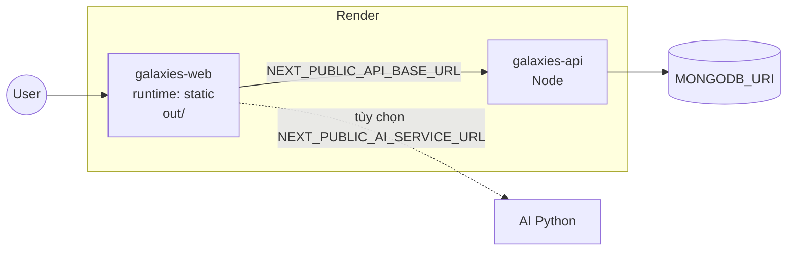

# Triển khai Galaxies lên Render

Blueprint: API Node + **client Static Site (CDN)**. Biến: [`shared/envNames.js`](../shared/envNames.js).

## Sơ đồ



| Service | Loại | Build |
|---------|------|-------|
| `galaxies-api` | Web Node | `npm run install:all` → `cd services/api && npm start` |
| `galaxies-web` | **Static Site** | `npm ci && npm run build:static` → publish `client/out/` |

File: [`render.yaml`](../render.yaml).

## Cảnh báo build static (bình thường)

Nếu log có dòng kiểu *"rewrites/redirects/headers will not automatically work with output: export"* — sau khi cập nhật `next.config.js` (chỉ bật các rule đó khi **không** export) thì cảnh báo biến mất. Redirect Studio cũ (`/studio/tutorial` → learning-path) cấu hình trên **Render → Redirects** hoặc trong `render.yaml` (`routes`).

Build vẫn chạy tiếp sau các dòng `Creating an optimized production build` — đợi đến `✓ Export` / deploy xong. `npm audit` không chặn deploy.

## Static site (`galaxies-web`)

- Build: `npm run build:static` (`RENDER_STATIC=true`, export ra `out/`).
- Không chạy `next start` — chỉ file tĩnh + CDN Render.
- API gọi từ trình duyệt qua `NEXT_PUBLIC_API_BASE_URL` (build-time).
- Trợ lý AI (tùy chọn): set `NEXT_PUBLIC_AI_SERVICE_URL` trỏ service Python public; nếu không có, tính năng AI tắt trên bản static (không còn proxy `/api/chat`).

Local thử static:

```bash
cd client
npm run build:static
npx serve out
```

## Liên kết URL (Blueprint)

| Nơi nhận | Biến | Nguồn |
|----------|------|--------|
| API | `CLIENT_URL` | `galaxies-web` → `RENDER_EXTERNAL_URL` |
| API | `API_PUBLIC_URL` | `galaxies-api` → `RENDER_EXTERNAL_URL` |
| Static client | `NEXT_PUBLIC_API_BASE_URL` | `galaxies-api` → `RENDER_EXTERNAL_URL` |
| Static client | `NEXT_PUBLIC_AI_SERVICE_URL` | `sync: false` (nếu deploy AI) |

Sau đổi tên service / custom domain: redeploy **cả API và static client** (biến `NEXT_PUBLIC_*` nhúng lúc build).

## Biến bắt buộc

**API:** `MONGODB_URI`, `JWT_SECRET`, `INTERNAL_API_SECRET`, VNPay nếu dùng thanh toán.

**Static client (build):** `NEXT_PUBLIC_API_BASE_URL`, Firebase `NEXT_PUBLIC_FIREBASE_*` nếu dùng đăng nhập Google/Facebook.

## VNPay IPN

`${API_PUBLIC_URL}` + path `/api/payments/ipn` (xem `shared/appPaths.js`).

## Node client (thay static)

Nếu cần `next start` + proxy `/api/chat` dev-style, đổi `galaxies-web` trong `render.yaml` về `runtime: node`, `buildCommand: npm ci && npm run build`, `startCommand: npm start` — không dùng `staticPublishPath`.

## Local env

- [`services/api/.env.example`](../services/api/.env.example)
- [`client/.env.local.example`](../client/.env.local.example)
