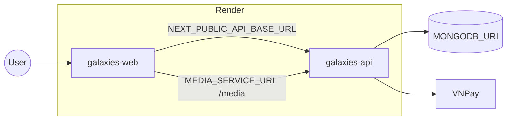

# Triển khai Galaxies lên Render

Blueprint dùng **tên biến** và `fromService` — không hardcode URL trong repo. Danh sách biến: [`shared/envNames.js`](../shared/envNames.js). Đường dẫn app: [`shared/appPaths.js`](../shared/appPaths.js).

## Sơ đồ



| Service | Build | Start |
|---------|-------|-------|
| `galaxies-api` | `npm run install:all` | `cd services/api && npm start` |
| `galaxies-web` | `npm ci && npm run build` (`client/`) | `npm start` |

File: [`render.yaml`](../render.yaml).

## Liên kết URL giữa service (Blueprint)

Render inject `RENDER_EXTERNAL_URL` trên mỗi web service. Blueprint map:

| Service nhận | Biến | Nguồn |
|--------------|------|--------|
| API | `CLIENT_URL` | `galaxies-web` → `RENDER_EXTERNAL_URL` |
| API | `API_PUBLIC_URL` | `galaxies-api` → `RENDER_EXTERNAL_URL` |
| Client | `NEXT_PUBLIC_API_BASE_URL` | `galaxies-api` → `RENDER_EXTERNAL_URL` |
| Client | `MEDIA_SERVICE_URL` | `galaxies-api` → `RENDER_EXTERNAL_URL` |

Sau khi đổi tên service hoặc custom domain: cập nhật env trên Dashboard (hoặc `sync: false` + nhập tay), rồi redeploy **client** (biến `NEXT_PUBLIC_*` lúc build).

## Biến bắt buộc khi apply Blueprint

**API (`galaxies-api`):**

- `MONGODB_URI` (`sync: false`)
- `JWT_SECRET`, `INTERNAL_API_SECRET` (generate hoặc tự nhập)
- `CLIENT_URL`, `API_PUBLIC_URL` — tự gán qua `fromService` nếu Blueprint hỗ trợ `envVarKey`
- Thanh toán: `VNPAY_TMN_CODE`, `VNPAY_HASH_SECRET`, `VNPAY_HOST`, `VNPAY_TEST_MODE`

**Client (`galaxies-web`):**

- `NEXT_PUBLIC_API_BASE_URL`, `MEDIA_SERVICE_URL` — từ API service (build-time)

Render tự set `PORT` trên mỗi web service.

## VNPay IPN

Trên merchant portal, IPN URL:

```text
${API_PUBLIC_URL}${paymentsIpn}
```

Với path cố định trong code: `shared/appPaths.js` → `paymentsIpn` = `/api/payments/ipn`.

Return browser: `${CLIENT_URL}${paymentReturn}` (`/payment/return`).

## Local

- API: copy [`services/api/.env.example`](../services/api/.env.example) → `.env`
- Client: copy [`client/.env.local.example`](../client/.env.local.example) → `.env.local`

Không có fallback `localhost` trong mã — chỉ file `.env*` mẫu.

## Media production

- Khuyến nghị: `S3_MEDIA_BUCKET` + AWS keys
- Hoặc bật `disks` trong `render.yaml` (comment sẵn trong file)

## Python (tùy chọn)

Deploy `services/embedding` / `services/ai` riêng, rồi set trên client: `EMBEDDING_URL`, `AI_SERVICE_URL`.

## Kiểm tra

| Kiểm tra | Cách |
|----------|------|
| API | `GET ${API_PUBLIC_URL}/health` |
| CORS | `CLIENT_URL` khớp origin web |
| OAuth | Redirect `${API_PUBLIC_URL}/auth/google/callback` (và Facebook) |

Xem thêm: [`SERVICES.md`](../SERVICES.md).
